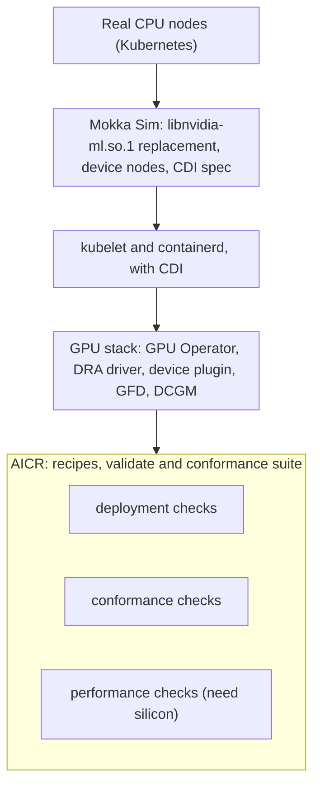
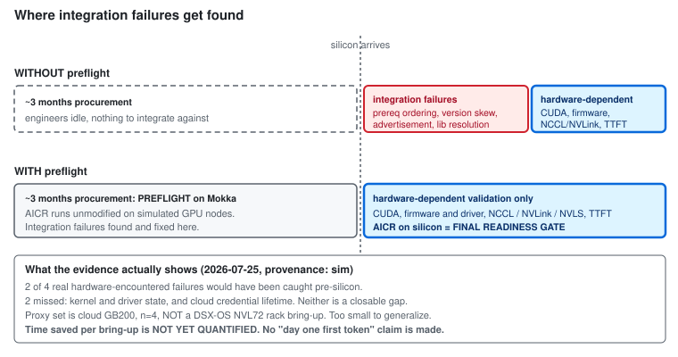

# Pre-silicon integration preflight: Mokka Sim + AICR

**Audience:** platform engineers at neocloud providers and enterprises who have GPU capacity on order
and want to be ready when it lands.

**One line:** AICR defines what "ready" means, and Mokka Sim lets you run most of that definition
before the hardware exists.

All coverage numbers on this page come from a real run on 2026-07-25. They are simulation-provenance
(`sim`) and none has been confirmed on silicon. The run is
[reproducible](../../tests/aicr-preflight/README.md), and the raw output is
[committed](../../tests/aicr-preflight/results/2026-07-25-gb200-kind/).

## The problem

You buy a GB200 cluster. It arrives in roughly three months. Your engineers are available now, and
there is nothing for them to integrate against. So the work waits.

When the racks land, the clock starts. Every hour spent discovering that a prerequisite ConfigMap
lands in the wrong ordering slot, or that a recipe's Kubernetes floor is below what the DRA API needs,
is an hour not spent on the work that genuinely requires the hardware: driver and firmware
compatibility, NCCL and NVLink behaviour, and getting real tokens out of a real model.

Those integration failures are not exotic. They are ordinary, they are found late, and they consume
bring-up time that was budgeted for something else.

## What AICR is

AICR codifies configurations that have been **validated and optimized on real hardware**. It gives you
a known-good baseline instead of rediscovering the stack yourself, expressed as recipes plus a
validation and conformance suite you can run against your cluster.

AICR is the readiness definition. That does not change here.

## What Mokka Sim is

Mokka Sim (the `nvml-mock` project) presents real CPU nodes to Kubernetes as a GPU fleet. It is not an
API-level fake: it replaces `libnvidia-ml.so.1` on the host with a real shared library, ships the real
`nvidia-smi` binary patched to resolve against it, creates device nodes, and generates a CDI spec. The
interception is at the NVML and driver line, so everything above that line is the real software.

That means the NVIDIA GPU Operator installs for real, the device plugin advertises `nvidia.com/gpu` for
real, GPU Feature Discovery labels nodes from real NVML calls, the DRA driver publishes real
ResourceSlices, and dcgm-exporter scrapes real metrics endpoints.

**Mokka needs real nodes.** It replaces a library on the host and needs a real kubelet and container
runtime, so it cannot run on KWOK nodes.

## How they compose

AICR runs **on** a Mokka-enabled Kubernetes cluster, unmodified. Mokka is the substrate; AICR is the
workload. You are validating the real readiness path, not a simulation-specific one.

The direction matters, because the common misreading is that simulation lives inside AICR. It does
not. Mokka is node-level substrate underneath the whole stack, and AICR sits on top of it.

## What preflight covers, and what it does not

This is the part to read carefully.

| Preflight covers | Preflight does NOT cover |
|---|---|
| GPU Operator installation and reconciliation | CUDA execution |
| DRA installation and resource advertisement | Firmware and driver compatibility |
| NVML-facing components (`nvidia-smi`, GFD, DCGM path) | NCCL, NVLink, NVLS, network fabric |
| Scheduling and control-plane behaviour | Workload TTFT and throughput |
| Prerequisite ordering, version and API skew | Anything that needs a real device to compute |

The right-hand column is what determines time to first token. **AICR validation on real silicon
remains the final readiness gate.** Preflight moves the integration work left; it does not replace the
gate.

## What the numbers actually say

Of the 21 checks in the AICR validate catalog:

| Bucket | Count | Meaning |
|---|---:|---|
| **A** meaningful under Mokka | 14 | exercises real integration, can fail for a real reason |
| **B** passes trivially | 0 | green only because the mock answered |
| **C** hardware-dependent | 4 | not judgeable pre-silicon |
| **G** closable gap | 3 | would be meaningful, Mokka lacks the capability today |

- **66.7% carries real pre-silicon signal today** (A / total).
- **81.0% is reachable** once the tracked gaps close. That is a roadmap number, not a current claim.
- **42.9% is what Mokka specifically unlocks** (9 of 21). The other 5 bucket-A checks are
  control-plane checks that any cluster would run, so honesty requires separating them.

Two limits on that headline, stated plainly because they matter more than the percentage:

1. **9 of 21 checks actually executed** in the reference run (5 passed, 4 failed). The remaining 12
   were not selected by the generated recipe. Their buckets are analysis, not observation.
2. **The run used one node.** It says nothing about GPU-stack fidelity at large node counts.

See [coverage.md](coverage.md) for the per-check breakdown.

## What this looked like in practice

The clearest positive: `check-nvidia-smi` passed. It schedules a pod requesting `nvidia.com/gpu` and
runs `nvidia-smi` inside it, exercising device-plugin allocation, CDI injection, container-toolkit
wiring, and dynamic-library resolution. That is the exact chain that broke in a real regression where
three missing exported symbols made the library fail to load while the build, unit tests, and linters
all stayed green.

The more useful result: `dra-support` failed, and the reason was a genuine, previously unknown gap.
The DRA driver installs and publishes all 8 simulated GB200 devices as ResourceSlices, but enabling
ComputeDomains crashes the plugin because Mokka registers no IMEX channel device class. That is a
concrete defect found on a laptop, months before any hardware arrives, and it is now tracked as
[#498](https://github.com/NVIDIA/k8s-test-infra/issues/498).

Finding real defects is the point. A suite that goes uniformly green against a mock would be evidence
of nothing.

## The honest claim

**Preflight reduces time to first token** by moving integration failures earlier, so that silicon time
is spent on the hardware-dependent validation that actually needs silicon.

**It does not mean you hit first token on day one.** Simulation cannot prove that, because the entire
hardware-dependent path is untested by construction. Anyone telling you otherwise is overselling.

## Diagrams

Each is available as mermaid (renders inline on GitHub) and as a committed SVG for use in email and
slides, under [`diagrams/`](diagrams/).

| Diagram | Shows |
|---|---|
| [stack-layering](diagrams/stack-layering.svg) | AICR is the workload, Mokka is the substrate |
| [vertical-vs-horizontal](diagrams/vertical-vs-horizontal.svg) | KWOK breadth and Mokka depth are orthogonal |
| [preflight-timeline](diagrams/preflight-timeline.svg) | where integration failures get found |
| [coverage-map](diagrams/coverage-map.svg) | the A/B/C/G split and the final-gate boundary |
| [preflight-workflow](diagrams/preflight-workflow.svg) | the operational sequence and failure triage |

## Further reading

- [how-it-works.md](how-it-works.md): the mechanism, for someone who will run it.
- [coverage.md](coverage.md): what preflight validates, what needs silicon, and the gap backlog.
- [Harness](../../tests/aicr-preflight/README.md): how to reproduce the run.
- [Findings](../../tests/aicr-preflight/FINDINGS.md): the full POC result, including its limits.
