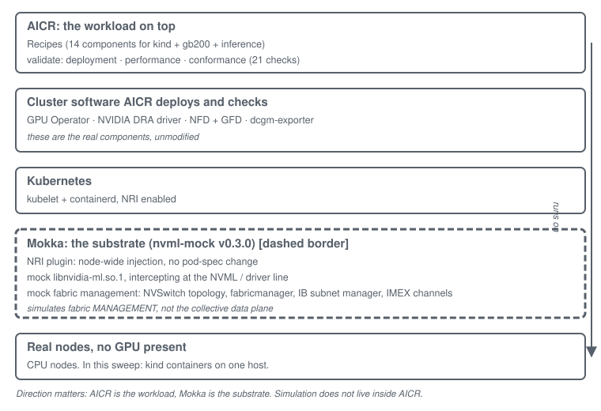
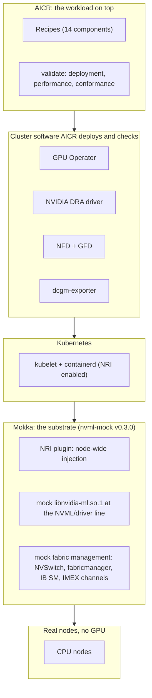
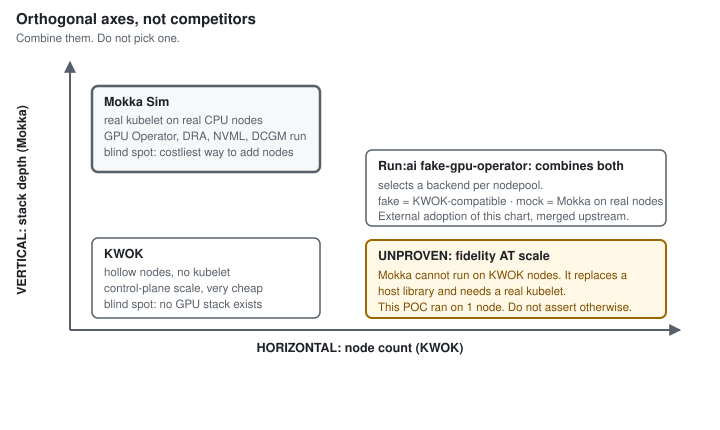

# AICR pre-silicon preflight, on a simulated GPU fleet

You have bought a GPU cluster. It lands in about three months. Your engineers are here now, and there
is nothing for them to integrate against. Whatever breaks when the hardware arrives, you find out
then, on the clock, at scale, with everyone watching.

This page explains a way to move part of that work earlier, what it covers, and what it does not.

## The two pieces

**AICR** (AI Cloud Ready) codifies configurations that have been validated and optimized on real
hardware. It gives a cloud provider a known-good baseline instead of each one rediscovering the stack
independently. It ships recipes (what to deploy) and a validation suite (21 checks across deployment,
performance and conformance phases).

**Mokka** (`nvml-mock`) presents ordinary CPU nodes to Kubernetes as a faithful GPU and fabric fleet.
It intercepts at the NVML and driver line, so the real GPU Operator, the real device plugin, the real
DRA driver, real NFD and GFD, and a real dcgm-exporter all run and see GPUs that are not there.

They compose in one direction, and the direction matters:

**AICR runs unmodified on a Mokka-enabled cluster.** AICR is the workload. Mokka is the substrate
underneath it. Simulation does not live "inside" AICR.

## What this is

A **pre-silicon integration preflight**. It finds integration failures before the hardware lands, so
the hardware time is spent on the things that genuinely need hardware.

**AICR validation on real silicon remains the final readiness gate.** Preflight does not replace it
and cannot.

The defensible claim is that this **reduces** time to first token, by moving integration failures
earlier. It is not a claim that you **hit** first token on day one. Simulation cannot prove that,
because the path that determines first token is exactly the path simulation does not exercise.

## What preflight covers

From a real sweep on 2026-08-03 (kind, Kubernetes 1.36.1, Mokka v0.3.0 `gb200`, AICR `0752ea14`):

- The GPU Operator installs and reconciles against the mock driver surface.
- The device plugin advertises `nvidia.com/gpu` (8 per worker, from the profile).
- `nvidia-smi` works inside a CUDA base-image pod on every GPU node: device-plugin allocation, device
  injection and `dlopen` of `libnvidia-ml.so.1`, end to end.
- A real dcgm-exporter serves `DCGM_FI_DEV_*` telemetry read off the mock NVML.
- The NVIDIA DRA driver publishes ResourceSlices (16 devices across 2 nodes) derived from the mock.
- Ordinary pods see GPUs with **no** resource request, **no** hostPath and **no** pod-spec change,
  through node-wide NRI injection.
- Recipe-level constraints are enforced: the sweep caught a GPU Operator version that violated the
  gb200 recipe's own `>= v25.10.0` floor.

## What preflight does NOT cover

This list is not a disclaimer. It is the reason the final gate stays where it is.

- **CUDA execution.** The mock runs no kernel. `cudaLaunchKernel` is a no-op.
- **Firmware and driver compatibility.** Every version string is configuration text.
- **NCCL, NVLink and NVLS data-plane throughput.** Mokka simulates fabric *management* (NVSwitch
  topology, fabricmanager, InfiniBand subnet manager, IMEX channels). It does not move bytes. NVLink
  counters advance with the clock, not with traffic.
- **Workload time-to-first-token and throughput.** There is no inference to measure.
- **Anything reading GPU memory utilization as evidence of real work.** With the allocation watcher
  enabled, `memory.used` reflects that a claim *exists*. The bytes are synthetic by construction.

In AICR's 21-check suite, 4 checks (three NCCL variants and `inference-perf`) fall entirely in this
category and cannot be judged without hardware.

## What this sweep does NOT tell you

**Nothing about scale.** The sweep ran on three containers on one laptop with a 7.75 GiB budget. Deep
GPU-stack fidelity at large node counts is unproven and is not claimed here.

**No bring-up-time number.** Measuring that needs a real bring-up's failure history to back-test
against. That data was not available, so no time saving is quoted. Treat any such number attributed
to this work as unsupported.

## Mokka and KWOK are orthogonal

The common question is whether this competes with KWOK. It does not.

| | KWOK (horizontal) | Mokka (vertical) |
|---|---|---|
| Layer | API and control plane; no kubelet | Real kubelet and runtime on real CPU nodes; GPU faked at the NVML/driver line |
| Nodes | Hollow; pods reach Running as status only | Real device plugin, DRA driver, GPU Operator, NFD/GFD, dcgm-exporter all run |
| Cost | Very cheap per node | One CPU node per simulated GPU node |
| Good for | Scheduler, API server and etcd at scale | GPU-stack depth: the layer AICR's checks actually read |
| Blind spot | No GPU stack exists, so AICR has nothing to validate | Not the cheapest way to push node count |

AICR already ships a KWOK lane, and its own README draws the line: KWOK validates scheduling, not
runtime, and explicitly not container execution or GPU functionality. `aicr validate` cannot run under
KWOK at all, because every validator is a containerized Job that needs a real pod on a real kubelet.

That is the whole argument for combining them, in AICR's own words rather than ours: KWOK gives
recipe and scheduling breadth cheaply; Mokka is what lets the 21 validator checks run at all before
silicon.

## Where to go next

- [how-it-works.md](how-it-works.md): bring-up order, what runs where, what the mock intercepts.
- [coverage.md](coverage.md): the measured matrix, what needs silicon, and the gap backlog.
- The harness that produced these numbers: [`tests/aicr-sweep/`](../../tests/aicr-sweep/).
