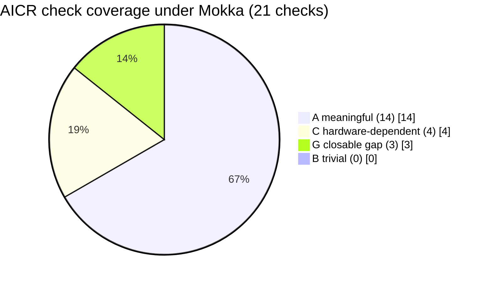

# Coverage: what preflight validates, and what needs silicon

Every number here comes from the run on 2026-07-25 against AICR at commit `06256cc8`. Provenance is
`sim` throughout. Raw output:
[`results/2026-07-25-gb200-kind/`](../../tests/aicr-preflight/results/2026-07-25-gb200-kind/).

## Headline

Of the **21** checks in the AICR validate catalog:

| Bucket | Count | Share |
|---|---:|---:|
| **A** meaningful under Mokka | 14 | 66.7% |
| **B** passes trivially against the mock | 0 | 0% |
| **C** hardware-dependent, silicon only | 4 | 19.0% |
| **G** closable Mokka gap | 3 | 14.3% |

- **Today: 66.7%** carries real pre-silicon signal (A / total).
- **Reachable: 81.0%** once the tracked gaps close ((A + G) / total). Roadmap, not a current claim.
- **Mokka specifically unlocks 42.9%** (9 of 21), because 5 of the 14 bucket-A checks are
  control-plane checks any cluster would run.
- **Executed: 9 of 21** (5 pass, 4 fail). 12 were not selected by the recipe and carry no evidence.

## Per-check breakdown

`GPU-dep` marks whether the check touches the GPU stack at all. A bucket-A check that is not
GPU-dependent moves left, but Mokka is not what unlocks it.

| # | Check | Phase | Bucket | GPU-dep | Outcome | Note |
|---|---|---|---|---|---|---|
| 1 | `operator-health` | deployment | A | yes | pass | real GPU Operator reconciled |
| 2 | `expected-resources` | deployment | A | yes | fail | prerequisite component absent |
| 3 | `gpu-operator-version` | deployment | A | no | pass | version constraint satisfied |
| 4 | `check-nvidia-smi` | deployment | A | yes | **pass** | full allocation-to-NVML chain |
| 5 | `nccl-all-reduce-bw` | performance | C | yes | not run | needs real links |
| 6 | `nccl-all-reduce-bw-net` | performance | C | yes | not run | needs real NET fabric |
| 7 | `nccl-all-reduce-bw-nvls` | performance | C | yes | not run | needs a real IMEX domain |
| 8 | `inference-perf` | performance | C | yes | not run | TTFT and throughput, needs CUDA |
| 9 | `dra-support` | conformance | **G** | yes | fail | [#498](https://github.com/NVIDIA/k8s-test-infra/issues/498) |
| 10 | `gang-scheduling` | conformance | A | no | not run | CPU-only upstream by design |
| 11 | `accelerator-metrics` | conformance | A | yes | pass | real dcgm-exporter path |
| 12 | `ai-service-metrics` | conformance | A | yes | fail | Prometheus absent |
| 13 | `inference-gateway` | conformance | A | no | not run | pure control-plane |
| 14 | `pod-autoscaling` | conformance | A | yes | not run | HPA on a GPU external metric |
| 15 | `cluster-autoscaling` | conformance | **G** | no | not run | [#499](https://github.com/NVIDIA/k8s-test-infra/issues/499) |
| 16 | `robust-controller` | conformance | A | no | not run | operator CRD reconciliation |
| 17 | `secure-accelerator-access` | conformance | A | yes | not run | GPU isolation between containers |
| 18 | `slinky-slurm-health` | conformance | A | yes | not run | needs Slurm deployed |
| 19 | `slinky-slurm-imex-channel` | conformance | **G** | yes | not run | [#498](https://github.com/NVIDIA/k8s-test-infra/issues/498) |
| 20 | `gpu-operator-health` | conformance | A | yes | pass | ClusterPolicy ready, see caveat |
| 21 | `platform-health` | conformance | A | no | fail | 8 namespaces absent |

## Why bucket B is empty

An empty B bucket in a study like this deserves suspicion, so here is the reason. AICR's checks are
written as **integration assertions**, not value assertions, so none is green purely because the mock
answered an API.

The corresponding limitation, which the bucket scheme does not express, is that where Mokka's values
are synthetic a check validates the path and stays silent on the values. `accelerator-metrics`
requires `DCGM_FI_DEV_GPU_UTIL`, `FB_USED`, `GPU_TEMP` and `POWER_USAGE` to be **present**, and
Mokka's `FB_USED` is a constant zero. The exporter-to-NVML path is genuinely exercised. The telemetry
values are checked by nobody.

Two caveats on green results worth carrying:

- **`gpu-operator-health`.** ClusterPolicy reaching `ready` is weaker under Mokka than on silicon,
  because cuda-validation runs with `WITH_WORKLOAD=false` (kernel launch is a no-op) and the toolkit
  stage is short-circuited by a pre-touched readiness marker. Do not read it as validating the driver
  or the toolkit.
- **Three of the four failures** were missing prerequisite components rather than simulation limits.
  That is harness scoping. Evidence the checks read live state: installing the DRA driver mid-run
  moved `platform-health` from 9 missing namespaces to 8.

## What needs silicon, permanently

These four are bucket C by construction. No gap closure reaches them, and they are why AICR validation
on real silicon remains the final readiness gate.

| Area | Checks | Why simulation cannot judge it |
|---|---|---|
| CUDA execution | `inference-perf` | Mokka exports 1 CUDA driver-API symbol (`cuInit`); kernel launch is a no-op |
| Fabric transport | `nccl-all-reduce-bw`, `-net`, `-nvls` | no collective transport, no real links |
| TTFT and throughput | `inference-perf` | needs real model serving on real devices |
| Firmware and driver | (spans several) | `driver.enabled=false`; there is no kernel module |

`nccl-all-reduce-bw-nvls` deserves specific mention: it exists to fail loudly when a broken IMEX domain
makes NCCL silently fall back to NET. That is the GB200 NVL72 failure mode that matters most, and it is
precisely what preflight cannot see.

## Gap backlog

Summary issue: [#502](https://github.com/NVIDIA/k8s-test-infra/issues/502).

| Gap | Issue | Unlocks | Size | Status |
|---|---|---|---:|---|
| No `nvidia-caps-imex-channels` device class, blocks DRA ComputeDomains | [#498](https://github.com/NVIDIA/k8s-test-infra/issues/498) | 2 checks, G to A | M | open |
| No simulated node provisioner | [#499](https://github.com/NVIDIA/k8s-test-infra/issues/499) | 1 check, G to A | M | open |
| GFD e2e assertion warning-only, can never fail | [#500](https://github.com/NVIDIA/k8s-test-infra/issues/500) | test quality, no bucket move | S | closed |

Closing #498 and #499 takes the Mokka-specific share from 42.9% to 57.1% (12 of 21), and the overall
A share from 66.7% to 81.0%.

**#498 is the highest-leverage item** and the only gap on the GB200 critical path, since ComputeDomains
is how IMEX is expressed in DRA.

### Deliberately not filed

**MIG.** Mokka's MIG coverage is zero: every `GpuInstance` and `ComputeInstance` call is a stub. But
**no check in the AICR catalog requires MIG**, so closing it would unlock no coverage. Recorded here so
nobody refiles it as a blocker.

## Scale caveat

The mock replaces `libnvidia-ml.so.1` on the host and needs a real kubelet, so it **cannot run on KWOK
nodes**. This POC ran on **one node** with 8 simulated GPUs, on linux/arm64.

It therefore says nothing about GPU-stack fidelity at KWOK-scale node counts. That combination of
fidelity and scale is a claim to prove, not to assert. [#499](https://github.com/NVIDIA/k8s-test-infra/issues/499)
would compose the two axes for the autoscaling check specifically, and even then it would prove the
control loop only, not node-level fidelity.

## Back-test status

The primary back-test against real DSX-OS GB200 NVL72 bring-up failures is **pending**: no captured
failure set exists in any searchable location, and none was synthesized. Tracked as
[#501](https://github.com/NVIDIA/k8s-test-infra/issues/501).

A clearly-relabelled secondary proxy against real cloud-GB200 failures caught 2 of 4, with both misses
explained by category (kernel and driver state, cloud credential lifetime) rather than by a fixable
gap. See [FINDINGS.md](../../tests/aicr-preflight/FINDINGS.md) section 3 for the table and its four
caveats, including a recorded objection to running the proxy at all.
