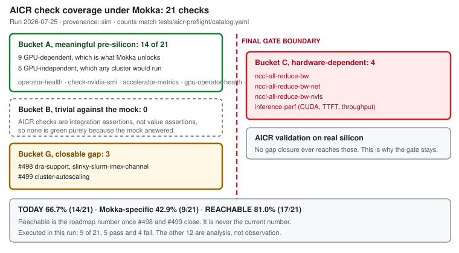
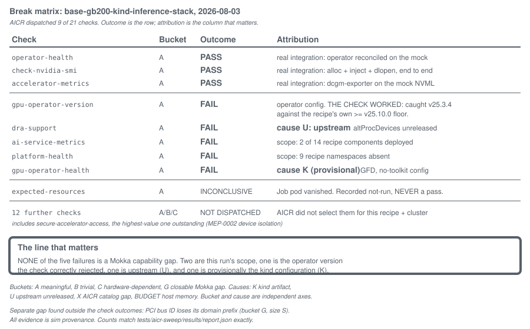

# Coverage: what preflight validates, and what needs silicon

Every number on this page comes from the sweep run on 2026-08-03. The raw results are
[`tests/aicr-sweep/results/report.json`](https://github.com/NVIDIA/k8s-test-infra/blob/main/tests/aicr-sweep/results/report.json); the per-check
reasoning with source citations is
[`tests/aicr-sweep/catalog.yaml`](https://github.com/NVIDIA/k8s-test-infra/blob/main/tests/aicr-sweep/catalog.yaml).

**All evidence is simulation provenance (`sim`).** None of it was run on silicon.

## The suite, split

AICR ships 21 validator checks: 4 deployment, 4 performance, 13 conformance.

| Bucket | Count | Share | What it means for you |
|---|---|---|---|
| **A meaningful** | 16 | 76% | integration work that can move earlier, before silicon |
| **B trivial** | 1 | 5% | preflight does **not** cover this; it would pass either way |
| **C hardware-dependent** | 4 | 19% | why AICR-on-silicon remains the final gate |
| **G closable Mokka gap** | 0 | 0% | none at v0.3.0 |

## Two numbers, and the difference between them

- **Analytical ceiling: 76%** (A / total). What would carry real pre-silicon signal if the full
  14-component recipe stack is deployed. **This is not a measured result.**
- **Reachable once tracked gaps close: 76%** ((A + G) / total). Identical, because no catalogued check
  is blocked by a missing Mokka capability at v0.3.0.
- **Measured in this run: 14%.** AICR dispatched 9 of 21 checks and 3 reached a meaningful pass.

The distance between 14% and 76% is almost entirely the host memory budget: 7.75 GiB held 2 of the 14
recipe components. It is not a Mokka limitation. Re-running on a 32 GiB host is the single highest
value next step, and nothing about Mokka has to change first.

Of the 16 A-bucket checks, **10 are GPU-dependent**. The other 6 (`gpu-operator-version`,
`gang-scheduling`, `inference-gateway`, `cluster-autoscaling`, `robust-controller`, `platform-health`)
run on any cluster at all, so Mokka is not what unlocks them and they should not be counted as GPU
coverage.

## What passed, and what that proves

| Check | What the pass demonstrates |
|---|---|
| `check-nvidia-smi` | device-plugin allocation, device injection and `dlopen` of `libnvidia-ml.so.1`, end to end, inside a real CUDA base image on every GPU node |
| `operator-health` | the real GPU Operator reconciles against the mock driver surface and its operands reach healthy |
| `accelerator-metrics` | a real dcgm-exporter serves `DCGM_FI_DEV_GPU_UTIL`, `FB_USED`, `GPU_TEMP` and `POWER_USAGE` read off the mock NVML |

Alongside those, verified directly rather than through a check: the device plugin advertised
`nvidia.com/gpu: 8` per worker, the DRA driver published 16 devices across 2 ResourceSlices, and a
plain pod with `resources: {}` listed 8 GB200s.

## What failed, and whose problem each one is

| Check | Cause | Attribution |
|---|---|---|
| `gpu-operator-version` | v25.3.4 installed; gb200 recipe requires `>= v25.10.0` | operator config. **The check worked**: this is a version-skew catch, pre-silicon. |
| `dra-support` | ComputeDomain controller absent; enabling it crashes on `/proc/devices` | **U**, upstream. The DRA driver needs `altProcDevices`, on main, in no release including v25.12.0. |
| `ai-service-metrics` | Prometheus not deployed | scope. 2 of 14 recipe components deployed. |
| `platform-health` | 9 recipe namespaces absent | scope, same reason. |
| `gpu-operator-health` | `ClusterPolicy notReady` because GFD crashed | **K**, provisionally. See the gap backlog. |

**None of the five is a Mokka capability gap.**

## What needs silicon, permanently

These four checks are bucket C by construction. No amount of simulation work moves them.

| Check | Why |
|---|---|
| `nccl-all-reduce-bw` | measures collective bus bandwidth; Mokka moves no bytes |
| `nccl-all-reduce-bw-net` | additionally asserts the NET transport carried traffic |
| `nccl-all-reduce-bw-nvls` | additionally asserts NVLS multicast across an NVL72 IMEX domain |
| `inference-perf` | throughput and p99 time-to-first-token from a real vLLM workload |

Note the boundary carefully: Mokka **does** simulate fabric *management*, so NVSwitch topology,
fabricmanager state, the InfiniBand subnet manager and IMEX channel assignment are all reachable and
can be bucket A. Collective *throughput* is not. Those two must never be blurred.

## Gap backlog

One gap found. It is closable and it is small.

| Gap | Blocks | Coverage unlocked | Size | Status |
|---|---|---|---|---|
| PCI bus ID reaches NVML consumers without its domain prefix (`:0a:00.0` instead of `0000:0a:00.0`), breaking `dra.k8s.io/pcieRoot` on the DRA driver and crashing `gpu-feature-discovery` | the `pcieRoot` topology attribute; indirectly `gpu-operator-health` via ClusterPolicy | 1 check moves from fail to testable, plus the topology attribute | S | open |

Two consumers, one symptom, all 8 devices. Evidence:
[`results/pci-busid-evidence.log`](https://github.com/NVIDIA/k8s-test-infra/blob/main/tests/aicr-sweep/results/pci-busid-evidence.log).

This also bears on issue #265, which records `dra.k8s.io/pcieRoot` as unavailable and attributes it to
Go's `os` package bypassing the `LD_PRELOAD` shim. The DRA driver log shows the failure happening
earlier, at bus-ID string parsing, before any sysfs read. That diagnosis is at least incomplete, and
the fix may be considerably smaller than the docs imply.

## Not covered by this sweep, and not claimed

- **Scale.** Three containers on one laptop. Nothing here speaks to node counts.
- **Bring-up time saved.** Measuring it needs a real bring-up's failure history to back-test against.
  That data was not available, so no number is given. Any time saving attributed to this work is
  unsupported.
- **11 of the 21 checks** were never dispatched in this run, including `secure-accelerator-access`,
  which is the highest-value one still outstanding: it directly exercises the MEP-0002 device
  isolation contract.
- **`gb300`.** AICR's catalog has no gb300 accelerator, so there is nothing to run against Mokka's
  gb300 profile. That is an AICR-side decision, not a Mokka gap.
