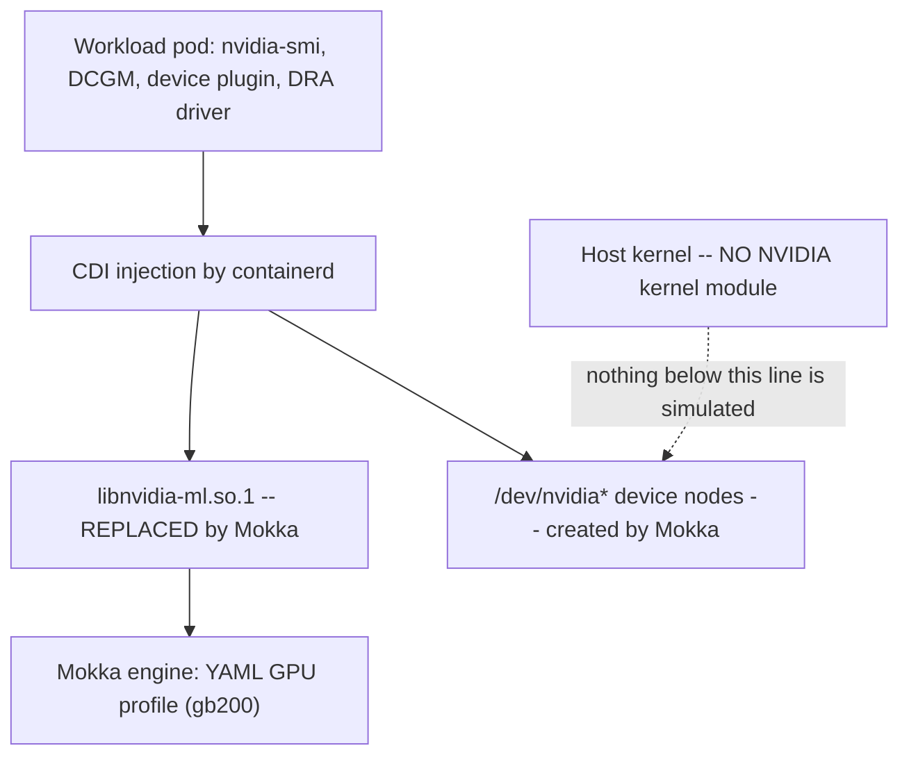

# How pre-silicon preflight works

**Audience:** an engineer who will actually run this.

For the reproducible commands see the [harness README](../../tests/aicr-preflight/README.md). This
page explains the mechanism so the results are interpretable.

## Where the simulation boundary sits

Everything above the NVML and driver line is the real software. Mokka replaces the line itself.



Consequences worth internalising:

- A consumer that calls NVML gets profile-derived answers. That is why GFD labels, device-plugin
  counts, and DRA ResourceSlices are all real code paths producing correct-shaped data.
- A consumer that needs a **kernel module** gets nothing. `driver.enabled=false` is not a workaround,
  it is the boundary.
- A consumer that needs to **compute** gets nothing. Mokka exports one CUDA driver-API symbol,
  `cuInit`. Kernel launch is a documented no-op.

## Bring-up order

1. **Cluster.** Kind or real nodes, with containerd CDI enabled and the NVIDIA runtime handler
   registered.
2. **Container toolkit.** Installed into the node so CDI injection works.
3. **Mokka.** The `nvml-mock` Helm chart with a GPU profile (`gb200`). A privileged DaemonSet writes
   the host driver overlay at `/var/lib/nvml-mock`, creates device nodes, and generates the CDI spec.
   It also labels the node `nvidia.com/gpu.present=true`.
4. **GPU stack.** GPU Operator with `driver.enabled=false` and `toolkit.enabled=false`, since Mokka
   supplies the driver userspace. Then the DRA driver.
5. **AICR.** Generate a recipe, then `aicr validate`.

Order matters: the GPU Operator's operands probe NVML on startup, so Mokka has to be in place first.

## What AICR does when you run it

`aicr validate` deploys containerized validator Jobs into the cluster, one per selected check, and
emits a [CTRF](https://ctrf.io) JSON report. Checks are selected by the recipe, not by the CLI, so the
recipe determines your coverage.

```bash
aicr recipe --service kind --accelerator gb200 --intent inference -o recipe.yaml
aicr validate --recipe recipe.yaml --phase deployment --phase conformance --fail-on-error=false --output ctrf/validate.json
```

`--fail-on-error=false` matters. The goal is to record every outcome, not to stop at the first failure.

Three phases exist:

| Phase | What it covers | Preflight-relevant? |
|---|---|---|
| `deployment` | operator health, expected resources, version constraints, `nvidia-smi` | Yes, this is the core |
| `conformance` | DRA, scheduling, metrics, gateway, autoscaling, isolation | Mostly, per check |
| `performance` | NCCL bandwidth, inference throughput and TTFT | No, needs silicon |

## How the classification works

The harness joins two independent things:

- **The catalog** (`tests/aicr-preflight/catalog.yaml`) carries the analytical judgment: which bucket
  each check belongs in, why, and the source evidence. It is reviewable without running anything.
- **The run** supplies only the observed outcome.

The harness never edits a bucket. That separation is what makes the catalog auditable: you can
disagree with a bucket assignment by reading the rationale, without re-running anything.

```bash
go run ./tests/aicr-preflight -ctrf ctrf -markdown coverage.md -json report.json -provenance sim
```

## Reading the buckets

| Bucket | Question it answers | How to act on it |
|---|---|---|
| **A** | Does this exercise real integration that could fail for a real reason? | Fix failures now, pre-silicon |
| **B** | Is this green only because the mock answered? | Ignore as coverage; it bounds the claim |
| **C** | Does this need real hardware? | Schedule it for silicon; it is why the final gate exists |
| **G** | Would this be meaningful, but Mokka lacks the capability? | Roadmap; every G row links a tracked issue |

Bucket A is additionally split by `gpuDependent`. A bucket-A check that is GPU-independent
(`gang-scheduling` is deliberately CPU-only upstream) still moves left, but any cluster runs it, so
Mokka is not what unlocks it. Do not count those toward what simulation bought you.

## Triaging a failure

A failing check is not automatically a simulation limit. Separate three causes before concluding
anything:

1. **Missing prerequisite component.** A recipe declaring 14 components run against a cluster with 2
   of them will fail `platform-health` on absent namespaces. That is your scoping, not Mokka's limit.
2. **Version or contract skew** between AICR and the component it inspects. These are real integration
   findings and are exactly what preflight is for.
3. **A genuine Mokka capability gap.** Only these are bucket G, and each needs a tracked issue.

A worked example of the third case, from the reference run. `dra-support` failed on a missing
`nvidia-dra-driver-gpu-controller` Deployment. That Deployment is templated only when
`resources.computeDomains.enabled=true`. Enabling it produced:

```
error getting nvcap for IMEX channel '0': error getting device major:
error parsing '/proc/devices': unexpected regex match: []
```

The check was right and the cluster was wrong. The gap is closable, and it is smaller than it first
looks: the DRA driver already exposes an `altProcDevices` value (documented example path:
`/var/lib/nvml-mock/imex/proc-devices`) that mounts an alternate file and passes
`ALT_PROC_DEVICES_PATH`, and its own CI builds that surface against `nvml-mock`. What is missing is
that `nvml-mock` does not ship the surface and the released NGC chart has no `altProcDevices` key.
Tracked as [#498](https://github.com/NVIDIA/k8s-test-infra/issues/498).

Two wrong hypotheses preceded that conclusion, which is the point of the triage step. The first was
that AICR carried a stale expectation; checking the chart templates disproved it. The second was that
Mokka needed a way to fake `/proc/devices` invented from scratch; reading the DRA driver's own CI
disproved that too. Do not stop at the first plausible story.

Also worth knowing: mounting a file over `/proc/devices` inside a container does not work, because
runc rejects it. That is exactly why the `ALT_PROC_DEVICES_PATH` indirection exists.

## Guarantees the harness gives you

Built in, and unit-tested:

1. A check the run never reported is recorded `not-run`, never promoted to a pass.
2. CTRF `pending` and `other` map to `not-run` rather than being laundered into a pass.
3. A bucket-C check reporting green under `sim` provenance is flagged `suspect`.
4. Every record carries `sim` or `silicon` provenance.
5. A bucket-G row without a tracked issue fails catalog validation.
6. A check in the run but absent from the catalog is reported as catalog drift.

The intent is that an incomplete or broken run degrades to "not run" rather than to a favourable
number.

## Known operational notes

- The reference run used linux/arm64, which is the correct architecture for GB200 since Grace is ARM.
- A single-node cluster with roughly 8 GiB of container memory runs the GPU Operator plus the DRA
  driver. The full 14-component recipe needs considerably more.
- `expected-resources` can take several minutes and produced a transient `other` status on one run
  before reporting a real verdict on the next. Treat `other` as "no verdict" and re-run.
