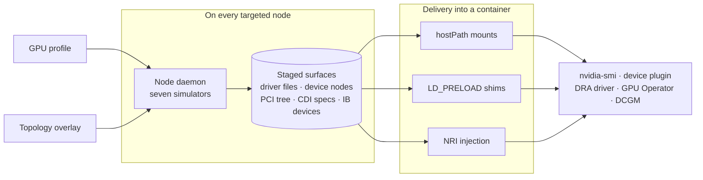

# Architecture

The main idea of Mokka is to simulate very low-level system contracts,
so that higher layer components work meaningfully without any modifications.

This is achieved via simulation of device status, PCI trees, driver footprints for GPU and networking.
The lower level we operate, the better here as we expand the number of real workflows that are executed (vs. being completely disabled or mocked away).

Higher level applications are our consumers:
- platform components such as [nvidia-smi](https://docs.nvidia.com/deploy/nvidia-smi/index.html), [K8s DRA driver](https://github.com/kubernetes-sigs/dra-driver-nvidia-gpu), [NFD](https://github.com/kubernetes-sigs/node-feature-discovery), [GPU Operator](https://github.com/nvidia/gpu-operator), [Network Operator](https://github.com/Mellanox/network-operator), [Topograph](https://github.com/NVIDIA/topograph), etc.
- applications like [Slurm](https://github.com/SlinkyProject/slurm-operator), [NVSentinel](https://github.com/nvidia/nvsentinel), etc.

We don't try to mock a specific higher layer component or use case, but rather focus on the simulation of contracts between lower and higher layers.
This should help to support a wide range of higher layer applications that we don't know or have access to (for example, neocloud's proprietary AI infrastructure services).

Mokka provides a mock driver that looks like the real one to management tooling.
Same libraries and file footprints, no real kernel module, no GPU data path.
That is why nvidia-smi can run unmodified, and why module surfaces such as what `lsmod` reads belong in the same story.
GPU identity and behavior come from config profiles (different chips, counts, topology), with tools to change health and fault state at runtime.

## Contract surfaces

Mocking a single interface (for example NVML alone) can prove a GPU can be *allocated*.
Many K8s control-plane consumers read a broader evidence surface than allocation alone: NVML / nvidia-smi, PCI and sysfs trees, and kernel or driver footprints under `/proc` and `/sys` (including module state such as `lsmod`).

Not every surface is covered yet. See
[what is not simulated yet](faq.md#what-is-not-simulated-yet) in the FAQ.

## Independent failure and attribution

Layers form a dependency stack, but each layer must be able to fail on its own while others stay healthy.
Which layer broke decides the owner, the remediation path, and the urgency.

For the mock, that means each simulated surface has to be controllable independently.
A GPU can show up in the PCI tree with no driver footprint; that is a normal failure mode, and the mock needs to reproduce it.
If surfaces can only be turned on together, the layers collapse into one failure and attribution cannot be tested.

## Delivery

Simulated file surfaces also have to be visible at the paths consumers already use.
Pointing a consumer at a substitute path with a flag only works when that flag exists, and it no longer tests that the consumer reads the real path.

`LD_PRELOAD` can rewrite libc calls for C tools such as `lspci` and `ibv_devinfo`.
It does not work for Go binaries: they make syscalls directly and never go through the preloaded library.
Most of the Kubernetes control plane is Go, so file surfaces need to be mounted into the container instead of intercepted.

## The moving parts

| Component | Runs as | Responsibility |
|---|---|---|
| Node daemon | DaemonSet container, one per node | Stages every simulated surface onto the host and supervises the long-lived ones |
| Simulators | Packages inside the node daemon | One per surface: GPU driver, PCI bus, CDI, IMEX, NVLink, fabricmanager, InfiniBand |
| Mock NVML library | Shared object loaded by each consumer process | Answers NVML calls from the profile instead of a driver |
| Shims | `LD_PRELOAD` libraries and an `execve` wrapper | Make C tools read the staged tree at the real paths |
| NRI plugin | Optional DaemonSet | Injects the mock into containers that never requested a GPU |
| Allocation watcher | Sidecar next to the node daemon | Reads the kubelet pod-resources socket to see which GPUs are claimed |
| `nvml-mock-ctl` | CLI, run against a node | Changes simulated state at runtime without a redeploy |
| Control plane | Deployment, disabled by default | Health probes only today; see MEP-0001 for the intent |

The **GPU profile** is the single input. It names the model, count, topology and
health, and every component above derives its behaviour from it. Swapping
profiles changes what the whole node appears to be.

## How they connect

### Three ways a surface reaches a consumer

A staged file is useless if the consumer looks somewhere else, so Mokka has
three delivery paths and uses whichever the consumer's runtime allows:

| Mechanism | Works for | Used because |
|---|---|---|
| hostPath mounts | anything, including Go binaries | the only approach that survives direct syscalls |
| `LD_PRELOAD` shims | C tools — `lspci`, `ibv_devinfo` | rewrites libc path calls, so tools read the mock tree at real paths |
| NRI injection | pods with no GPU request | adds devices and mounts at container-create time, with no pod spec change |

## How the system behaves

### A node comes up

The daemon reads the profile, stages all seven simulators in parallel, waits for
that wave to finish, then starts the long-lived processes. If any simulator
fails to stage, no daemon starts: a half-built node is worse than an obviously
broken one. Teardown reverses it on a timeout that outlives context
cancellation, so a deleted pod still cleans up after itself.

### A consumer reads a GPU

`nvidia-smi` and the device plugin load the mock library in their own process
and get values from the profile. `lspci` and `ibv_devinfo` are C tools, so a
shim rewrites their paths into the staged tree. Go consumers bypass shims
entirely and read the hostPath mounts. All three paths describe the same node.

### State changes at runtime

There is no daemon to send a command to — the library lives inside each
consumer process. `nvml-mock-ctl` instead writes an override file next to the
profile, and every loaded copy of the library re-reads it on a short TTL and
merges it over the base. Running and newly started processes converge on the
new state within one interval, and the base profile is never mutated. See
[Runtime Control](nvml-mock-ctl.md).

### A GPU fails

Failure is a configuration state, not a special path: a profile or an override
marks a device as ECC-faulted, lost, or fallen off the bus, and every surface
reports it consistently. That is what makes the failure legible to a consumer —
the device plugin, DCGM and `nvidia-smi` agree, exactly as they would on real
hardware.

### The fleet is heterogeneous

Each release targets a node set, so different nodes can run different profiles
at once. A cluster can present A100 and T4 workers side by side without either
being real.

## Where to go next

| To understand | Read |
|---|---|
| How a node gets its simulated surfaces | [Node Daemon](components/node-daemon.md) |
| How the mock library answers a call | [Mock NVML Library](components/mock-nvml.md) |
| How a pod gets GPUs without asking | [NRI Plugin](components/nri-plugin.md) |
| How unmodified C tools read the mock tree | [Shims](components/shims.md) |
| Every knob in the profile | [Configuration](configuration.md) |
| Deploying and shaping a cluster | [Installation](helm-chart.md) |
| Changing state on a running node | [Runtime Control](nvml-mock-ctl.md) |
| Adding functions or profiles | [Contributing](contributing/index.md) |
