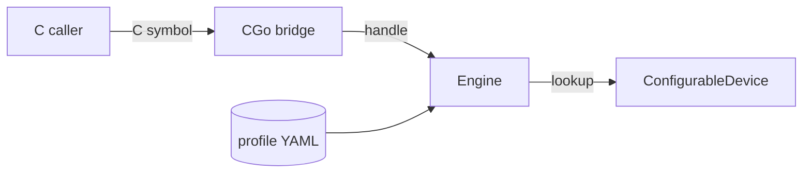

# Mock NVML Library

The component that answers NVML calls. It is a real `libnvidia-ml.so` that
`nvidia-smi`, DCGM, the device plugin and the DRA driver load exactly as they
would the vendor library — but it reads a YAML profile instead of a driver and
a GPU.

For where it sits in the wider system, see the
[architecture overview](../architecture.md).

## It runs inside each consumer, not as a service

There is no daemon. Every process that loads the library gets its own copy of
the engine, its own device objects and its own view of the node. Two consumers
on the same node agree because they read the same configuration, not because
they talk to anything shared.

That single fact explains most of the component's behaviour — including why
runtime changes are delivered as a file rather than a command.

## How a call is answered



A consumer calls a C symbol. The bridge converts arguments across the CGo
boundary and resolves the opaque device handle to a Go object. That object
answers from configuration, and the value travels back out the same way,
converted to C types at the bridge.

Handles are opaque pointers, valid from `nvmlInit` until the matching
`nvmlShutdown`. Initialisation is reference-counted, so a consumer that
initialises twice must shut down twice. On the final shutdown handles are
invalidated and their addresses are never reused — a stale handle is rejected
rather than silently resolving to a different device.

The library is safe to use from multiple threads.

## What decides the answer

Two inputs, merged in a fixed order:

| Input | Changes | Scope |
|---|---|---|
| The GPU profile | At install or `helm upgrade` | The node's static identity: model, count, memory, topology |
| Runtime overrides | At any time, without a restart | Health and telemetry: temperature, power, utilisation, clocks, ECC state, failure modes |

Because the library is per-process, an override cannot be pushed to it. It is
written to a file beside the profile instead, and every loaded copy re-reads
that file on a short TTL and merges it over the base. Running and newly started
processes converge within one interval, and the profile itself is never mutated.
See [Runtime Control](../nvml-mock-ctl.md).

## Implemented versus stubbed

NVML is large, and not every function has a hand-written implementation. Those
that do not still **export a symbol** and return `NVML_ERROR_NOT_SUPPORTED`.

This matters more than it sounds. A consumer that probes for a function gets a
truthful "not supported" and takes its fallback path — the same thing it would
do against an older real driver. A missing symbol would instead fail the dynamic
link and crash the consumer at load.

For the current split:

```bash
go run ./cmd/generate-bridge -input $GO_NVML_DIR/pkg/nvml/nvml.go --stats
```

The stub layer is generated from NVML's own header, so adding a hand-written
implementation removes its stub automatically. See the
[contributing guide](../contributing/index.md) for that workflow.

## Limits

The library answers management calls. It has no data path: nothing computes, and
no memory is allocated on a device that does not exist. Anything that needs a
real GPU to *do work* rather than *report state* is out of scope.

CUDA simulation on CPU is not supported as of now. For the other surfaces Mokka
does not simulate, see
[what is not simulated yet](../faq.md#what-is-not-simulated-yet).

## Related

| To read about | See |
|---|---|
| How the whole system fits together | [Architecture](../architecture.md) |
| What stages this library onto a node | [Node Daemon](node-daemon.md) |
| Every profile knob | [Configuration](../configuration.md) |
| Changing state at runtime | [Runtime Control](../nvml-mock-ctl.md) |
| Adding functions or profiles | [Contributing](../contributing/index.md) |
