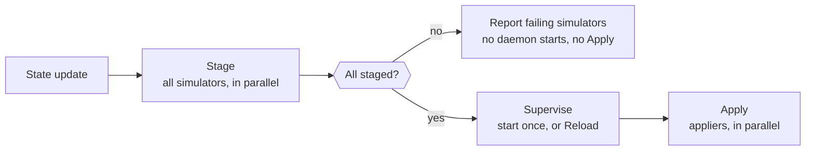

# Node Daemon

The component that makes a node look like it has GPUs. One instance runs on
every targeted node as the DaemonSet's main container, and everything a
consumer later reads — driver files, device nodes, the PCI tree, CDI specs,
InfiniBand devices — was put there by this process.

It is a level-triggered reconciler, not a one-shot installer: it compiles a
desired state from the GPU profile and converges the node onto it, repeating
that whenever the profile changes.

!!! note "It still ships as `node-agent`"
    The container, its binary and the `nodeAgent` chart values block are all
    named `node-agent` for now, so that is what `kubectl` and `values.yaml`
    show. The rename to *daemon* is in progress.

For where it sits in the wider system, see the
[architecture overview](../architecture.md).

## Simulators

The daemon owns no simulation logic itself. Each surface is a **simulator**, and
the daemon's job is to run them in the right order and supervise the ones that
outlive a reconcile.

| Simulator | Stages |
|---|---|
| `gpudriver` | Character devices, the mock NVML library, `nvidia-smi`, procfs entries, the engine config, and the `/run/nvidia/driver` symlink the GPU Operator expects |
| `pcibus` | A fake `/sys/bus/pci/devices` tree, the `libpcisysfs.so` shim, and the NFD feature file that lets Node Feature Discovery label the node |
| `cdi` | Two CDI specs that containerd uses to inject mock GPUs into workload containers |
| `imex` | IMEX channel character devices, a `/proc/devices` overlay, and the capability file the DRA compute-domain plugin reads |
| `nvlink` | The ComputeDomain topology document, which gives the node its NVLink fabric identity |
| `fabricmanager` | A stand-in for `nv-fabricmanager`, which on a real NVSwitch platform must register GPUs before they are usable |
| `ib` | A fake `/sys/class/infiniband` tree, the IB shims and CLI tools, and the `mock-ib` daemon serving UMAD and verbs |

## The reconcile lifecycle

A simulator implements one required interface and up to two optional ones. Which
it implements decides when the daemon calls it.

| Interface | Implemented by | Purpose |
|---|---|---|
| `Simulator` | all seven | `Stage` writes artifacts that are not yet externally visible. Idempotent, re-runs on every state change |
| `Applier` | `gpudriver`, `pcibus`, `cdi` | `Apply` publishes artifacts that something *outside* the node acts on — containerd, NFD, the GPU Operator validator |
| `Daemon` | `fabricmanager`, `ib` | `Run` supervises a long-lived process; `Reload` delivers later state to it without a restart |

One reconcile pass runs three waves:

The split between `Stage` and `Apply` is the important part. Staging is private:
files exist but nothing outside the node is looking at them yet. Publishing is
what makes them real to containerd, NFD and the operator. Separating the two
means a node is never half-visible — either every surface staged and then all of
them publish, or nothing publishes at all.

The two waves handle failure differently, on purpose:

- **Stage collects every error.** A single reconcile reports all the simulators
  that failed, not just the first, so one pass tells you everything that is
  wrong.
- **Apply fails fast.** Appliers depend on each other — the CDI spec references
  character devices `gpudriver` must have staged — so continuing past the first
  failure would publish something incoherent.

**Daemons start exactly once**, on the first successful barrier. A daemon owns a
socket or a port, so a second instance would contend for it rather than converge
with it. Later state reaches a running daemon through `Reload`, which is why a
profile edit does not need a pod restart.

## Health

Both probes are served on port 9091 and answer different questions:

| Probe | Passes when | Reports |
|---|---|---|
| `/healthz` | the last `Stage` wave completed without error | which simulators failed, when they did. Recovers on the next successful `Stage` |
| `/readyz` | every simulator reports itself ready | which simulator is not serving |

Neither consults the state source. Liveness reflects what staging did, not
whether new state can be fetched — so an unreachable source leaves the node
serving what it already staged instead of triggering a fleet-wide restart.

## Where the desired state comes from

A **state source** feeds the daemon. Today one implementation ships: a file
source that watches the profile and the topology document, emitting an update
whenever either changes.

It polls the containing *directories* rather than the files. A ConfigMap update
is an atomic symlink swap, so watching a file directly would pin the replaced
inode and the daemon would never see the change.

A control-plane source is stubbed for [MEP-0001](https://github.com/NVIDIA/k8s-test-infra/tree/main/enhancements/meps/0001-mokka-control-plane),
which would let a cluster-wide component drive node state instead of a
ConfigMap. It is not implemented; the file source is the only path in use.

## Shutdown

Teardown is the inverse of a reconcile, and runs even when the daemon is exiting
because something failed:

1. **Revoke** on every applier — stop publishing, so nothing outside the node
   keeps acting on artifacts that are about to disappear.
2. **Discard** on every simulator — remove the staged artifacts.

Both waves run concurrently and best-effort: a failure in one simulator's
teardown does not prevent the others from cleaning up. The teardown context
outlives cancellation of the daemon's own context, so a deleted pod still gets
the chance to leave the node as it found it.

## Related

| To read about | See |
|---|---|
| How the whole system fits together | [Architecture](../architecture.md) |
| The library the daemon stages | [Mock NVML Library](mock-nvml.md) |
| Every profile knob the daemon compiles | [Configuration](../configuration.md) |
| Changing simulated state without a redeploy | [Runtime Control](../nvml-mock-ctl.md) |
