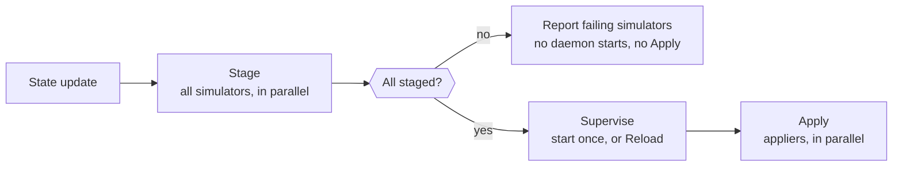

# Node Daemon

The component that makes a node look like it has GPUs. One instance runs on
every targeted node as the DaemonSet's main container, and everything a
consumer later reads — driver files, device nodes, the PCI tree, CDI specs,
InfiniBand devices — was put there by this process.

It is a level-triggered reconciler, not a one-shot installer: it compiles a
desired state from the GPU profile and converges the node onto it, repeating
that whenever the profile changes.

!!! note "It still ships as `node-agent`"
    The container, its binary and the `nodeAgent` chart values block are all
    named `node-agent` for now, so that is what `kubectl` and `values.yaml`
    show. The rename to *daemon* is in progress.

For where it sits in the wider system, see the
[architecture overview](../architecture.md).

## Simulators

The daemon owns no simulation logic itself. Each surface is a **simulator**, and
the daemon's job is to run them in the right order and supervise the ones that
outlive a reconcile.

| Simulator | Stages                                                                                                                                                   |
|---|----------------------------------------------------------------------------------------------------------------------------------------------------------|
| `gpudriver` | Character devices, the mock NVML library, `nvidia-smi`, procfs entries, the engine config, and a bind mount of the driver tree at `/run/nvidia/driver`, the path GPU Operator expects |
| `pcibus` | A fake `/sys/bus/pci/devices` tree, the `libmockfs.so` shim, and the NFD feature file that lets Node Feature Discovery label the node                  |
| `cri` | Two CDI specs that containerd uses to inject mock GPUs into workload containers, and the [container runtime setup](#container-runtime-setup) that registers the `nvidia` handler |
| `imex` | IMEX channel character devices, a `/proc/devices` overlay, and the capability file the DRA compute-domain plugin reads                                   |
| `nvlink` | The ComputeDomain topology document, which gives the node its NVLink fabric identity                                                                     |
| `fabricmanager` | A stand-in for `nv-fabricmanager`, which on a real NVSwitch platform must register GPUs before they are usable                                           |
| `ib` | A fake `/sys/class/infiniband` tree, the IB shims and CLI tools, and the `mock-ib` daemon serving UMAD and verbs                                         |
| `kernellog` | Announces injected Xids on the node's kernel log, the way a driver's printk does                                                                         |

## The reconcile lifecycle

A simulator implements one required interface and up to two optional ones. Which
it implements decides when the daemon calls it.

| Interface | Implemented by | Purpose |
|---|---|---|
| `Simulator` | all eight | `Stage` writes artifacts that are not yet externally visible. Idempotent, re-runs on every state change |
| `Applier` | `gpudriver`, `pcibus`, `cri` | `Apply` publishes artifacts that something *outside* the node acts on — containerd, NFD, the GPU Operator validator |
| `Daemon` | `fabricmanager`, `ib`, `kernellog` | `Run` supervises a long-lived process; `Reload` delivers later state to it without a restart |

One reconcile pass runs three waves:


```mermaid
flowchart LR
    state[State update] --> stage[Stage<br/>all simulators, in parallel]
    stage --> barrier{{All staged?}}
    barrier -->|no| fail[Report failing simulators<br/>no daemon starts, no Apply]
    barrier -->|yes| daemons[Supervise<br/>start once, or Reload]
    daemons --> apply[Apply<br/>appliers, in parallel]
```

The split between `Stage` and `Apply` is the important part. Staging is private:
files exist but nothing outside the node is looking at them yet. Publishing is
what makes them real to containerd, NFD and the operator. Separating the two
means a node is never half-visible — either every surface staged and then all of
them publish, or nothing publishes at all.

The two waves handle failure differently, on purpose:

- **Stage collects every error.** A single reconcile reports all the simulators
  that failed, not just the first, so one pass tells you everything that is
  wrong.
- **Apply fails fast.** Appliers depend on each other — the CDI spec references
  character devices `gpudriver` must have staged — so continuing past the first
  failure would publish something incoherent.

**Daemons start exactly once**, on the first successful barrier. A daemon owns a
socket or a port, so a second instance would contend for it rather than converge
with it. Later state reaches a running daemon through `Reload`, which is why a
profile edit does not need a pod restart.

## Health

Both probes are served on port 9091 and answer different questions:

| Probe | Passes when | Reports |
|---|---|---|
| `/healthz` | the last `Stage` wave completed without error | which simulators failed, when they did. Recovers on the next successful `Stage` |
| `/readyz` | every simulator reports itself ready | which simulator is not serving |

Neither consults the state source. Liveness reflects what staging did, not
whether new state can be fetched — so an unreachable source leaves the node
serving what it already staged instead of triggering a fleet-wide restart.

## Where the desired state comes from

A **state source** feeds the daemon. Today one implementation ships: a file
source that watches the profile and the topology document, emitting an update
whenever either changes.

It watches the containing *directories* rather than the files, through
filesystem events. A ConfigMap update and an editor's save both replace the
file's inode — the kubelet by renaming the atomic `..data` symlink — so a watch
on the file itself would hold the one just replaced. A path reached through a
symlink is watched at both ends, so an edit behind `/etc/mokka/config.yaml`
arrives too.

`--resync-interval` re-reads both documents regardless of events, covering a
node whose kernel reports none: a profile on NFS, or a host at its inotify
watch limit.

A control-plane source is stubbed for [MEP-0001](https://github.com/NVIDIA/k8s-test-infra/tree/main/enhancements/meps/0001-mokka-control-plane),
which would let a cluster-wide component drive node state instead of a
ConfigMap. It is not implemented; the file source is the only path in use.

## Container runtime setup

The `cri` simulator also prepares the node's container runtime for those specs,
as [MEP-0006](https://github.com/NVIDIA/k8s-test-infra/tree/main/enhancements/meps/0006-automatic-cdi-setup)
describes. It is on by default (`nodeAgent.containerRuntime.enabled`), and
containerd is the only runtime it sets up so far.

The simulator installs the NVIDIA Container Toolkit release that ships in the
image. That release's own `nvidia-ctk` then registers the toolkit's runtime with
containerd as the `nvidia` handler, in CDI mode, and makes it the default
handler:

```text
nvidia-ctk runtime configure --runtime=containerd --config-source=file \
  --config=/etc/containerd/config.toml \
  --drop-in-config=/etc/containerd/conf.d/50-mokka.toml \
  --nvidia-runtime-name=nvidia \
  --nvidia-runtime-path=/usr/bin/nvidia-container-runtime \
  --nvidia-set-as-default \
  --cdi.enabled
```

| Path on the node | Content |
|---|---|
| `/usr/local/nvml-mock/toolkit/` | `nvidia-container-runtime`, `nvidia-ctk` and `nvidia-cdi-hook` from the toolkit release in the image, and the runtime's `config.toml` |
| `/usr/bin/nvidia-container-runtime`, `nvidia-ctk`, `nvidia-cdi-hook` | links into the toolkit directory, where a package install puts the binaries |
| `/etc/nvidia-container-runtime/config.toml` | a link to the runtime's configuration: CDI mode, default kind `nvidia.com/gpu` |
| `/etc/containerd/conf.d/50-mokka.toml` | Mokka's config file, which `nvidia-ctk` writes: the `nvidia` handler as the default, and `enable_cdi = true` |
| `imports` in `/etc/containerd/config.toml` | the `conf.d/*.toml` glob, which `nvidia-ctk` adds when no entry covers it. `nvidia-ctk` rewrites the file on every run, so comments in it are lost |

containerd's config dir, where Mokka's config file goes, is
`nodeAgent.containerRuntime.containerd.configDir`, `/etc/containerd/conf.d`
unless set.

Every container on the node then runs under the NVIDIA runtime. A container
whose `NVIDIA_VISIBLE_DEVICES` names GPUs, as the device plugin sets it, gets
the mock driver for those GPUs; one without the variable runs as it would under
`runc`. Pods that name `runtimeClassName: nvidia`, as the GPU Operator's own
pods do, get the same handler. The revert removes the default with Mokka's
config file, so the node goes back to its own default handler.

The toolkit's classic setup and the EKS accelerated AMI configure a node the
same way. The GPU Operator with CDI on keeps `runc` as the default instead and
serves workloads through containerd's own CDI support, which works on a Mokka
node too.

**When containerd restarts.** Apply restarts containerd through the host's
systemd when Mokka's config file changed, and once when a node pod starts. For
this the node pod runs in the host's PID namespace, because systemctl refuses
to talk to a systemd it cannot see. If containerd does not come back, the node
pod is not ready and its log has the error; `journalctl -u containerd` on the
node says why. No new container starts on that node until containerd runs
again: remove Mokka's config file by hand, as below, to bring it back without
the handler. With `restartMode: none` the file is written, the node pod stays
ready, and its log says a restart is pending; the pod then keeps its own PID
namespace.

**Nodes it leaves alone.** A node with no `containerd` on the host's `PATH`
runs another runtime, such as CRI-O, or the containerd that k3s and rke2 embed:
the simulator installs nothing and logs a warning. A toolkit file at one of the
package paths that the simulator did not link means another installer prepared
the node: it installs nothing and leaves containerd alone. In both cases the
node pod stays ready, and its log says why.

**When the node pod stops.** Revoke deletes Mokka's config file and queues a
containerd restart, which systemd finishes after the pod is gone.
`helm uninstall` thus leaves no Mokka handler in containerd, and a rollout
restarts containerd twice on each node: once as the old pod stops, once as the
new one sets up. The chart refuses a rollout with `maxSurge` while the setup is
on, because the old pod's revert would remove the new pod's setup. The binaries
stay, because containers created through the handler call the runtime for
`exec`, `kill` and `delete`.

**GPU Operator.** Install it with `toolkit.enabled=false`. The operator's
toolkit cannot run on a node without the NVIDIA kernel module, and this
simulator does its job.

**Requirements.** containerd 1.7 or later, systemd or `restartMode: none`, and
writable `/usr/bin`, `/usr/local` and `/etc` on the node. Where containerd runs
but the node cannot be set up, such as Bottlerocket or a read-only `/usr`, set
`nodeAgent.containerRuntime.enabled=false`.

**Removing it by hand.** A node pod that was killed before it ran Revoke leaves
the setup behind. On the node:

```bash
rm -f /etc/containerd/conf.d/50-mokka.toml
systemctl restart containerd
# Once no container runs under the nvidia handler any more:
rm -f /usr/bin/nvidia-container-runtime /usr/bin/nvidia-ctk /usr/bin/nvidia-cdi-hook \
  /etc/nvidia-container-runtime/config.toml
rm -rf /usr/local/nvml-mock
```

Revoke leaves the `conf.d/*.toml` entry `nvidia-ctk` added to `imports` in
place, and with the directory empty it loads nothing; remove it from
`config.toml` if you prefer.

## Shutdown

Teardown is the inverse of a reconcile, and runs even when the daemon is exiting
because something failed:

1. **Revoke** on every applier — stop publishing, so nothing outside the node
   keeps acting on artifacts that are about to disappear.
2. **Discard** on every simulator — remove the staged artifacts.

Both waves run concurrently and best-effort: a failure in one simulator's
teardown does not prevent the others from cleaning up. The `cri` simulator's
Revoke also reverts the [container runtime setup](#container-runtime-setup). The teardown context
outlives cancellation of the daemon's own context, so a deleted pod still gets
the chance to leave the node as it found it.

## Related

| To read about | See |
|---|---|
| How the whole system fits together | [Architecture](../architecture.md) |
| The libraries and shims the daemon stages | [Libraries and Shims](libraries-and-shims.md) |
| Every profile knob the daemon compiles | [Configuration](../configuration.md) |
| Changing simulated state without a redeploy | [Runtime Control](../nvml-mock-ctl.md) |
