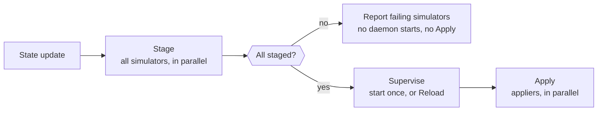

# Node Daemon

The component that makes a node look like it has GPUs. One instance runs on
every targeted node as the DaemonSet's main container, and everything a
consumer later reads — driver files, device nodes, the PCI tree, CDI specs,
InfiniBand devices — was put there by this process.

It is a level-triggered reconciler, not a one-shot installer: it compiles a
desired state from the GPU profile and converges the node onto it, repeating
that whenever the profile changes.

!!! note "It still ships as `node-agent`"
    The container, its binary and the `nodeAgent` chart values block are all
    named `node-agent` for now, so that is what `kubectl` and `values.yaml`
    show. The rename to *daemon* is in progress.

For where it sits in the wider system, see the
[architecture overview](../architecture.md).

## Simulators

The daemon owns no simulation logic itself. Each surface is a **simulator**, and
the daemon's job is to run them in the right order and supervise the ones that
outlive a reconcile.

| Simulator | Stages                                                                                                                                                   |
|---|----------------------------------------------------------------------------------------------------------------------------------------------------------|
| `gpudriver` | Character devices, the mock NVML library, `nvidia-smi`, procfs entries, the engine config, and a bind mount of the driver tree at `/run/nvidia/driver`, the path GPU Operator expects |
| `pcibus` | A fake `/sys/bus/pci/devices` tree, the `libmockfs.so` shim, and the NFD feature file that lets Node Feature Discovery label the node                  |
| `cdi` | Two CDI specs that containerd uses to inject mock GPUs into workload containers                                                                          |
| `imex` | IMEX channel character devices, a `/proc/devices` overlay, and the capability file the DRA compute-domain plugin reads                                   |
| `nvlink` | The ComputeDomain topology document, which gives the node its NVLink fabric identity                                                                     |
| `fabricmanager` | A stand-in for `nv-fabricmanager`, which on a real NVSwitch platform must register GPUs before they are usable                                           |
| `ib` | A fake `/sys/class/infiniband` tree, the IB shims and CLI tools, and the `mock-ib` daemon serving UMAD and verbs                                         |
| `kernellog` | Announces injected Xids on the node's kernel log, the way a driver's printk does                                                                         |
| `dmi` | A system identity at `/sys/devices/virtual/dmi/id` on a node whose kernel exposes none, and its copy in the served PCI tree — see [DMI](#dmi) |
| `numa` | The profile's NUMA nodes at `/sys/bus/node/devices`, only on a node whose kernel exposes none — see [NUMA](#numa) |

## The reconcile lifecycle

A simulator implements one required interface and up to two optional ones. Which
it implements decides when the daemon calls it.

| Interface | Implemented by | Purpose |
|---|---|---|
| `Simulator` | all ten | `Stage` writes artifacts that are not yet externally visible. Idempotent, re-runs on every state change |
| `Applier` | `gpudriver`, `pcibus`, `cdi`, `dmi`, `numa` | `Apply` publishes artifacts that something *outside* the node acts on — containerd, NFD, the GPU Operator validator |
| `Daemon` | `fabricmanager`, `ib`, `kernellog` | `Run` supervises a long-lived process; `Reload` delivers later state to it without a restart |

One reconcile pass runs three waves:

```mermaid
flowchart LR
    state[State update] --> stage[Stage<br/>all simulators, in parallel]
    stage --> barrier{{All staged?}}
    barrier -->|no| fail[Report failing simulators<br/>no daemon starts, no Apply]
    barrier -->|yes| daemons[Supervise<br/>start once, or Reload]
    daemons --> apply[Apply<br/>appliers, in parallel]
```

The split between `Stage` and `Apply` is the important part. Staging is private:
files exist but nothing outside the node is looking at them yet. Publishing is
what makes them real to containerd, NFD and the operator. Separating the two
means a node is never half-visible — either every surface staged and then all of
them publish, or nothing publishes at all.

The two waves handle failure differently, on purpose:

- **Stage collects every error.** A single reconcile reports all the simulators
  that failed, not just the first, so one pass tells you everything that is
  wrong.
- **Apply fails fast.** Appliers depend on each other — the CDI spec references
  character devices `gpudriver` must have staged — so continuing past the first
  failure would publish something incoherent.

**Daemons start exactly once**, on the first successful barrier. A daemon owns a
socket or a port, so a second instance would contend for it rather than converge
with it. Later state reaches a running daemon through `Reload`, which is why a
profile edit does not need a pod restart.

## DMI and NUMA on nodes without them

A kernel booted from a device tree instead of firmware tables — an arm64 VM, as
Docker Desktop on Apple Silicon is — exposes neither the system identity nor
the NUMA layout a GPU server has. NFD then logs an error for each missing
attribute on every discovery pass and publishes no `system.dmiid` or
`memory.numa` features. On such a node two simulators fill the gap; a node
whose kernel exposes either surface is never touched there.

### DMI

DMI (Desktop Management Interface) is the kernel's view of the firmware's
SMBIOS tables, under `/sys/devices/virtual/dmi/id`. The `dmi` simulator serves
the 16 public attributes NFD reads:

| Attributes | Value |
|---|---|
| `sys_vendor`, `bios_vendor`, `board_vendor`, `chassis_vendor` | `NVIDIA` |
| `product_name`, `board_name` | The profile's GPU name, e.g. `NVIDIA GB300 NVL` — the same string behind `nvidia.com/gpu.machine` |
| `bios_date`, `bios_version`, `board_asset_tag`, `board_version`, `chassis_asset_tag`, `chassis_type`, `chassis_version`, `product_family`, `product_sku`, `product_version` | Empty |

`product_uuid` and the serial numbers are deliberately absent. kind injects its
own `product_uuid` into every container once the node shows one, and a
container has no target for it, so no container on the node would start.

A container served the mock GPUs gets the rendered PCI tree in place of
`/sys/devices`, which hides the node's DMI directory, so the simulator also
stages a copy inside that tree. On a node whose kernel exposes DMI the copy
holds only `product_name` and an empty `product_uuid`: those are the files
kind's hook mounts over in every container, and a missing target stops the
container from starting. On a node without kernel DMI the copy holds the same
attributes as the node.

### NUMA

The `numa` simulator serves `/sys/bus/node/devices/node<N>`, one entry per NUMA
node the profile's [PCIe topology](../helm-chart.md#pcie-topology-mocking) declares, or `node0` for a
profile that declares none. NFD counts these entries to publish
`memory.numa` and the `feature.node.kubernetes.io/memory-numa` label.

Only the count is simulated. The entries link to
`/sys/devices/system/node`, which stays absent because kubelet reads it for
its own topology; tools that follow the links, such as hwloc, find nothing
there and report a single NUMA node, as they do without the simulator.

### How they are served

sysfs refuses new directories, so `Apply` mounts a staged tree over the parent
directory — `/sys/devices/virtual` or `/sys/bus` — and binds each of the node's
own entries (`net`, `pci`, …) back into it. The mount reaches the node through
a Bidirectional mount of that directory, and `Revoke` detaches it. Two
consequences follow:

- **Only pods started afterwards see it.** A hostPath mount of `/sys` is a
  snapshot taken when its container starts, so an NFD worker already running
  keeps logging until it restarts.
- **Those pods survive an agent restart.** Their copy stays bound to the staged
  tree, which the agent never removes, so they keep the node's own entries and
  see the entry the next agent stages.
- **An entry the kernel adds to the parent while it is served stays hidden**
  until the daemon restarts. Entries inside existing ones, such as a new
  network interface, appear as usual.

Set `nodeAgent.dmi.enabled=false` or `nodeAgent.numa.enabled=false` to leave
that part of `/sys` untouched; the chart then drops its Bidirectional mount as
well. The DMI copy in the served PCI tree is staged either way, since a served
container on a kind node with kernel DMI cannot start without it.

## Health

Both probes are served on port 9091 and answer different questions:

| Probe | Passes when | Reports |
|---|---|---|
| `/healthz` | the last `Stage` wave completed without error | which simulators failed, when they did. Recovers on the next successful `Stage` |
| `/readyz` | every simulator reports itself ready | which simulator is not serving |

Neither consults the state source. Liveness reflects what staging did, not
whether new state can be fetched — so an unreachable source leaves the node
serving what it already staged instead of triggering a fleet-wide restart.

## Where the desired state comes from

A **state source** feeds the daemon. Today one implementation ships: a file
source that watches the profile and the topology document, emitting an update
whenever either changes.

It watches the containing *directories* rather than the files, through
filesystem events. A ConfigMap update and an editor's save both replace the
file's inode — the kubelet by renaming the atomic `..data` symlink — so a watch
on the file itself would hold the one just replaced. A path reached through a
symlink is watched at both ends, so an edit behind `/etc/mokka/config.yaml`
arrives too.

`--resync-interval` re-reads both documents regardless of events, covering a
node whose kernel reports none: a profile on NFS, or a host at its inotify
watch limit.

A control-plane source is stubbed for [MEP-0001](https://github.com/NVIDIA/k8s-test-infra/tree/main/enhancements/meps/0001-mokka-control-plane),
which would let a cluster-wide component drive node state instead of a
ConfigMap. It is not implemented; the file source is the only path in use.

## Shutdown

Teardown is the inverse of a reconcile, and runs even when the daemon is exiting
because something failed:

1. **Revoke** on every applier — stop publishing, so nothing outside the node
   keeps acting on artifacts that are about to disappear.
2. **Discard** on every simulator — remove the staged artifacts.

Both waves run concurrently and best-effort: a failure in one simulator's
teardown does not prevent the others from cleaning up. The teardown context
outlives cancellation of the daemon's own context, so a deleted pod still gets
the chance to leave the node as it found it.

## Related

| To read about | See |
|---|---|
| How the whole system fits together | [Architecture](../architecture.md) |
| The libraries and shims the daemon stages | [Libraries and Shims](libraries-and-shims.md) |
| Every profile knob the daemon compiles | [Configuration](../configuration.md) |
| Changing simulated state without a redeploy | [Runtime Control](../nvml-mock-ctl.md) |
