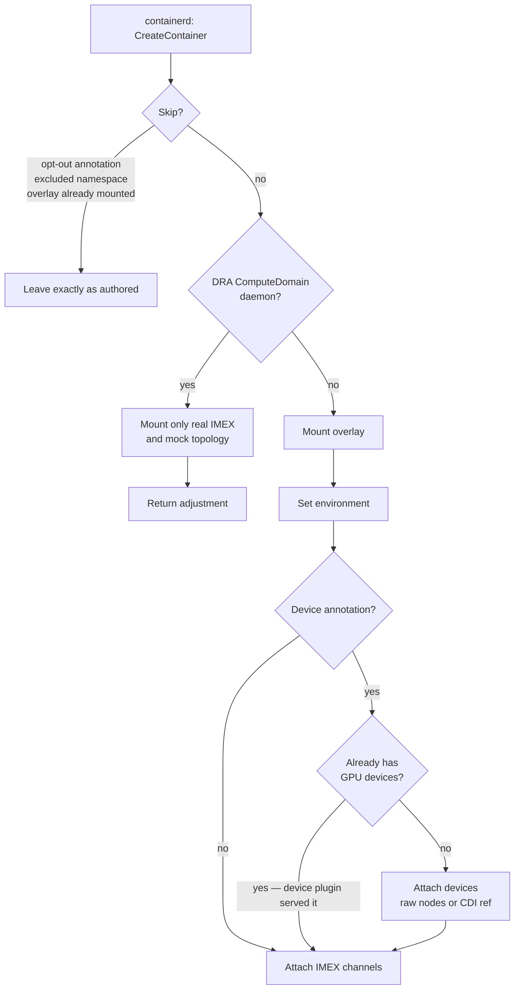

# NRI Plugin

The component that puts mock GPUs inside a container the pod author never
changed.

The [node daemon](node-daemon.md) stages a GPU tree on the host, but a container
sees only what its runtime gives it. The usual way in is a pod spec change — a
resource request, a `hostPath` mount, some `MOCK_*` environment. The NRI plugin
removes that step: it registers with containerd's Node Resource Interface and
edits containers as they are created, so an unmodified workload comes up
believing it has GPUs.

!!! note "What NRI is"
    The **Node Resource Interface** is a framework for plugging extensions into
    OCI-compatible container runtimes. A plugin registers with the runtime, is
    notified as containers are created, and may make limited adjustments to a
    container's OCI spec — mounts, devices, environment — before it starts.

    It sits *below* the Container Runtime Interface, so it is a runtime feature
    rather than a Kubernetes API: there is no NRI object in the Kubernetes API
    and nothing on kubernetes.io describing it. containerd 1.7 or later is
    required. See the
    [NRI project](https://github.com/containerd/nri) and
    [containerd's NRI documentation](https://github.com/containerd/containerd/blob/main/docs/NRI.md).

For where it sits in the wider system, see the
[architecture overview](../architecture.md).

## Two layers of injection

The plugin does two separable things, and conflating them is the usual source
of confusion.

| Layer | Applies to | Delivers |
|---|---|---|
| **Overlay** | every container unless skipped or identified as the DRA ComputeDomain daemon | The mock driver tree and environment — enough for `nvidia-smi` to run and report the node's profile |
| **Devices** | only containers that opt in | Actual `/dev/nvidia*` nodes, or a CDI reference the runtime resolves |

The overlay is **ambient**: a plain pod that requests nothing gets it. Devices
are **opt-in**, because handing every container real device nodes would be both
surprising and wrong.

## What happens to a container

Adjustment runs as a fixed sequence, and no step can fail:

### When a container is left alone

Three conditions, any of which skips adjustment entirely:

- the container carries `nvml-mock.nvidia.com/inject: "false"`;
- its namespace is in the excluded list;
- it already mounts the overlay at the destination path.

That last check is what makes re-adjustment safe. A container that already has
the overlay has been through here before, so re-running would double-apply.

### ComputeDomain CDI composition

The upstream DRA driver's CDI edits deliver the mock driver, IMEX shim and CLI,
generated domain config, and device nodes. NRI receives `CreateContainer`
before containerd resolves CDI devices sourced from the pod's resource claim,
so that CDI reference is not available as a selector. Mokka instead requires
both the DRA-owned `resource.nvidia.com/computeDomain` pod label and the
`compute-domain-daemon` container name. It then adds only the node-staged
`nvidia-imex.real` executable and mock topology document, plus the environment
pointer to that topology. It does not mount the ambient overlay, rewrite
`PATH`, or attach devices again.

The two-part match keeps the exception limited to the intended container;
matching only the `nvidia` namespace would also affect unrelated containers.

## Composing with the NVIDIA device plugin

Both this plugin and the real `k8s-device-plugin` can put GPU devices into a
container. Left alone they would both do it, and a pod asking for one GPU would
see every mock GPU on the node.

The rule, from [MEP-0002](https://github.com/NVIDIA/k8s-test-infra/tree/main/enhancements/meps/0002-device-plugin-nri-composition):
**whatever the device plugin already served wins.** Before injecting devices,
the plugin checks whether the container arrived carrying GPUs that something
else put there, recognising both delivery mechanisms the device plugin supports:

| Evidence | Produced by |
|---|---|
| A device path under `/dev/nvidia` | device plugin with `--pass-device-specs` |
| A CDI device named `nvidia.com/…` | device plugin with `--device-list-strategy=cdi-*` |

If either is present, device injection is suppressed and the container keeps
exactly the GPUs it was allocated. The overlay still applies, so `nvidia-smi`
works — it just reports the allocated subset rather than the whole node.

!!! note "IMEX sits outside this rule"
    IMEX channel injection is deliberately not suppressed. The device plugin
    never delivers IMEX channels, so there is nothing to defer to.

## Device injection modes

When the plugin does deliver devices, `deviceInjectionMode` picks the mechanism.
It changes *how*, never *whether* — suppression is decided before this is
consulted.

| Mode | Delivers | Use when |
|---|---|---|
| `raw` (default) | The mock `/dev/nvidiaN` nodes, staged directly into the adjustment | Always works. Required by MEP-0002 to stay reachable, and the only mode that works where CDI is off or absent |
| `cdi` | A CDI device reference the runtime resolves from the spec the `cdi` simulator wrote | containerd 2.x, which enables CDI by default — no container toolkit needed on the node |

An unknown value is rejected rather than coerced. A typo that silently fell back
to `raw` would look identical to a working CDI deployment, and the difference is
only visible in the OCI spec of an already-running pod.

## Annotations

| Annotation | Effect |
|---|---|
| `nvml-mock.nvidia.com/inject: "false"` | Opt out of adjustment entirely |
| `nvml-mock.nvidia.com/devices: "true"` | Opt in to GPU device injection |
| `nvml-mock.nvidia.com/imex-channels` | Request IMEX channels |

## Startup ordering and recovery

Ordinary container adjustment fails open. Nothing orders this plugin's DaemonSet
after the node daemon's, so on a fresh node the plugin may be asked to adjust a
container before the GPU tree exists. When a surface is missing, injection is
reduced — overlay-only instead of overlay-plus-devices — and container creation
proceeds.

The DRA ComputeDomain daemon is the exception. Its Mokka-specific adjustment is
useful only when both the real IMEX executable and the node topology are staged.
The plugin rejects that container's creation while either prerequisite is
missing, so kubelet retries after the node agent converges. This gate applies
only to a container named `compute-domain-daemon` in a pod carrying the DRA
ComputeDomain label; it cannot block the node agent or unrelated workloads.

That choice has a consequence worth knowing about. **A plugin containerd has
unregistered stays alive and silently stops injecting** — nothing crashes, pods
just quietly come up without GPUs. The plugin therefore reports whether
injection is actually happening, rather than merely whether the process is
running.

It also watches for wedged requests. If an in-flight adjustment exceeds the
timeout containerd told the plugin it is applying, the runtime has already
abandoned that request and the container was created without injection. The
threshold is a multiple of the runtime's own timeout, so a single slow request
cannot trigger a restart, but a genuinely stuck plugin gets replaced.

## How the code is split

| Package | Role |
|---|---|
| `internal/nri` | The runtime-coupled half: registers with containerd, translates its container types, reports health |
| `internal/nri/inject` | The decision: what to add to a container. No containerd types cross this boundary, so every rule above is exercisable as a plain table test |

## Related

| To read about | See |
|---|---|
| How the whole system fits together | [Architecture](../architecture.md) |
| What stages the tree this plugin mounts | [Node Daemon](node-daemon.md) |
| Enabling NRI and its chart values | [Installation](../helm-chart.md) |
| A runnable walkthrough | [Node-Wide Injection](../guides/node-wide-injection/README.md) |
