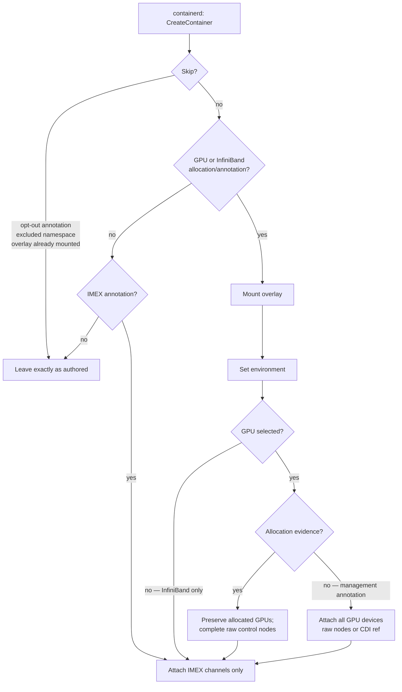

# NRI Plugin

The component that gives an allocated GPU container Mokka's userspace driver
surface without widening the allocation.

The [node daemon](node-daemon.md) stages a GPU tree on the host, but a container
sees only what its runtime gives it. The NVIDIA device plugin or Dynamic
Resource Allocation (DRA) selects devices, but a CPU-only node has no NVIDIA
runtime hook to deliver Mokka's userspace driver. The NRI plugin fills that
runtime role by editing eligible containers as they are created.

!!! note "What NRI is"
    The **Node Resource Interface** is a framework for plugging extensions into
    OCI-compatible container runtimes. A plugin registers with the runtime, is
    notified as containers are created, and may make limited adjustments to a
    container's OCI spec — mounts, devices, environment — before it starts.

    It sits *below* the Container Runtime Interface, so it is a runtime feature
    rather than a Kubernetes API: there is no NRI object in the Kubernetes API
    and nothing on kubernetes.io describing it. containerd 1.7 or later is
    required. See the
    [NRI project](https://github.com/containerd/nri) and
    [containerd's NRI documentation](https://github.com/containerd/containerd/blob/main/docs/NRI.md).

For where it sits in the wider system, see the
[architecture overview](../architecture.md).

## Two layers of injection

The plugin does two separable things, and conflating them is the usual source
of confusion.

| Layer | Applies to | Delivers |
|---|---|---|
| **Overlay** | a container with an allocated GPU, or the explicit all-GPU annotation | The mock driver tree and environment — enough for `nvidia-smi` to report the container's allocated devices |
| **Devices** | only the explicit all-GPU management path | Every mock `/dev/nvidia*` node, or a CDI reference the runtime resolves |

A plain container with no allocation and no annotation is left untouched. The
decision is per container, so a sidecar does not inherit a sibling container's
GPU allocation.

## What happens to a container

Adjustment runs as a fixed sequence, and no step can fail:

### When a container is left alone

The plugin leaves a container alone when it has no allocated NVIDIA GPU or
InfiniBand device, and no GPU, InfiniBand, or IMEX annotation. Three structural conditions also
skip adjustment entirely:

- the container carries `nvml-mock.nvidia.com/inject: "false"`;
- its namespace is in the excluded list;
- it already mounts the overlay at the destination path.

That last check is what makes re-adjustment safe. A container that already has
the overlay has been through here before, so re-running would double-apply.

## Composing with the NVIDIA device plugin

Both this plugin and the real `k8s-device-plugin` can put GPU devices into a
container. Left alone they would both do it, and a pod asking for one GPU would
see every mock GPU on the node.

The rule, from [MEP-0002](https://github.com/NVIDIA/k8s-test-infra/tree/main/enhancements/meps/0002-device-plugin-nri-composition):
**whatever the device plugin already served wins.** Before injecting devices,
the plugin checks whether the container arrived carrying GPUs that something
else put there, recognising both delivery mechanisms the device plugin supports:

| Evidence | Produced by |
|---|---|
| A numbered device path such as `/dev/nvidia0` | device plugin with `--pass-device-specs` |
| A CDI device named `nvidia.com/…` | device plugin with `--device-list-strategy=cdi-*` |

If either is present, all-GPU injection is suppressed and the container keeps
exactly the GPUs it was allocated. The overlay still applies, so `nvidia-smi`
reports the allocated subset rather than the whole node. For a raw allocation,
NRI adds only missing node-wide control devices (`/dev/nvidiactl`,
`/dev/nvidia-uvm`, and `/dev/nvidia-uvm-tools`); it never adds another numbered
GPU. A CDI allocation is treated as complete.

!!! note "IMEX sits outside this rule"
    IMEX channel injection is deliberately not suppressed. The device plugin
    never delivers IMEX channels, so there is nothing to defer to.

## Device injection modes

When the explicit management annotation asks for all devices,
`deviceInjectionMode` picks the mechanism.
It changes *how*, never *whether* — suppression is decided before this is
consulted.

| Mode | Delivers | Use when |
|---|---|---|
| `raw` (default) | The mock `/dev/nvidiaN` nodes, staged directly into the adjustment | Always works. Required by MEP-0002 to stay reachable, and the only mode that works where CDI is off or absent |
| `cdi` | A CDI device reference the runtime resolves from the spec the `cdi` simulator wrote | containerd 2.x, which enables CDI by default — no container toolkit needed on the node |

An unknown value is rejected rather than coerced. A typo that silently fell back
to `raw` would look identical to a working CDI deployment, and the difference is
only visible in the OCI spec of an already-running pod.

## Annotations

| Annotation | Effect |
|---|---|
| `nvml-mock.nvidia.com/inject: "false"` | Opt out of adjustment entirely |
| `nvml-mock.nvidia.com/devices: "true"` | Explicitly expose every mock GPU without scheduler accounting; intended for node-management and test agents |
| `nvml-mock.nvidia.com/infiniband: "true"` | Enable the mock InfiniBand userspace surface; a GPU allocation alone keeps it disabled |
| `nvml-mock.nvidia.com/imex-channels: "true"` | Request IMEX channels independently; by itself this does not mount the GPU overlay |

## Failing open

Every step degrades rather than blocks. Nothing orders this plugin's DaemonSet
after the node daemon's, so on a fresh node the plugin may be asked to adjust a
container before the GPU tree exists. When a surface is missing, injection is
reduced — overlay-only instead of overlay-plus-devices — and container creation
proceeds.

The alternative would be worse: a plugin that errors on a missing surface blocks
every container on the node, including the daemon that would have created the
surface.

That choice has a consequence worth knowing about. **A plugin containerd has
unregistered stays alive and silently stops injecting** — nothing crashes, pods
just quietly come up without GPUs. The plugin therefore reports whether
injection is actually happening, rather than merely whether the process is
running.

It also watches for wedged requests. If an in-flight adjustment exceeds the
timeout containerd told the plugin it is applying, the runtime has already
abandoned that request and the container was created without injection. The
threshold is a multiple of the runtime's own timeout, so a single slow request
cannot trigger a restart, but a genuinely stuck plugin gets replaced.

## How the code is split

| Package | Role |
|---|---|
| `internal/nri` | The runtime-coupled half: registers with containerd, translates its container types, reports health |
| `internal/nri/inject` | The decision: what to add to a container. No containerd types cross this boundary, so every rule above is exercisable as a plain table test |

## Related

| To read about | See |
|---|---|
| How the whole system fits together | [Architecture](../architecture.md) |
| What stages the tree this plugin mounts | [Node Daemon](node-daemon.md) |
| NRI runtime prerequisites and chart values | [Installation](../helm-chart.md) |
