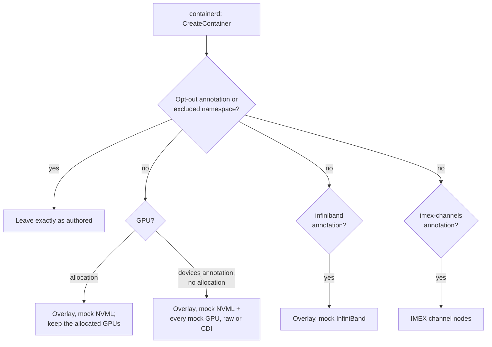

# NRI Plugin

The component that puts mock GPUs inside a container the pod author never
changed.

The [node daemon](node-daemon.md) stages a GPU tree on the host, but a container
sees only what its runtime gives it. Without help, a workload would need
Mokka-specific pod spec changes — a `hostPath` mount, some `MOCK_*`
environment. The NRI plugin removes that step: it registers with containerd's
Node Resource Interface and edits containers as they are created, so a workload
that was allocated GPUs the usual way comes up with the mock driver, unchanged.

!!! note "What NRI is"
    The **Node Resource Interface** is a framework for plugging extensions into
    OCI-compatible container runtimes. A plugin registers with the runtime, is
    notified as containers are created, and may make limited adjustments to a
    container's OCI spec — mounts, devices, environment — before it starts.

    It sits *below* the Container Runtime Interface, so it is a runtime feature
    rather than a Kubernetes API: there is no NRI object in the Kubernetes API
    and nothing on kubernetes.io describing it. containerd 1.7 or later is
    required. See the
    [NRI project](https://github.com/containerd/nri) and
    [containerd's NRI documentation](https://github.com/containerd/containerd/blob/main/docs/NRI.md).

For where it sits in the wider system, see the
[architecture overview](../architecture.md).

## Which containers are injected

The plugin injects only containers that were given GPUs or explicitly asked for
a mock surface. Everything else on the node is left exactly as authored, just as
a real GPU node gives nothing to a pod that requested no GPU.

It makes three independent selections — GPU, InfiniBand and IMEX — and adds only
the surfaces that were selected. None of them brings another along.

| Container | Receives |
|---|---|
| Holds a GPU allocation from the device plugin or the NVIDIA DRA driver | The overlay with mock NVML active. The allocated GPUs stay exactly as the scheduler assigned them |
| Pod annotated `nvml-mock.nvidia.com/devices: "true"`, no allocation | The overlay with mock NVML active, and every mock GPU on the node |
| Pod annotated `nvml-mock.nvidia.com/infiniband: "true"` | The overlay with the mock InfiniBand tools active |
| Pod annotated `nvml-mock.nvidia.com/imex-channels: "true"` | The mock IMEX channel nodes, and nothing else |
| Anything else | Nothing |

A container that matches several rows gets each of their surfaces.

The **overlay** is the mock driver tree mounted at `/opt/nvml-mock`, plus the
`PATH`, `LD_LIBRARY_PATH` and `LD_PRELOAD` shims that point at it. The GPU and
InfiniBand selections share it, because the InfiniBand tools and shims are
staged beside the mock driver. The environment turns on only what was selected:

| Selected | Environment |
|---|---|
| GPU | `MOCK_NVML_CONFIG`, `MOCK_PCI_ROOT`, `GFD_MACHINE_TYPE_FILE` and, when staged, the ComputeDomain topology |
| GPU, not InfiniBand | `MOCK_IB=off`, so the preloaded InfiniBand shims do nothing |
| InfiniBand | `MOCK_IB=full`, `MOCK_IB_ROOT` and `MOCK_IB_PING_SOCKET` |
| InfiniBand, not GPU | `MOCK_NVML_VISIBLE_DEVICES=none`, so the staged `nvidia-smi` reports no GPUs |

When the container already sets one of these variables, its own value wins,
except against `MOCK_IB=off` and `MOCK_NVML_VISIBLE_DEVICES=none`: the
annotations decide what a container gets, not an environment baked into its
image.

The `devices` annotation is the management path: it gives a pod the whole node,
such as a monitoring agent, without scheduler accounting. Like the other
annotations, it applies to every container in the pod.

## What happens to a container

Adjustment runs as a fixed sequence, and no step can fail:

```mermaid
flowchart TB
    create[containerd: CreateContainer] --> skip{Opt-out annotation or<br/>excluded namespace?}
    skip -->|yes| asis[Leave exactly as authored]
    skip -->|no| gpu{GPU?}
    skip -->|no| ib{infiniband<br/>annotation?}
    skip -->|no| imex{imex-channels<br/>annotation?}
    gpu -->|allocation| keep[Overlay, mock NVML;<br/>keep the allocated GPUs]
    gpu -->|devices annotation,<br/>no allocation| all[Overlay, mock NVML +<br/>every mock GPU, raw or CDI]
    ib -->|yes| fabric[Overlay, mock InfiniBand]
    imex -->|yes| channels[IMEX channel nodes]
```

When no branch selects anything, the container is left exactly as authored.

### When a container is left alone

Any of these leaves the container exactly as authored:

- the pod carries `nvml-mock.nvidia.com/inject: "false"`;
- its namespace is in the excluded list;
- it holds no GPU allocation and carries none of the `devices`, `infiniband`
  and `imex-channels` annotations;
- it already mounts the overlay at the destination path.

That last check is what makes re-adjustment safe. A container that already has
the overlay has been through here before, so re-running would double-apply.

## Recognising a GPU allocation

The kubelet applies a device plugin's or DRA driver's allocation before the
runtime asks this plugin to adjust the container, so the allocation is visible
in the incoming container spec. Only these count as evidence:

| Evidence | Produced by |
|---|---|
| A numbered `/dev/nvidiaN` character device **and** a cgroup rule allowing exactly that device | device plugin with `--pass-device-specs=true` |
| A CDI device `k8s.device-plugin.nvidia.com/gpu=<id>` | device plugin with the `cdi-cri` device list strategy; `<id>` is the GPU UUID, or its index with `--device-id-strategy=index` |
| A CDI device `k8s.gpu.nvidia.com/claim=<id>` | NVIDIA DRA driver |

The rules are strict so that a container is never mistaken for an allocated
one:

- A privileged container inherits every host device under a wildcard cgroup
  rule. Its `/dev/nvidiaN` nodes were not allocated, so they do not count.
- Control devices such as `/dev/nvidiactl` or `/dev/nvidia-uvm` accompany an
  allocation but do not identify a GPU.
- Other CDI kinds do not count. That includes the device plugin's
  `k8s.device-plugin.nvidia.com/gdrcopy=all` and `…/mofed=all`, which come with
  every allocation, the container toolkit's `nvidia.com/gpu`, and Mokka's own
  `nvml-mock.nvidia.com/gpu=all`.

An allocation always wins over the `devices` annotation: the container keeps
exactly the GPUs it was allocated, and `nvidia-smi` reports that subset, not
the whole node. This is the rule from
[MEP-0002](https://github.com/NVIDIA/k8s-test-infra/tree/main/enhancements/meps/0002-device-plugin-nri-composition):
whatever the scheduler allocated is never widened.

!!! warning "The device plugin must leave evidence of the allocation"
    A device plugin that only sets `NVIDIA_VISIBLE_DEVICES` (the default
    `envvar` strategy) or delivers CDI devices only through pod annotations
    (`cdi-annotations`) leaves no evidence in the container spec. Its pods are
    treated as unallocated and receive nothing. Run the device plugin with
    `--pass-device-specs=true`, as the
    [device plugin guide](../guides/device-plugin.md) does, or with the
    `cdi-cri` strategy, as the GPU Operator does when CDI is enabled.

!!! note "IMEX sits outside this rule"
    IMEX channels are requested by their own annotation and never suppressed.
    Neither the device plugin nor the DRA driver delivers mock IMEX channels, so
    there is nothing to defer to.

## Selecting InfiniBand

Only the `infiniband` annotation selects InfiniBand. A privileged container
inherits every host `/dev/infiniband/*` node under a wildcard cgroup rule
without asking for RDMA, so device paths are not evidence. The plugin does not
yet recognise an allocation from an RDMA device plugin or DRA driver; that needs
a signal that inherited nodes cannot produce, and none has been validated.

The annotation never adds or removes real `/dev/infiniband/*` nodes. It points
the InfiniBand tools at the mock sysfs tree the node agent renders. On a profile
without InfiniBand that tree holds no HCA: the pod still starts, its tools find
nothing, and the plugin logs a warning.

## Device injection modes

When the plugin delivers GPUs to a `devices`-annotated pod with no allocation,
`deviceInjectionMode` picks the mechanism. It changes *how*, never *whether*,
and never touches an allocated container.

| Mode | Delivers | Use when |
|---|---|---|
| `raw` (default) | The mock `/dev/nvidiaN` nodes, staged directly into the adjustment | Always works. Required by MEP-0002 to stay reachable, and the only mode that works where CDI is off or absent |
| `cdi` | A CDI device reference the runtime resolves from the spec the `cdi` simulator wrote | containerd 2.x, which enables CDI by default — no container toolkit needed on the node |

An unknown value is rejected rather than coerced. A typo that silently fell back
to `raw` would look identical to a working CDI deployment, and the difference is
only visible in the OCI spec of an already-running pod.

## Annotations

| Annotation | Effect |
|---|---|
| `nvml-mock.nvidia.com/inject: "false"` | Opt out of adjustment entirely |
| `nvml-mock.nvidia.com/devices: "true"` | Without an allocation: receive the overlay and every mock GPU. With an allocation: no effect |
| `nvml-mock.nvidia.com/infiniband: "true"` | Receive the overlay with the mock InfiniBand tools active. Adds no GPUs |
| `nvml-mock.nvidia.com/imex-channels: "true"` | Receive the mock IMEX channels. Adds no overlay and no GPUs |

## Failing open

Every step degrades rather than blocks.

Before each adjustment, the plugin checks the node agent in its pod. It takes
the shared side of a staging lock, which the agent holds exclusively while it
stages or tears down the driver tree, and asks the agent's `/stagedz` endpoint
whether the tree is staged. `/stagedz` follows the agent's Stage wave only, so
a failed Apply, such as a failed write of the NFD feature file, does not close
it. In `cdi` mode, Stage also withdraws the plugin's CDI spec until Apply
republishes it, so a container created in between gets raw device nodes from
the new tree rather than a spec naming nodes a smaller profile removed. While
the agent is restarting, restaging or not yet staged, the plugin
leaves the container unmodified, logs a warning naming its namespace, pod and
container, and fails `/readyz` with the reason. Containers the plugin skips
anyway, such as those in an excluded namespace, are not reported.

The lock file lives in a memory-backed `emptyDir` mounted only into the node
agent and the plugin, so no workload can hold it and stall staging. It covers
the plugin's decision, not the runtime applying it, so a teardown that starts
in between can still race one container. During pod termination the agent
waits at most half of its shutdown timeout for the lock, then tears down
without it.

Once the agent is serving, individual missing device surfaces can still reduce
injection to overlay-only instead of blocking container creation.

The alternative would be worse: a plugin that errors on a missing surface blocks
every container on the node, including the daemon that would have created the
surface.

That choice has a consequence worth knowing about. **A plugin containerd has
unregistered stays alive and silently stops injecting** — nothing crashes, pods
just quietly come up without GPUs. The plugin therefore reports whether
injection is actually happening, rather than merely whether the process is
running.

It also watches for wedged requests. If an in-flight adjustment exceeds the
timeout containerd told the plugin it is applying, the runtime has already
abandoned that request and the container was created without injection. The
threshold is a multiple of the runtime's own timeout, so a single slow request
cannot trigger a restart, but a genuinely stuck plugin gets replaced.

## How the code is split

| Package | Role |
|---|---|
| `internal/nri` | The runtime-coupled half: registers with containerd, translates its container types, reports health |
| `internal/nri/inject` | The decision: what to add to a container. No containerd types cross this boundary, so every rule above is exercisable as a plain table test |

## Related

| To read about | See |
|---|---|
| How the whole system fits together | [Architecture](../architecture.md) |
| What stages the tree this plugin mounts | [Node Daemon](node-daemon.md) |
| Enabling NRI and its chart values | [Installation](../helm-chart.md) |
| A runnable walkthrough | [Node-Wide Injection](../guides/node-wide-injection/README.md) |
