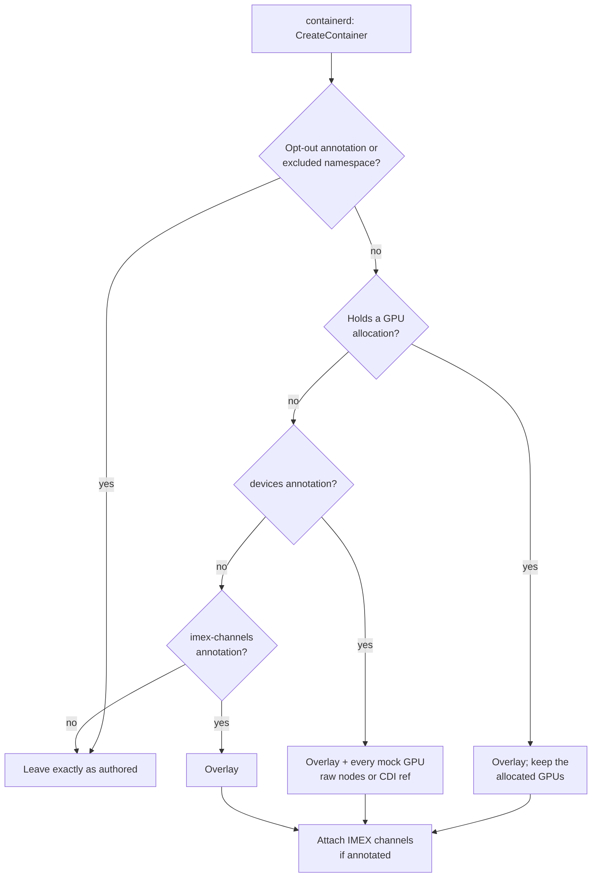

# NRI Plugin

The component that puts mock GPUs inside a container the pod author never
changed.

The [node daemon](node-daemon.md) stages a GPU tree on the host, but a container
sees only what its runtime gives it. Without help, a workload would need
Mokka-specific pod spec changes — a `hostPath` mount, some `MOCK_*`
environment. The NRI plugin removes that step: it registers with containerd's
Node Resource Interface and edits containers as they are created, so a workload
that was allocated GPUs the usual way comes up with the mock driver, unchanged.

!!! note "What NRI is"
    The **Node Resource Interface** is a framework for plugging extensions into
    OCI-compatible container runtimes. A plugin registers with the runtime, is
    notified as containers are created, and may make limited adjustments to a
    container's OCI spec — mounts, devices, environment — before it starts.

    It sits *below* the Container Runtime Interface, so it is a runtime feature
    rather than a Kubernetes API: there is no NRI object in the Kubernetes API
    and nothing on kubernetes.io describing it. containerd 1.7 or later is
    required. See the
    [NRI project](https://github.com/containerd/nri) and
    [containerd's NRI documentation](https://github.com/containerd/containerd/blob/main/docs/NRI.md).

For where it sits in the wider system, see the
[architecture overview](../architecture.md).

## Which containers are injected

The plugin injects only containers that were given GPUs or explicitly asked for
the mock. Everything else on the node is left exactly as authored, just as a
real GPU node gives nothing to a pod that requested no GPU.

| Container | Receives |
|---|---|
| Holds a GPU allocation from the device plugin or the NVIDIA DRA driver | The overlay. The allocated GPUs stay exactly as the scheduler assigned them |
| Pod annotated `nvml-mock.nvidia.com/devices: "true"`, no allocation | The overlay and every mock GPU on the node |
| Pod annotated `nvml-mock.nvidia.com/imex-channels: "true"` | The overlay and the mock IMEX channels, without GPUs |
| Anything else | Nothing |

The **overlay** is the mock driver tree plus the environment that points at it
(`LD_LIBRARY_PATH`, the `LD_PRELOAD` shims and the `MOCK_*` variables) —
enough for `nvidia-smi` and NVML clients to run.

The `devices` annotation is the management path: it gives a pod the whole node,
such as a monitoring agent, without scheduler accounting. It is a pod
annotation, so it applies to every container in that pod.

## What happens to a container

Adjustment runs as a fixed sequence, and no step can fail:

```mermaid
flowchart TB
    create[containerd: CreateContainer] --> skip{Opt-out annotation or<br/>excluded namespace?}
    skip -->|yes| asis[Leave exactly as authored]
    skip -->|no| alloc{Holds a GPU<br/>allocation?}
    alloc -->|yes| keep[Overlay; keep the<br/>allocated GPUs]
    alloc -->|no| mgmt{devices annotation?}
    mgmt -->|yes| all[Overlay + every mock GPU<br/>raw nodes or CDI ref]
    mgmt -->|no| imexq{imex-channels<br/>annotation?}
    imexq -->|yes| imexonly[Overlay]
    imexq -->|no| asis
    keep --> imex[Attach IMEX channels<br/>if annotated]
    all --> imex
    imexonly --> imex
```

### When a container is left alone

Any of these leaves the container exactly as authored:

- the pod carries `nvml-mock.nvidia.com/inject: "false"`;
- its namespace is in the excluded list;
- it holds no GPU allocation and carries neither the `devices` nor the
  `imex-channels` annotation;
- it already mounts the overlay at the destination path.

That last check is what makes re-adjustment safe. A container that already has
the overlay has been through here before, so re-running would double-apply.

## Recognising a GPU allocation

The kubelet applies a device plugin's or DRA driver's allocation before the
runtime asks this plugin to adjust the container, so the allocation is visible
in the incoming container spec. Only these count as evidence:

| Evidence | Produced by |
|---|---|
| A numbered `/dev/nvidiaN` character device **and** a cgroup rule allowing exactly that device | device plugin with `--pass-device-specs=true` |
| A CDI device `nvidia.com/gpu=<id>` | device plugin with the `cdi-cri` device list strategy |
| A CDI device `k8s.gpu.nvidia.com/claim=<id>` | NVIDIA DRA driver |

The rules are strict so that a container is never mistaken for an allocated
one:

- A privileged container inherits every host device under a wildcard cgroup
  rule. Its `/dev/nvidiaN` nodes were not allocated, so they do not count.
- Control devices such as `/dev/nvidiactl` or `/dev/nvidia-uvm` accompany an
  allocation but do not identify a GPU.
- Other CDI kinds, including Mokka's own `nvml-mock.nvidia.com/gpu=all`, do not
  count.

An allocation always wins over the `devices` annotation: the container keeps
exactly the GPUs it was allocated, and `nvidia-smi` reports that subset, not
the whole node. This is the rule from
[MEP-0002](https://github.com/NVIDIA/k8s-test-infra/tree/main/enhancements/meps/0002-device-plugin-nri-composition):
whatever the scheduler allocated is never widened.

!!! warning "The device plugin must pass device specs"
    A device plugin that only sets `NVIDIA_VISIBLE_DEVICES` (the default
    `envvar` strategy) or delivers CDI devices through pod annotations
    (`cdi-annotations`) leaves no evidence in the container spec. Its pods are
    treated as unallocated and receive nothing. Run the device plugin with
    `--pass-device-specs=true`, as the
    [device plugin guide](../guides/device-plugin.md) does.

!!! note "IMEX sits outside this rule"
    IMEX channels are requested by their own annotation and never suppressed.
    Neither the device plugin nor the DRA driver delivers mock IMEX channels, so
    there is nothing to defer to.

## Device injection modes

When the plugin delivers GPUs to a `devices`-annotated pod with no allocation,
`deviceInjectionMode` picks the mechanism. It changes *how*, never *whether*,
and never touches an allocated container.

| Mode | Delivers | Use when |
|---|---|---|
| `raw` (default) | The mock `/dev/nvidiaN` nodes, staged directly into the adjustment | Always works. Required by MEP-0002 to stay reachable, and the only mode that works where CDI is off or absent |
| `cdi` | A CDI device reference the runtime resolves from the spec the `cdi` simulator wrote | containerd 2.x, which enables CDI by default — no container toolkit needed on the node |

An unknown value is rejected rather than coerced. A typo that silently fell back
to `raw` would look identical to a working CDI deployment, and the difference is
only visible in the OCI spec of an already-running pod.

## Annotations

| Annotation | Effect |
|---|---|
| `nvml-mock.nvidia.com/inject: "false"` | Opt out of adjustment entirely |
| `nvml-mock.nvidia.com/devices: "true"` | Without an allocation: receive the overlay and every mock GPU. With an allocation: no effect |
| `nvml-mock.nvidia.com/imex-channels: "true"` | Receive the overlay and the mock IMEX channels |

## Failing open

Every step degrades rather than blocks. Nothing orders this plugin's container
after the node agent's, so on a fresh node the plugin may be asked to adjust a
container before the GPU tree exists. When a surface is missing, injection is
reduced — overlay-only instead of overlay-plus-devices — and container creation
proceeds.

The alternative would be worse: a plugin that errors on a missing surface blocks
every container on the node, including the daemon that would have created the
surface.

That choice has a consequence worth knowing about. **A plugin containerd has
unregistered stays alive and silently stops injecting** — nothing crashes, pods
just quietly come up without GPUs. The plugin therefore reports whether
injection is actually happening, rather than merely whether the process is
running.

It also watches for wedged requests. If an in-flight adjustment exceeds the
timeout containerd told the plugin it is applying, the runtime has already
abandoned that request and the container was created without injection. The
threshold is a multiple of the runtime's own timeout, so a single slow request
cannot trigger a restart, but a genuinely stuck plugin gets replaced.

## How the code is split

| Package | Role |
|---|---|
| `internal/nri` | The runtime-coupled half: registers with containerd, translates its container types, reports health |
| `internal/nri/inject` | The decision: what to add to a container. No containerd types cross this boundary, so every rule above is exercisable as a plain table test |

## Related

| To read about | See |
|---|---|
| How the whole system fits together | [Architecture](../architecture.md) |
| What stages the tree this plugin mounts | [Node Daemon](node-daemon.md) |
| Enabling NRI and its chart values | [Installation](../helm-chart.md) |
| A runnable walkthrough | [Node-Wide Injection](../guides/node-wide-injection/README.md) |
