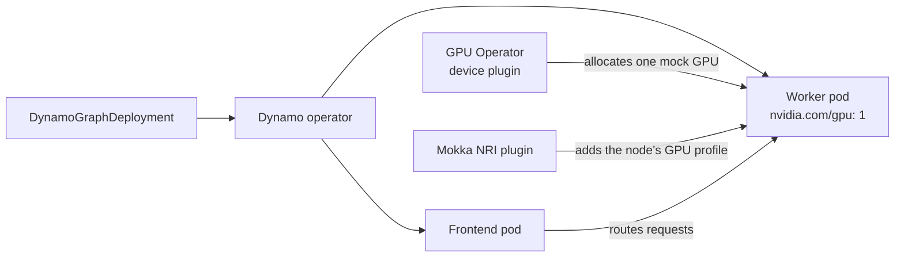

# NVIDIA Dynamo

Serve an OpenAI-compatible endpoint with [NVIDIA Dynamo](https://github.com/ai-dynamo/dynamo)
on a cluster with no GPUs. The real Dynamo operator deploys an inference graph,
the real GPU Operator schedules its worker onto a mock GPU, and a chat
completion round-trips through Dynamo's frontend and router.

## How it fits together

Dynamo splits serving into a **frontend** (the HTTP API and router) and
**workers** that run an inference engine. A `DynamoGraphDeployment` (DGD)
describes that graph; the Dynamo operator turns it into pods.

Every layer here is unmodified except one. The engine is the part that needs
real CUDA, so this guide runs Dynamo's **mocker**: a simulated engine that
registers with the router, tracks a KV cache and streams tokens, without a
GPU kernel. Its output is random tokens, by design.

The worker still asks for a GPU the usual way, `nvidia.com/gpu: 1`:



The device plugin's allocation brings the mock `libnvidia-ml.so` and
`nvidia-smi` into the worker, but not the node's GPU profile. The
[NRI plugin](../../components/nri-plugin.md) adds that profile as the container
is created, and the worker keeps exactly the one GPU it was allocated. Leave it
off and the worker reports a default `Mock NVIDIA A100-SXM4-40GB` whatever
profile the node runs.

## Prerequisites

- [Docker](https://docs.docker.com/get-started/get-docker/) and
  [Kind](https://kind.sigs.k8s.io/)
- [Helm 3.8 or newer](https://helm.sh/docs/intro/install/)
- [kubectl](https://kubernetes.io/docs/reference/kubectl/) and
  [jq](https://jqlang.org/)

Takes about 15 minutes, most of it pulling the GPU Operator and Dynamo images.
Both Dynamo images used here are multi-arch, so it runs on arm64 hosts too.

## Step 1 — Create a cluster with NRI enabled

The Mokka node image ships containerd with CDI enabled and the NVIDIA container
runtime installed. The NRI plugin also needs containerd's NRI socket, which
the config below turns on.

```bash
cat > kind.yaml <<'EOF'
kind: Cluster
apiVersion: kind.x-k8s.io/v1alpha4
containerdConfigPatches:
  - |-
    [plugins."io.containerd.nri.v1.nri"]
      disable = false
      disable_connections = false
      socket_path = "/var/run/nri/nri.sock"
nodes:
  - role: control-plane
  - role: worker
EOF

kind create cluster --name dynamo --config kind.yaml \
  --image ghcr.io/nvidia/mokka-kind-node:latest
```

## Step 2 — Install Mokka with the NRI plugin

```bash
helm install nvml-mock oci://ghcr.io/nvidia/k8s-test-infra/chart/nvml-mock \
  --version 0.4.0 \
  --namespace mokka --create-namespace \
  --set nri.enabled=true \
  --set 'nri.excludedNamespaces={gpu-operator}' \
  --wait --timeout 300s
```

`kubectl -n mokka get pods -o wide` should list an `nvml-mock-nri` pod running
on every node next to `nvml-mock`.

`excludedNamespaces` keeps the plugin away from the GPU Operator's pods, which
run without it as in the [GPU Operator guide](../gpu-operator.md). On 0.4.0 the
plugin would otherwise inject the operator's validator, and each validator
start stacks more mounts on the node: see
[Mounts pile up on a node with NRI enabled](../../troubleshooting.md#mounts-pile-up-on-a-node-with-nri-enabled).

## Step 3 — Install the GPU Operator

Install it exactly as in the [GPU Operator guide](../gpu-operator.md#step-3--install-the-gpu-operator):
write its `gpu-operator-values.yaml` overlay, then install with that file. Pin
the chart version:

```bash
helm repo add nvidia https://helm.ngc.nvidia.com/nvidia && helm repo update

helm install gpu-operator nvidia/gpu-operator --version v26.3.3 \
  --namespace gpu-operator --create-namespace \
  -f gpu-operator-values.yaml \
  --wait --timeout 600s

kubectl get node dynamo-worker -o jsonpath='{.status.allocatable.nvidia\.com/gpu}'
# 4 — the gb300 default profile has four devices
```

Wait for a non-zero count before going on. Until the device plugin registers,
the Dynamo worker has nowhere to schedule.

!!! warning "Stay on v26.3.x for now"
    GPU Operator v26.7.1 gates every operand on an `nvidia` line in
    `/proc/modules`, which Mokka cannot serve to those containers, so GFD, the
    device plugin and `dcgm-exporter` never start.

## Step 4 — Install the Dynamo platform

```bash
helm install dynamo-platform \
  https://helm.ngc.nvidia.com/nvidia/ai-dynamo/charts/dynamo-platform-1.5.0.tgz \
  --namespace dynamo-system --create-namespace \
  --wait --timeout 300s
```

This installs the operator only. etcd, NATS, Grove and the KAI Scheduler are
optional and off by default; an aggregated graph needs none of them.

`--wait` matters: the operator installs its own CRDs from an init container,
and the `DynamoGraphDeployment` kind does not exist until it has run.

## Step 5 — Deploy the inference graph

```bash
cat > qwen3.yaml <<'EOF'
apiVersion: nvidia.com/v1beta1
kind: DynamoGraphDeployment
metadata:
  name: qwen3
  namespace: dynamo-system
spec:
  components:
    - name: Frontend
      type: frontend
      replicas: 1
      podTemplate:
        spec:
          containers:
            - name: main
              image: nvcr.io/nvidia/ai-dynamo/dynamo-planner:1.5.0
    - name: decode
      type: decode
      replicas: 1
      podTemplate:
        spec:
          containers:
            - name: main
              image: nvcr.io/nvidia/ai-dynamo/dynamo-planner:1.5.0
              workingDir: /workspace
              command: [python3, -m, dynamo.mocker]
              args:
                - --model-path
                - Qwen/Qwen3-0.6B
                - --model-name
                - Qwen/Qwen3-0.6B
                - --speedup-ratio
                - "1.0"
              resources:
                limits:
                  nvidia.com/gpu: "1" # (1)!
EOF

kubectl apply -f qwen3.yaml
kubectl -n dynamo-system wait dgd/qwen3 --for=condition=Ready --timeout=600s
```

1. Dynamo's own mocker example requests no GPU. Requesting one is what places
   the worker on a mock-GPU node and hands it the mock driver.

There is no dedicated mocker image; `dynamo-planner` ships the Python package
the mocker runs from. `Qwen/Qwen3-0.6B` is ungated, so no Hugging Face token is
needed.

## Step 6 — Verify

The worker sees the one GPU it was allocated, and it is the node's profile:

```bash
WORKER=$(kubectl -n dynamo-system get pod \
  -l nvidia.com/dynamo-graph-deployment-name=qwen3,nvidia.com/dynamo-component-type=decode \
  -o jsonpath='{.items[0].metadata.name}')

kubectl -n dynamo-system exec "$WORKER" -- nvidia-smi -L
# GPU 0: NVIDIA GB300 NVL (UUID: GPU-...)

kubectl get node dynamo-worker -o jsonpath='{.metadata.labels.nvidia\.com/gpu\.product}'
# NVIDIA-GB300-NVL
```

Then send a request through the frontend:

```bash
kubectl -n dynamo-system port-forward svc/qwen3-frontend 8000:8000 &

curl -s localhost:8000/v1/chat/completions \
  -H 'Content-Type: application/json' \
  -d '{"model": "Qwen/Qwen3-0.6B",
       "messages": [{"role": "user", "content": "Hello from a mock GPU"}],
       "max_tokens": 16}' | jq '{content: .choices[0].message.content, usage}'
```

The `content` is noise. `usage.completion_tokens` equal to `max_tokens` is
the meaningful part: those tokens came from the worker, through the router.

## Troubleshooting

**The worker reports `Mock NVIDIA A100-SXM4-40GB`, or `GPU-4d4f434b-…` UUIDs.**
Its mock library found no profile and fell back to the built-in default. The
NRI plugin is off, or the worker was created before it was registered: NRI only
edits containers at creation. Check that an `nvml-mock-nri` pod is running on
the worker's node, then delete the worker pod so the operator recreates it.

**`/v1/models` stays empty and requests return 404 while the worker runs.** For
a few seconds after the graph reports Ready this is expected: the frontend has
not discovered the worker yet, so retry. If it is still empty after two
minutes, the frontend missed the worker, which can happen on a cold start when
the frontend comes up minutes before the worker registers. Delete the frontend
pod; its replacement discovers the worker on startup.

**The worker stays `Pending`.** The node advertises no `nvidia.com/gpu` yet.
Check that the GPU Operator's device plugin is running:
`kubectl -n gpu-operator get pods`.

**`kubectl apply` fails with `no matches for kind "DynamoGraphDeployment"`.**
The operator has not installed its CRDs yet. Re-run the Step 4 install with
`--wait`, or wait for its pod to be `Ready`.

More symptoms in [Troubleshooting](../../troubleshooting.md).

## Running it from a checkout

With the repository cloned, the Tilt environment builds Mokka from source and
runs this same stack, with an extra button that asserts it end to end:

```bash
make cluster-create
tilt up -- --dynamo
```

See [Local Development](../../contributing/local-development.md#adding-consumers).

## Clean up

```bash
kind delete cluster --name dynamo
```

## Related

| To read about | See |
|---|---|
| The GPU Operator overlay and what each value does | [NVIDIA GPU Operator](../gpu-operator.md) |
| Which containers the NRI plugin injects, and why | [NRI Plugin](../../components/nri-plugin.md) |
| Changing GPU state while Dynamo runs | [Runtime Control](../../nvml-mock-ctl.md) |
| Dynamo's mocker engine | [Dynamo: Simulate a Kubernetes Deployment with Mocker](https://docs.nvidia.com/dynamo/v1.4.1/kubernetes/operations/dynosim/live-simulation-with-mocker) |
