# Run Mokka on Amazon EKS

Install Mokka on CPU-only Amazon Elastic Kubernetes Service (EKS) workers,
advertise simulated GPUs, and run an unmodified `nvidia-smi` from a neutral
workload image.

This guide starts from an existing compatible EKS cluster. If you do not have
one, the optional Terraform path creates a disposable reference cluster with
the required worker runtime configuration. It creates billable AWS resources,
so destroy that stack when you finish.

## Validation scope

The procedure validates:

- NVIDIA Container Toolkit operation on managed CPU nodes without physical
  GPUs;
- the integration between the NVIDIA device plugin, NVIDIA runtime, Container
  Device Interface (CDI), and Mokka;
- Mokka placement on a dedicated managed node group; and
- simulated GPU injection into a normal application container.

The reference configuration is deliberately small but spans availability zones
to verify DaemonSet placement:

| Component | Validated value | Why |
|---|---|---|
| Region | `us-west-2` | Example default; override it in `terraform.tfvars` |
| Kubernetes | EKS `1.35` | Matches the current Mokka Kind test target |
| Workers | 2 × on-demand `t3.large` | CPU-only, enough memory for system and Mokka pods |
| Worker image | EKS-optimized accelerated AL2023 x86_64, `1.35.7-20260911` | Includes the NVIDIA runtime and CDI hook binaries while still running on CPU-only instances |
| Worker placement | Private subnets in two availability zones, one shared NAT gateway | Runs one Mokka pod per worker without public worker IPs while keeping the reference cluster's NAT cost down |
| Mokka | chart and image `0.4.0-rc1`, `gb300` profile | Pins the newest compatible published chart and image pair |
| Device plugin | `nvcr.io/nvidia/k8s-device-plugin:v0.18.2` | Advertises `nvidia.com/gpu` through Mokka's NVML implementation |
| Container toolkit | `1.20.0-1`, bundled with the worker image | Supplies the NVIDIA runtime and CDI hook binaries on CPU nodes |

These versions record a reproducible Mokka validation target; they are not an
AWS support statement. When updating Kubernetes or the AL2023 release, repeat
the neutral-workload test rather than assuming the runtime configuration is
unchanged.

!!! warning "Use a test AWS account"

    The optional Terraform configuration creates IAM roles, networking, an EKS
    cluster, and EC2 instances. Use an isolated account or obtain approval for
    those resources. The `aws_account_id` variable prevents an accidental
    apply to a different account, but it is not a substitute for
    least-privilege IAM.

## Prerequisites

For every path, install these tools locally:

- [kubectl](https://kubernetes.io/docs/tasks/tools/)
- [Helm](https://helm.sh/docs/intro/install/) 3.8 or newer
- `curl` and `jq`

You also need an EKS cluster with at least one dedicated Linux x86_64 CPU
worker. Mokka requires privileged pods and `hostPath` volumes. The worker image
must use containerd with the Node Resource Interface (NRI) and Container Device
Interface (CDI) enabled, and must
contain NVIDIA Container Toolkit with `nvidia-container-runtime` configured as
the default runtime in CDI mode. A physical GPU is not required. The optional
reference-cluster path uses AWS's accelerated AL2023 image for the runtime
components, even though the selected EC2 instance type is CPU-only.

Set variables for your cluster. The AWS variables are needed only when creating
the optional reference cluster:

```bash
export MOKKA_AWS_PROFILE=default
export MOKKA_AWS_REGION=us-west-2
export MOKKA_CLUSTER=mokka-817
export MOKKA_CONTEXT=mokka-817
```

## 1. Download the installation assets

The guide uses published images and the assets beside this page; it does not
need a source checkout.

```bash
mkdir mokka-eks-guide
cd mokka-eks-guide

export MOKKA_ASSET_BASE=https://raw.githubusercontent.com/NVIDIA/k8s-test-infra/main/docs/guides/install/aws/eks

for file in mokka-values.yaml device-plugin-values.yaml verify-workload.yaml; do
  curl -fsSLO "${MOKKA_ASSET_BASE}/${file}"
done
```

These assets scope Mokka and the device plugin to nodes labelled
`mokka.nvidia.com/type=sgpu`.

## 2. Select a cluster path

### Use an existing cluster

Set `MOKKA_CONTEXT` to the kubeconfig context for the cluster. Select the
dedicated CPU workers and label each one; do not label real GPU nodes or a
shared general-purpose pool:

```bash
kubectl --context "${MOKKA_CONTEXT}" get nodes -o wide
kubectl --context "${MOKKA_CONTEXT}" label node \
  <worker-name> mokka.nvidia.com/type=sgpu
```

Confirm with the cluster administrator that the labelled nodes meet the
runtime requirements above. Worker runtime configuration happens before
kubelet starts; if the nodes are not prepared, create a replacement managed
node group rather than modifying live shared nodes. Continue at
[Step 4](#4-install-mokka).

### Create the reference cluster

Continue with Step 3. The supplied Terraform creates and labels two prepared
workers. It is an optional reproducibility aid, not a requirement for
installing Mokka.

## 3. Create the optional reference cluster

Install [AWS CLI v2](https://docs.aws.amazon.com/cli/latest/userguide/getting-started-install.html)
and [Terraform](https://developer.hashicorp.com/terraform/install) 1.5.7 or
newer. Your AWS identity needs permission to manage EKS, EC2 networking and
instances, IAM roles, Key Management Service (KMS) keys, and CloudWatch log
groups. A production account should use narrowly scoped permissions.

!!! warning "Cluster-creator access is only for the reference cluster"

    The template sets `enable_cluster_creator_admin_permissions = true`. The
    EKS module creates an access entry that grants the Terraform caller the
    `AmazonEKSClusterAdminPolicy`, which provides full cluster-admin access.
    This keeps a disposable test cluster operable by the person who creates it;
    it is not a recommended production access model. Production deployments
    should manage access entries explicitly and grant each operator or role
    only the permissions it needs.

Download the Terraform assets:

```bash
mkdir terraform
for file in versions.tf variables.tf main.tf outputs.tf \
  terraform.tfvars.example .terraform.lock.hcl; do
  curl -fsSLo "terraform/${file}" "${MOKKA_ASSET_BASE}/terraform/${file}"
done
```

The workers, not the control plane, are in your VPC. The accelerated AL2023
image already includes NVIDIA Container Toolkit and registers the NVIDIA
runtime. After `nodeadm` writes containerd's base configuration, cloud-init
enables NRI, changes the runtime from hardware-probing `auto` mode to CDI mode,
and restarts containerd. See [`terraform/main.tf`](terraform/main.tf) for the
reference configuration.

### Authenticate and constrain access

Authenticate using your normal AWS CLI flow. For IAM Identity Center (SSO), for
example:

```bash
aws sso login --profile "${MOKKA_AWS_PROFILE}"
aws sts get-caller-identity --profile "${MOKKA_AWS_PROFILE}"
```

Confirm that the returned account is the one you intend to modify. Then prepare
the Terraform inputs:

```bash
cp terraform/terraform.tfvars.example terraform/terraform.tfvars
curl -fsS https://checkip.amazonaws.com
```

Edit `terraform/terraform.tfvars` and replace:

- `aws_account_id` with the 12-digit account from `get-caller-identity`; and
- the example API CIDR with the displayed public IP plus `/32`.

The template rejects `0.0.0.0/0`. Its public EKS endpoint is reachable only
from the listed CIDRs, while its private endpoint remains available inside the
VPC.

Terraform's AWS provider may otherwise select credentials from another
credential source. Export the exact profile credentials into this shell before
each Terraform operation:

```bash
eval "$(aws configure export-credentials \
  --profile "${MOKKA_AWS_PROFILE}" --format env)"
```

### Apply Terraform

```bash
cd terraform
terraform init
terraform fmt -check -recursive
terraform validate
terraform plan -out=mokka.tfplan
terraform apply mokka.tfplan
cd ..
```

Creation normally takes 15–25 minutes. Keep the generated
`terraform/terraform.tfstate` file: it is required for an exact destroy.

Configure kubectl and verify the cluster:

```bash
aws eks update-kubeconfig \
  --profile "${MOKKA_AWS_PROFILE}" \
  --region "${MOKKA_AWS_REGION}" \
  --name "${MOKKA_CLUSTER}" \
  --alias "${MOKKA_CONTEXT}"

kubectl --context "${MOKKA_CONTEXT}" wait \
  --for=condition=Ready nodes --all --timeout=10m
kubectl --context "${MOKKA_CONTEXT}" get nodes -o wide
kubectl --context "${MOKKA_CONTEXT}" get pods -n kube-system
```

Expect two Ready accelerated AL2023 nodes in different availability zones,
with no external IP address. CoreDNS, `aws-node`, and `kube-proxy` should be
Running.

AWS's accelerated image supplies NVIDIA Container Toolkit and makes
`nvidia-container-runtime` the containerd default. The bootstrap only forces
CDI mode because the image's `auto` mode tries to initialize a physical GPU
before Mokka's CDI specification can be used. It also enables containerd NRI,
which Mokka uses to deliver the mock stack to workload containers by default.

## 4. Install Mokka

```bash
helm upgrade --install nvml-mock \
  oci://ghcr.io/nvidia/k8s-test-infra/chart/nvml-mock \
  --version 0.4.0-rc1 \
  --kube-context "${MOKKA_CONTEXT}" \
  --namespace mokka \
  --create-namespace \
  --values mokka-values.yaml \
  --wait --timeout 5m

kubectl --context "${MOKKA_CONTEXT}" \
  --namespace mokka get daemonset,pods -o wide
kubectl --context "${MOKKA_CONTEXT}" \
  --namespace mokka exec daemonset/nvml-mock -- nvidia-smi -L
```

There should be one Ready Mokka pod per worker. The command reports four
`NVIDIA GB300 NVL` devices. It proves that Mokka staged its mock driver tree,
configuration, device nodes, and CDI specification on a node.

## 5. Advertise the simulated GPUs

Mokka provides the device behavior; the unmodified NVIDIA device plugin tells
the kubelet that the devices are schedulable resources. Install the official
chart with the supplied values. They point the plugin at Mokka's staged driver
tree, select the simulated-GPU workers, and remove the chart's physical-GPU
node affinity:

```bash
helm repo add nvdp https://nvidia.github.io/k8s-device-plugin
helm repo update nvdp

helm upgrade --install nvidia-device-plugin \
  nvdp/nvidia-device-plugin \
  --version 0.18.2 \
  --kube-context "${MOKKA_CONTEXT}" \
  --namespace nvidia-device-plugin \
  --create-namespace \
  --values device-plugin-values.yaml \
  --wait --timeout 5m

kubectl --context "${MOKKA_CONTEXT}" \
  --namespace nvidia-device-plugin rollout status \
  daemonset/nvidia-device-plugin --timeout=5m

kubectl --context "${MOKKA_CONTEXT}" get nodes -o json | jq -r '
  .items[] |
  [.metadata.name,
   .metadata.labels["mokka.nvidia.com/type"],
   .status.allocatable["nvidia.com/gpu"]] |
  @tsv'
```

Expect `sgpu` and `4` beside both nodes.

The request path is:

```mermaid
flowchart LR
    Pod[Pod declares nvidia.com/gpu: 1]
    Scheduler[Kubernetes scheduler selects a node]
    Kubelet[Kubelet selects an advertised GPU UUID]
    Plugin[NVIDIA device plugin returns NVIDIA_VISIBLE_DEVICES=UUID]
    Runtime[NVIDIA runtime resolves nvidia.com/gpu=UUID]
    Spec[Mokka-generated /run/cdi/nvidia.yaml]
    OCI[Runtime applies the spec's container edits]
    App[Unmodified application sees one simulated GPU]

    Pod --> Scheduler
    Scheduler --> Kubelet
    Kubelet -->|Allocate UUID| Plugin
    Plugin --> Runtime
    Runtime --> Spec
    Spec --> OCI
    OCI --> App
```



The default device-plugin discovery and environment-allocation strategies are
intentional. The plugin discovers the simulated devices through Mokka's driver
root and advertises their UUIDs to the kubelet. When a pod requests
`nvidia.com/gpu`, the kubelet selects an advertised UUID and the plugin returns
it through `NVIDIA_VISIBLE_DEVICES`. The NVIDIA runtime, configured in explicit
CDI mode, resolves that UUID against the `nvidia.com/gpu` specification
generated by Mokka and applies its container edits. This guide validates the
device plugin's default `envvar` allocation strategy. CDI-native device-plugin
strategies use a different, device-plugin-owned specification and are outside
the scope of this guide.

## 6. Test from a neutral workload

The verification image is plain Ubuntu. It contains neither `nvidia-smi` nor
Mokka, so a successful run proves that the node runtime injected both:

```bash
kubectl --context "${MOKKA_CONTEXT}" delete pod mokka-verify \
  --ignore-not-found
kubectl --context "${MOKKA_CONTEXT}" apply -f verify-workload.yaml
kubectl --context "${MOKKA_CONTEXT}" wait \
  --for=jsonpath='{.status.phase}'=Succeeded \
  pod/mokka-verify --timeout=3m
kubectl --context "${MOKKA_CONTEXT}" logs mokka-verify
```

Expected output contains one allocated GB300, not all four:

```text
GPU 0: NVIDIA GB300 NVL (UUID: GPU-b300b300-...)
```

This validates three separate outcomes: Kubernetes scheduled a GPU request,
the runtime injected the mock driver into an ordinary image, and the selected
GB300 configuration reached the consumer.

## Troubleshooting

### Terraform uses the wrong AWS identity

Run `aws sts get-caller-identity`, re-export the selected profile credentials,
and retry. The provider's `allowed_account_ids` check stops the apply if the
account differs from `terraform.tfvars`.

### kubectl cannot reach the API server

Your public IP may have changed. Update
`cluster_endpoint_public_access_cidrs` in `terraform.tfvars`, export the AWS
credentials again, and run `terraform apply`.

### The device plugin reports no GPUs

Confirm that Mokka is Ready first, then inspect the plugin:

```bash
kubectl --context "${MOKKA_CONTEXT}" --namespace mokka get pods -o wide
kubectl --context "${MOKKA_CONTEXT}" --namespace nvidia-device-plugin logs \
  daemonset/nvidia-device-plugin --tail=100
```

Warnings about optional graphics libraries are expected because Mokka stages
the NVML/CUDA management surface, not a complete physical GPU driver.

### The workload says `nvidia-smi: not found`

The worker is using plain `runc`, or the NVIDIA runtime setup did not complete.
Recreate the managed node group from this Terraform template instead of
modifying a live shared node.

## Clean up

Remove only the Kubernetes test objects if you want to keep experimenting with
the cluster:

```bash
kubectl --context "${MOKKA_CONTEXT}" delete -f verify-workload.yaml
helm --kube-context "${MOKKA_CONTEXT}" uninstall nvidia-device-plugin \
  --namespace nvidia-device-plugin
helm --kube-context "${MOKKA_CONTEXT}" uninstall nvml-mock --namespace mokka
```

If you created the optional reference cluster, destroy all of its AWS resources
when you finish:

```bash
eval "$(aws configure export-credentials \
  --profile "${MOKKA_AWS_PROFILE}" --format env)"
terraform -chdir=terraform destroy
```

Review the destroy plan, enter `yes`, and wait for completion. Confirm that it
reports `Destroy complete` before deleting the local guide directory or its
Terraform state.
