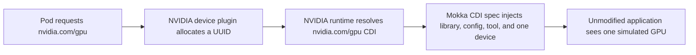

# Run Mokka on Amazon EKS

Install Mokka on CPU-only Amazon Elastic Kubernetes Service (EKS) workers,
advertise simulated GPUs, and run an unmodified `nvidia-smi` from a neutral
workload image.

This guide starts from an existing compatible EKS cluster. If you do not have
one, the optional Terraform path creates a disposable reference cluster with
the required worker runtime configuration. It creates billable AWS resources,
so destroy that stack when you finish.

## What you will validate

By the end, you will understand:

- why a managed CPU node needs NVIDIA Container Toolkit but no NVIDIA driver;
- how the NVIDIA device plugin, NVIDIA runtime, Container Device Interface
  (CDI), and Mokka divide responsibility;
- how to scope Mokka to a dedicated managed node group; and
- how to prove that a normal application container received one simulated GPU.

The reference configuration validated for this guide is deliberately small but
exercises DaemonSet placement across availability zones:

| Component | Validated value | Why |
|---|---|---|
| Region | `us-west-2` | Example default; override it in `terraform.tfvars` |
| Kubernetes | EKS `1.35` | Matches the current Mokka Kind test target |
| Workers | 2 × on-demand `t3.large` | CPU-only, enough memory for system and Mokka pods |
| Worker image | EKS-optimized AL2023 x86_64, `1.35.7-20260911` | Pins the validated containerd and operating-system combination |
| Worker placement | Private subnets in two availability zones, one shared NAT gateway | Exercises one Mokka pod per worker without public worker IPs while keeping the reference cluster's NAT cost down |
| Mokka | chart `0.3.0`, chart-default `latest` image, `gb300` profile | Published chart compatible with the current node agent; see the image note below |
| Device plugin | `nvcr.io/nvidia/k8s-device-plugin:v0.18.2` | Advertises `nvidia.com/gpu` through Mokka's NVML implementation |
| Container toolkit | `1.20.0-1` | Supplies the NVIDIA runtime and CDI hook binaries on CPU nodes |

These versions record a reproducible Mokka validation target; they are not an
AWS support statement. When updating Kubernetes or the AL2023 release, repeat
the neutral-workload test rather than assuming the runtime configuration is
unchanged.

!!! warning "Use a test AWS account"

    The optional Terraform configuration creates IAM roles, networking, an EKS
    cluster, and EC2 instances. Use an isolated account or obtain approval for
    those resources. The `aws_account_id` variable prevents an accidental
    apply to a different account, but it is not a substitute for
    least-privilege IAM.

## Prerequisites

For every path, install these tools locally:

- [kubectl](https://kubernetes.io/docs/tasks/tools/)
- [Helm](https://helm.sh/docs/intro/install/) 3.8 or newer
- `curl` and `jq`

You also need an EKS cluster with at least one dedicated Linux x86_64 CPU
worker. Mokka requires privileged pods and `hostPath` volumes. The worker image
must use containerd with Container Device Interface (CDI) enabled, and must
contain NVIDIA Container Toolkit with `nvidia-container-runtime` configured as
the default runtime in CDI mode. It must not have an NVIDIA kernel driver. The
optional reference-cluster path supplies that configuration.

Set variables for your cluster. The AWS variables are needed only when creating
the optional reference cluster:

```bash
export MOKKA_AWS_PROFILE=default
export MOKKA_AWS_REGION=us-west-2
export MOKKA_CLUSTER=mokka-817
export MOKKA_CONTEXT=mokka-817
```

## 1. Download the installation assets

The guide uses published images and the assets beside this page; it does not
need a source checkout.

```bash
mkdir mokka-eks-guide
cd mokka-eks-guide

export MOKKA_ASSET_BASE=https://raw.githubusercontent.com/NVIDIA/k8s-test-infra/main/docs/guides/managed-eks

for file in mokka-values.yaml device-plugin.yaml verify-workload.yaml; do
  curl -fsSLO "${MOKKA_ASSET_BASE}/${file}"
done
```

These assets scope Mokka and the device plugin to nodes labelled
`mokka.nvidia.com/type=sgpu`.

## 2. Select a cluster path

=== "Use an existing cluster"

    Set `MOKKA_CONTEXT` to the kubeconfig context for the cluster. Select the
    dedicated CPU workers and label each one; do not label real GPU nodes or a
    shared general-purpose pool:

    ```bash
    kubectl --context "${MOKKA_CONTEXT}" get nodes -o wide
    kubectl --context "${MOKKA_CONTEXT}" label node \
      <worker-name> mokka.nvidia.com/type=sgpu
    ```

    Confirm with the cluster administrator that the labelled nodes meet the
    runtime requirements above. Worker runtime configuration happens before
    kubelet starts; if the nodes are not prepared, create a replacement managed
    node group rather than modifying live shared nodes. Continue at
    [Step 4](#4-install-mokka).

=== "Create the reference cluster"

    Continue with Step 3. The supplied Terraform creates and labels two
    prepared workers. It is an optional reproducibility aid, not a requirement
    for installing Mokka.

## 3. Create the optional reference cluster

Install [AWS CLI v2](https://docs.aws.amazon.com/cli/latest/userguide/getting-started-install.html)
and [Terraform](https://developer.hashicorp.com/terraform/install) 1.5.7 or
newer. Your AWS identity needs permission to manage EKS, EC2 networking and
instances, IAM roles, Key Management Service (KMS) keys, and CloudWatch log
groups. A production account should use narrowly scoped permissions.

Download the Terraform assets:

```bash
mkdir terraform
for file in versions.tf variables.tf main.tf outputs.tf \
  terraform.tfvars.example .terraform.lock.hcl; do
  curl -fsSLo "terraform/${file}" "${MOKKA_ASSET_BASE}/terraform/${file}"
done
```

Learning checkpoint: inspect [`terraform/main.tf`](terraform/main.tf). The
workers, not the control plane, are in your VPC. Cloud-init installs NVIDIA
Container Toolkit before EKS bootstrap, then configures the NVIDIA runtime in
CDI mode after `nodeadm` has written containerd's base configuration.

### Authenticate and constrain access

Authenticate using your normal AWS CLI flow. For IAM Identity Center (SSO), for
example:

```bash
aws sso login --profile "${MOKKA_AWS_PROFILE}"
aws sts get-caller-identity --profile "${MOKKA_AWS_PROFILE}"
```

Confirm that the returned account is the one you intend to modify. Then prepare
the Terraform inputs:

```bash
cp terraform/terraform.tfvars.example terraform/terraform.tfvars
curl -fsS https://checkip.amazonaws.com
```

Edit `terraform/terraform.tfvars` and replace:

- `aws_account_id` with the 12-digit account from `get-caller-identity`; and
- the example API CIDR with the displayed public IP plus `/32`.

The template rejects `0.0.0.0/0`. Its public EKS endpoint is reachable only
from the listed CIDRs, while its private endpoint remains available inside the
VPC.

Terraform's AWS provider may otherwise select credentials from another
credential source. Export the exact profile credentials into this shell before
each Terraform operation:

```bash
eval "$(aws configure export-credentials \
  --profile "${MOKKA_AWS_PROFILE}" --format env)"
```

### Apply Terraform

```bash
cd terraform
terraform init
terraform fmt -check -recursive
terraform validate
terraform plan -out=mokka.tfplan
terraform apply mokka.tfplan
cd ..
```

Creation normally takes 15–25 minutes. Keep the generated
`terraform/terraform.tfstate` file: it is required for an exact destroy.

Configure kubectl and verify the cluster:

```bash
aws eks update-kubeconfig \
  --profile "${MOKKA_AWS_PROFILE}" \
  --region "${MOKKA_AWS_REGION}" \
  --name "${MOKKA_CLUSTER}" \
  --alias "${MOKKA_CONTEXT}"

kubectl --context "${MOKKA_CONTEXT}" wait \
  --for=condition=Ready nodes --all --timeout=10m
kubectl --context "${MOKKA_CONTEXT}" get nodes -o wide
kubectl --context "${MOKKA_CONTEXT}" get pods -n kube-system
```

Expect two Ready AL2023 nodes in different availability zones, with no external
IP address. CoreDNS, `aws-node`, and `kube-proxy` should be Running.

Learning checkpoint: the bootstrap installs NVIDIA Container Toolkit on these
CPU nodes, configures `nvidia-container-runtime` in CDI mode, and makes it the
containerd default. It intentionally installs no NVIDIA kernel driver.

## 4. Install Mokka

```bash
helm upgrade --install nvml-mock \
  oci://ghcr.io/nvidia/k8s-test-infra/chart/nvml-mock \
  --version 0.3.0 \
  --kube-context "${MOKKA_CONTEXT}" \
  --namespace mokka \
  --create-namespace \
  --values mokka-values.yaml \
  --wait --timeout 5m

kubectl --context "${MOKKA_CONTEXT}" \
  --namespace mokka get daemonset,pods -o wide
kubectl --context "${MOKKA_CONTEXT}" \
  --namespace mokka exec daemonset/nvml-mock -- nvidia-smi -L
```

There should be one Ready Mokka pod per worker. The command reports four
`NVIDIA GB300 NVL` devices. It proves that Mokka staged its mock driver tree,
configuration, device nodes, and CDI specification on a node.

!!! note "The chart and image releases are not yet aligned"

    Chart `0.3.0` defaults to image tag `latest`. Do not override it to
    `0.3.0`: that older image predates the chart's `node-agent` executable and
    fails at container start. Publishing matching immutable chart and image
    versions is a follow-up packaging gap; the rest of this guide pins every
    component that currently has a compatible release tag. The same version
    skew can produce a harmless `libpcisysfs.so.1` loader warning during
    `kubectl exec`; the neutral workload should still complete without it.

## 5. Advertise the simulated GPUs

Mokka provides the device behavior; the unmodified NVIDIA device plugin tells
the kubelet that the devices are schedulable resources:

```bash
kubectl --context "${MOKKA_CONTEXT}" apply -f device-plugin.yaml
kubectl --context "${MOKKA_CONTEXT}" --namespace kube-system rollout status \
  daemonset/nvidia-device-plugin-mock --timeout=5m

kubectl --context "${MOKKA_CONTEXT}" get nodes -o json | jq -r '
  .items[] |
  [.metadata.name,
   .metadata.labels["mokka.nvidia.com/type"],
   .status.allocatable["nvidia.com/gpu"]] |
  @tsv'
```

Expect `sgpu` and `4` beside both nodes.

The request path is:



The default device-plugin environment strategy is intentional. The NVIDIA
runtime translates the allocated UUID to Mokka's `nvidia.com/gpu` CDI device.
Using the plugin's `cdi-annotations` strategy instead generates a second CDI
spec that does not carry Mokka's selected profile configuration.

## 6. Test from a neutral workload

The verification image is plain Ubuntu. It contains neither `nvidia-smi` nor
Mokka, so a successful run proves that the node runtime injected both:

```bash
kubectl --context "${MOKKA_CONTEXT}" delete pod mokka-verify \
  --ignore-not-found
kubectl --context "${MOKKA_CONTEXT}" apply -f verify-workload.yaml
kubectl --context "${MOKKA_CONTEXT}" wait \
  --for=jsonpath='{.status.phase}'=Succeeded \
  pod/mokka-verify --timeout=3m
kubectl --context "${MOKKA_CONTEXT}" logs mokka-verify
```

Expected output contains one allocated GB300, not all four:

```text
GPU 0: NVIDIA GB300 NVL (UUID: GPU-b300b300-...)
```

This validates three separate outcomes: Kubernetes scheduled a GPU request,
the runtime injected the mock driver into an ordinary image, and the selected
GB300 configuration reached the consumer.

## Why EKS workers need preparation

The [NVIDIA device plugin guide](../device-plugin.md) uses a custom Kind node
image that already contains the runtime pieces. A stock EKS AL2023 CPU worker
can parse CDI specifications, but it does not contain the NVIDIA runtime or CDI
hook binaries. Mokka therefore needs the toolkit installation and runtime
configuration described in the prerequisites.

With stock `runc`, the neutral pod fails because `nvidia-smi` is not injected.
With the device plugin's `cdi-annotations` strategy, the pod starts but reports
Mokka's fallback A100 instead of the selected GB300 because the generated CDI
spec omits Mokka's profile configuration. The supplied worker bootstrap and
device-plugin manifest avoid both failure modes.

## Troubleshooting

### Terraform uses the wrong AWS identity

Run `aws sts get-caller-identity`, re-export the selected profile credentials,
and retry. The provider's `allowed_account_ids` check stops the apply if the
account differs from `terraform.tfvars`.

### kubectl cannot reach the API server

Your public IP may have changed. Update
`cluster_endpoint_public_access_cidrs` in `terraform.tfvars`, export the AWS
credentials again, and run `terraform apply`.

### The device plugin reports no GPUs

Confirm that Mokka is Ready first, then inspect the plugin:

```bash
kubectl --context "${MOKKA_CONTEXT}" --namespace mokka get pods -o wide
kubectl --context "${MOKKA_CONTEXT}" --namespace kube-system logs \
  daemonset/nvidia-device-plugin-mock --tail=100
```

Warnings about optional graphics libraries are expected because Mokka stages
the NVML/CUDA management surface, not a complete physical GPU driver.

### The workload says `nvidia-smi: not found`

The worker is using plain `runc`, or the NVIDIA runtime setup did not complete.
Recreate the managed node group from this Terraform template; do not install a
GPU driver.

### The workload reports the default A100 profile

Do not add `--device-list-strategy=cdi-annotations` to the device plugin. That
strategy's generated CDI spec injects the library but not Mokka's profile file.
Use the manifest supplied with this guide and the NVIDIA runtime in CDI mode.

## Clean up

Remove only the Kubernetes test objects if you want to keep experimenting with
the cluster:

```bash
kubectl --context "${MOKKA_CONTEXT}" delete -f verify-workload.yaml
kubectl --context "${MOKKA_CONTEXT}" delete -f device-plugin.yaml
helm --kube-context "${MOKKA_CONTEXT}" uninstall nvml-mock --namespace mokka
```

If you created the optional reference cluster, destroy all of its AWS resources
when you finish:

```bash
eval "$(aws configure export-credentials \
  --profile "${MOKKA_AWS_PROFILE}" --format env)"
terraform -chdir=terraform destroy
```

Review the destroy plan, enter `yes`, and wait for completion. Confirm that it
reports `Destroy complete` before deleting the local guide directory or its
Terraform state.

## Next steps

- Change `gpu.profile` in `mokka-values.yaml` and verify that the neutral
  workload sees the new identity.
- Enable [allocation-aware memory](../../configuration.md#allocation-aware--opt-in)
  and observe the simulated memory state while a GPU claim exists.
- Follow the [Node-Wide Injection](../node-wide-injection/README.md) or
  [Compute Domain](../compute-domain/README.md) guide for those feature-specific
  workflows; their behavior is not repeated here.
- Add the [GPU Operator](../gpu-operator.md) after the base runtime path works.
- Use separate labelled managed node groups for heterogeneous profiles; one
  node must belong to exactly one Mokka release.
