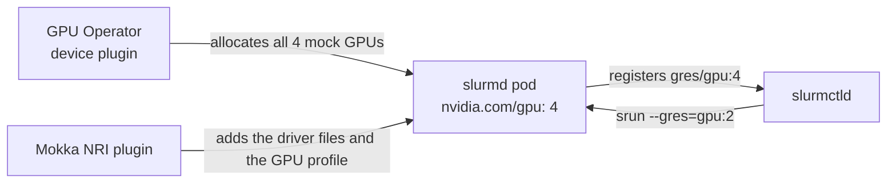

# Slinky (Slurm on Kubernetes)

Run a Slurm cluster on mock GPUs with SchedMD's
[Slinky](https://github.com/SlinkyProject/slurm-operator) operator. The real
`slurmd` discovers the GPUs itself, registers them as generic resources (GRES),
and `srun --gres=gpu:N` schedules jobs against them, all on a cluster with no
GPUs.

## How it fits together

Slinky runs Slurm's daemons as pods. A **NodeSet** is a group of `slurmd` pods.
Each pod is one Slurm compute node, and `slurmctld`, the controller, schedules
jobs onto them.

Each `slurmd` pod requests every GPU on its Kubernetes node. Slurm then splits
those GPUs between jobs, which is how Slurm runs on real GPU nodes too:



`slurmd` is not told which GPUs it has. With `AutoDetect=nvidia` in
`gres.conf`, it reads the files the NVIDIA kernel driver publishes. It
lists `/proc/driver/nvidia/gpus/` to find the GPUs, reads each GPU's model,
UUID and device minor from its `information` file, and reads its CPU affinity
from `/sys/bus/pci/drivers/nvidia/<pci-address>/local_cpulist`. Mokka serves
those files, and the [NRI plugin](../../components/nri-plugin.md) makes them
visible inside the `slurmd` container. runc does not allow mounts inside
`/proc`, so `libmockfs.so` intercepts those reads instead; see
[Libraries and Shims](../../components/libraries-and-shims.md#libmockfs).

!!! note "Requires nvml-mock 0.5.0 or newer"
    Earlier releases do not serve the driver files above. `slurmd` then finds no
    GPUs, and every node registers with `Gres=(null)`.

## Prerequisites

- [Docker](https://docs.docker.com/get-started/get-docker/) and
  [Kind](https://kind.sigs.k8s.io/)
- [Helm 3.8 or newer](https://helm.sh/docs/intro/install/)
- [kubectl](https://kubernetes.io/docs/reference/kubectl/)

Takes about 20 minutes, most of it pulling the GPU Operator and Slurm images.

## Step 1 — Create a cluster with NRI enabled

The Mokka node image ships containerd with CDI enabled and the NVIDIA container
runtime installed. The NRI plugin also needs containerd's NRI socket, which
the config below turns on.

```bash
cat > kind.yaml <<'EOF'
kind: Cluster
apiVersion: kind.x-k8s.io/v1alpha4
containerdConfigPatches:
  - |-
    [plugins."io.containerd.nri.v1.nri"]
      disable = false
      disable_connections = false
      socket_path = "/var/run/nri/nri.sock"
nodes:
  - role: control-plane
  - role: worker
EOF

kind create cluster --name slinky --config kind.yaml \
  --image ghcr.io/nvidia/mokka-kind-node:latest
```

## Step 2 — Install Mokka

```bash
helm install nvml-mock oci://ghcr.io/nvidia/k8s-test-infra/chart/nvml-mock \
  --version 0.5.0 \
  --namespace mokka --create-namespace \
  --wait --timeout 300s
```

The NRI plugin is on by default. The default `gb300` profile has four GPUs per
node, and Step 5 relies on that count.

## Step 3 — Install the GPU Operator

Install it exactly as in the [GPU Operator guide](../gpu-operator.md#step-3--install-the-gpu-operator):
write its `gpu-operator-values.yaml` overlay, then install with that file:

```bash
helm repo add nvidia https://helm.ngc.nvidia.com/nvidia && helm repo update

helm install gpu-operator nvidia/gpu-operator --version v26.3.3 \
  --namespace gpu-operator --create-namespace \
  -f gpu-operator-values.yaml \
  --wait --timeout 600s

kubectl get node slinky-worker -o jsonpath='{.status.allocatable.nvidia\.com/gpu}'
# 4
```

Wait for a non-zero count before going on. Until the device plugin registers
the GPUs, `slurmd` has nowhere to schedule.

## Step 4 — Install the Slinky operator

The operator's admission webhooks use certificates from
[cert-manager](https://cert-manager.io/), so install cert-manager first:

```bash
helm install cert-manager oci://quay.io/jetstack/charts/cert-manager \
  --version v1.21.2 \
  --namespace cert-manager --create-namespace \
  --set crds.enabled=true \
  --wait --timeout 300s

helm install slurm-operator-crds oci://ghcr.io/slinkyproject/charts/slurm-operator-crds \
  --version 1.2.3

helm install slurm-operator oci://ghcr.io/slinkyproject/charts/slurm-operator \
  --version 1.2.3 \
  --namespace slinky --create-namespace \
  --wait --timeout 300s
```

The operator, its CRDs and the `slurm` chart in the next step are released
together. Keep the three on the same version.

## Step 5 — Deploy the Slurm cluster

```bash
cat > slurm-values.yaml <<'EOF'
configFiles:
  gres.conf: |
    AutoDetect=nvidia # (1)!
controller:
  extraConfMap:
    GresTypes: ["gpu"] # (2)!
nodesets:
  gpu:
    scalingMode: DaemonSet # (3)!
    slurmd:
      resources:
        limits:
          nvidia.com/gpu: 4 # (4)!
    podSpec:
      nodeSelector:
        feature.node.kubernetes.io/pci-10de.present: "true" # (5)!
partitions:
  all:
    enabled: true
EOF

helm install slurm oci://ghcr.io/slinkyproject/charts/slurm \
  --version 1.2.3 \
  --namespace slurm --create-namespace \
  -f slurm-values.yaml

kubectl -n slurm wait pod -l app.kubernetes.io/name=slurmd \
  --for=condition=Ready --timeout=600s
```

1. `slurmd` finds the GPUs itself from the driver files Mokka serves, so
   neither `gres.conf` nor the node's `Gres` lists them.
2. Without it, `slurmctld` drops the GPUs every node reports, and nodes register
   with `Gres=(null)`. Chart 1.2.3 does not set it.
3. One `slurmd` per GPU node, so the Slurm cluster grows with the Kubernetes
   cluster.
4. Every GPU on the node, so Slurm can divide them between jobs. It must match
   the profile's GPU count. The allocation is also what makes the NRI plugin
   give `slurmd` the driver files: it injects only containers that hold GPUs.
5. Mokka labels its nodes with the NVIDIA PCI vendor ID through Node Feature
   Discovery, so `slurmd` lands only on mock-GPU nodes.

## Step 6 — Verify

Both nodes come up `idle` with four GPUs:

```bash
kubectl -n slurm exec slurm-controller-0 -c slurmctld -- sinfo -N -o '%N %T %G'
# NODELIST STATE GRES
# slinky-worker idle gpu:nvidia_gb300_nvl:4(S:0)
```

Slurm names the GPU type after the model it read, and `(S:0)` is the CPU
socket it derived from the GPUs' `local_cpulist`. Both vary with the profile.
A plain `--gres=gpu:2` matches any type.

Then run a job that asks for two of them:

```bash
kubectl -n slurm exec slurm-controller-0 -c slurmctld -- \
  srun -N1 --gres=gpu:2 bash -c 'echo "CUDA_VISIBLE_DEVICES=$CUDA_VISIBLE_DEVICES"; nvidia-smi -L'
# CUDA_VISIBLE_DEVICES=0,1
# GPU 0: ...
```

`CUDA_VISIBLE_DEVICES=0,1` is the meaningful part: Slurm allocated two GPUs
out of the four the node registered.

## What is not simulated

**`nvidia-smi` in a job lists every GPU on the node.** The mock decides which
GPUs a process sees from the `/dev/nvidia*` device nodes it can open. Slurm
confines a job to its GPUs with cgroup device rules, which the mock does not
model. `CUDA_VISIBLE_DEVICES` is still correct, and it is what a CUDA program
respects.

**A job reads the node's real driver files.** Slurm gives a job the
environment of the shell that ran `srun`, not of `slurmd`, so the shims the
NRI plugin preloads into `slurmd` are not loaded in the job. NVML in the job
still reports the node's profile, but a job reading `/proc/driver/nvidia` or
PCI sysfs directly sees the real files; see
[which containers are injected](../../components/nri-plugin.md#which-containers-are-injected).

**Jobs run no CUDA kernels.** [CUDA is not simulated](../../faq.md#can-i-run-cuda-workloads-against-mokka).

## Troubleshooting

**Nodes show `Gres=(null)`.** Either `GresTypes` is missing from the
controller configuration, or `slurmd` found no GPUs. Check that it can see
the driver files:

```bash
POD=$(kubectl -n slurm get pod -l app.kubernetes.io/name=slurmd -o jsonpath='{.items[0].metadata.name}')
kubectl -n slurm exec "$POD" -c slurmd -- ls /proc/driver/nvidia/gpus
```

An empty or missing directory means the NRI plugin did not inject the pod, or
Mokka is older than 0.5.0. Check that an `nvml-mock-nri` pod is running on the
node, then delete the `slurmd` pods so the operator recreates them. NRI only
edits containers when they are created.

**GPU jobs fail with `Requested node configuration is not available` after
reinstalling Mokka or switching profiles.** `slurmd` detects GPUs once, at
startup, and `slurmctld` keeps the GPU-to-CPU binding from a node's first
registration even when `slurmd` restarts. Delete the node records, then the
`slurmd` pods, so every node registers fresh:

```bash
kubectl -n slurm exec slurm-controller-0 -c slurmctld -- \
  scontrol delete nodename="$(kubectl -n slurm exec slurm-controller-0 -c slurmctld -- sinfo -h -N -o '%N' | paste -sd, -)"
kubectl -n slurm delete pod -l app.kubernetes.io/name=slurmd
```

**`slurmd` pods stay `Pending`.** The node advertises no `nvidia.com/gpu`, or
fewer than the pod requests. Check `kubectl -n gpu-operator get pods` and
compare the allocatable count from Step 3 with the NodeSet's limit.

More symptoms in [Troubleshooting](../../troubleshooting.md).

## Running it from a checkout

With the repository cloned, the Tilt environment builds Mokka from source and
runs this same stack, with SSH into the `slurmd` pods enabled. Tilt reports
ready only once every `slurmd` pod is `Ready`, and it prints `sinfo` once
they are:

```bash
make cluster-create
tilt up -- --slinky
```

See [Local Development](../../contributing/local-development.md#adding-consumers).

## Clean up

```bash
kind delete cluster --name slinky
```

## Related

| To read about | See |
|---|---|
| The GPU Operator overlay and what each value does | [NVIDIA GPU Operator](../gpu-operator.md) |
| Which containers the NRI plugin injects, and why | [NRI Plugin](../../components/nri-plugin.md) |
| Slurm's GPU autodetection | [Slurm `gres.conf`](https://slurm.schedmd.com/gres.conf.html#OPT_AutoDetect) |
| Slinky's Helm charts and their values | [Slinky documentation](https://slinky.schedmd.com) |
