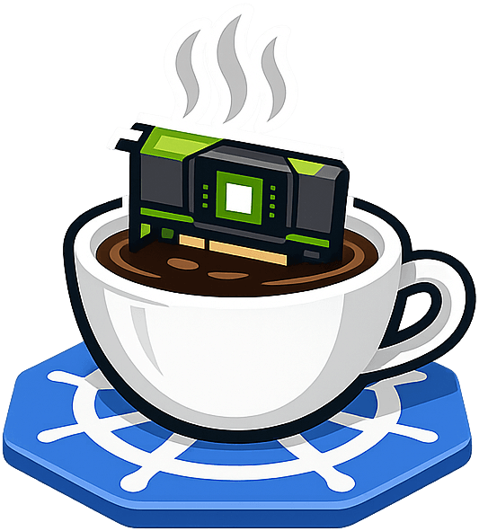
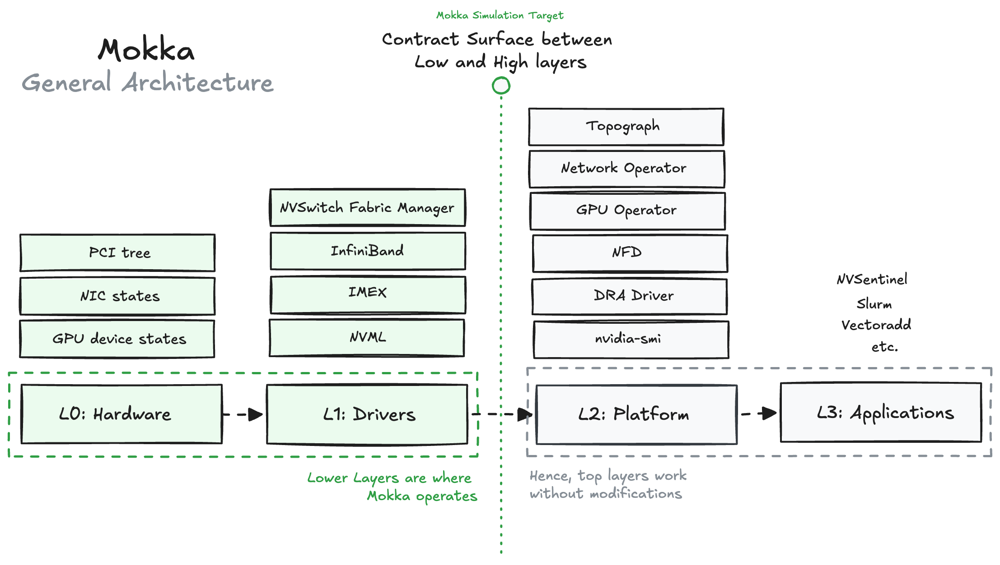

<div class="mokka-hero" markdown>


<p class="mokka-tagline">Simulate your GPU infrastructure on CPU nodes.</p>
</div>

# Mokka

Mokka turns any Kubernetes cluster into a multi-GPU environment for testing.
It implements the NVIDIA driver interfaces that GPU software talks to, so the
device plugin, the DRA driver, the GPU Operator and `nvidia-smi` all behave as
though real hardware were present. No physical NVIDIA GPU is required.

<div class="grid cards" markdown>

-   **Quick Start**

    Install into a KIND cluster and see simulated GPUs in five minutes.

    [Get started](quickstart.md)

-   **Architecture**

    How the mock NVML library, the CGo bridge and the GPU profiles fit together.

    [Read the design](architecture.md)

-   **Demos**

    Six runnable walkthroughs, from a standalone install to NVSentinel health
    monitoring.

    [Browse demos](demo/README.md)

-   **Configuration**

    Every YAML knob: profiles, topology, failure injection and dynamic metrics.

    [See the reference](configuration.md)

</div>

## Try it

```bash
# 1. Create a cluster
kind create cluster --name mokka

# 2. Load the published image. It is multi-arch, and `kind load docker-image`
# cannot load a multi-arch image from Docker Desktop's containerd store, so
# save a single platform first.
ARCH=$(uname -m | sed 's/x86_64/amd64/; s/aarch64/arm64/')
docker pull ghcr.io/nvidia/nvml-mock:latest
docker save --platform "linux/${ARCH}" ghcr.io/nvidia/nvml-mock:latest -o nvml-mock.tar
kind load image-archive nvml-mock.tar --name mokka

# 3. Install
helm install nvml-mock oci://ghcr.io/nvidia/k8s-test-infra/chart/nvml-mock
```

The [Helm chart guide](helm-chart.md) has the full walkthrough for each
consumer, including the device plugin, the DRA driver, the GPU Operator and a
multi-node heterogeneous fleet.

## How it fits together

<div class="mokka-architecture" markdown>

</div>

## Components

| Component | Description | Status |
|-----------|-------------|--------|
| Mock NVML (`libnvidia-ml.so`) | 400 NVML C API exports (111 with configurable behavior, 289 stubs), YAML-configurable GPU profiles | Production |
| nvidia-smi | Real binary with RPATH patch, backed by mock NVML | Production |
| Helm Chart | DaemonSet deployment with 7 GPU profiles | Production |
| CDI Injection | Container Device Interface specs for GPU Operator | Production |

## GPU profiles

| Profile | GPU Name | VRAM | Architecture |
|---------|----------|------|--------------|
| `a100` | A100-SXM4-40GB | 40 GiB | Ampere |
| `h100` | H100 80GB HBM3 | 80 GiB | Hopper |
| `b200` | B200 | 192 GiB | Blackwell |
| `gb200` | GB200 | 192 GiB | Blackwell |
| `gb300` | GB300 NVL | 288 GiB | Blackwell Ultra |
| `l40s` | L40S | 48 GiB | Ada Lovelace |
| `t4` | Tesla T4 | 16 GiB | Turing |

## Tested consumers

| Consumer | Role | Status |
|----------|------|--------|
| NVIDIA Device Plugin | `nvidia.com/gpu` extended resources | Tested |
| NVIDIA DRA Driver | Dynamic Resource Allocation | Tested |
| NVIDIA GPU Operator | Full stack device plugin, GFD and validator | Tested |
| GPU Feature Discovery | Node labeling from NVML | Tested |

## Integrations

| Integration | Description |
|-------------|-------------|
| [fake-gpu-operator](integrations/fake-gpu-operator.md) | Run:ai's K8s-level GPU simulation plus nvml-mock driver fidelity |
