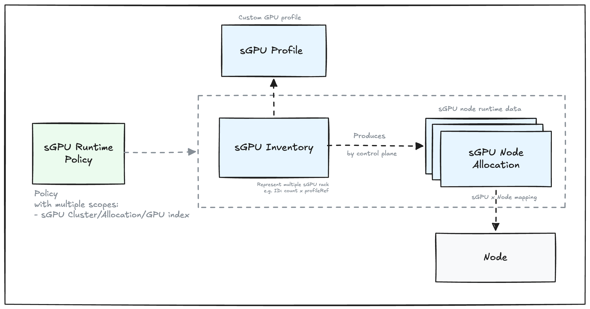
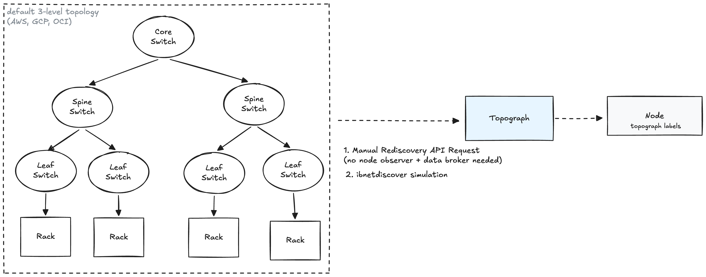

# MEP-0001: Mokka Control Plane

Author: [Roman Hlushko](https://github.com/roma-glushko)

<!-- toc -->
- [Summary](#summary)
- [Motivation](#motivation)
  - [Goals](#goals)
  - [Non-Goals](#non-goals)
- [Proposal](#proposal)
  - [User Stories (Optional)](#user-stories-optional)
    - [Story 1 (Optional)](#story-1-optional)
    - [Story 2 (Optional)](#story-2-optional)
  - [Notes/Constraints/Caveats (Optional)](#notesconstraintscaveats-optional)
  - [Risks and Mitigations](#risks-and-mitigations)
- [Design Details](#design-details)
- [Drawbacks](#drawbacks)
- [Alternatives](#alternatives)
<!-- /toc -->

## Summary

This proposal introduces a new component called Mokka Control Plane that centralizes:
- distribution of virtual GPU inventory (a new concept) across a K8s cluster 
- management of simulated GPU runtime state (for example, useful for chaos testing and fault injection)

## Motivation

The current architecture includes:
- a single central NVML mock component that acts as a node agent that applies NVML mock configuration and topology from configmaps
- each NVML instance is an independent component that knows nothing about the existence of any other NVML mock instances
- if you want to have different GPU profiles for different nodes, you need to label those nodes differently and deploy multiple Mokka helm charts with different node selectors.


This architecture has given us a chance to focus on developing the core simulation logic so far.
However, we are approaching use cases that push it to its limits:

- there is no way to simulate capacity distribution of GPU platforms like GB300. For example, if you want to simulate two GB300 instances in the cluster, you can get at most 2 × 18 = 36 GPU nodes, each with 4 GPUs. Today it's the responsibility of Mokka users to enforce that cap, which may lead to unrealistic cluster topologies.
- we would like to have a simple way to change simulated GPU runtime state like temperature, failure modes, etc. So there is a quick way for a cluster operator to propagate a failure across thousands of nodes.
- we ask cluster administrators to set `nvidia.com/clique` labels while it should be based on the GPU rack the node belongs to.
- We ask cluster administrators to provide cross-rack network topology.

### Goals

We aim for:
- decoupling of the simulated GPU profiles and runtime state from NVML mocks in order to control them centrally
- being able to schedule only a realistic number of GPU nodes based on provided configuration.
- automatically infer networking as much as we can.

### Non-Goals

<!--
What is out of scope for this MEP? Listing non-goals helps to focus discussion
and make progress.
-->

## Proposal

Before talking about the actual proposal, we need to refine our mental model. 
This should help us and our users reason about Mokka better.

The proposed way of thinking about our domain is one of the key pieces of the proposal.

### Context

When you buy a GPU platform like GB300 in clouds like AWS,
it becomes reserved for you.
You can then distribute the available number of GPUs across accounts and clusters as much as that capacity allows.

The reservation takes time and this is where Mokka can be useful.

### Mental Model

Let's think about the GPU infrastructure we want to simulate in terms of simulated GPU racks (we use the term *sGPU* to avoid confusion with *vGPU*, which already has an established meaning in the field) that the user is expecting to have
and networking between them. That's our simulated GPU inventory.

The GPU inventory holds the capacity that we can distribute in the cluster. 
For example, if we have 2x GB300 racks in our simulated GPU inventory this gives 2 × 18 = 36 GPU nodes, each with 4 sGPUs attached.
If we wanted to schedule 40 GPU nodes with that inventory, 40-36 = 4 would be without GPU.

The sGPU racks are characterized by:

- sGPU rack profile that contains physical and operational features and facts about the real GPU we simulate. This is our static ground truth. This includes expected node-level GPU profile (e.g. each of 18 GB300 nodes has 4 GPUs).
- sGPU runtime state which is a dynamic set of simulated sGPU characteristics like temperature, failure modes, fan state, etc. This is not sGPU rack-level information, it's sGPU-level information.

### Architecture

We propose to transform the current system state into a classic control-data plane architecture where:
- (new) Control Plane is a single, centralized source of truth for sGPU inventory information and network topology
- Data Plane is a node-level agent that applies the sGPU node information, runtime state and network topology.


With this, NVML mock becomes a node-level agent (or Mokka Node Agent). 
It makes sure sGPU and networking reflect the desired state. 
In that sense, it can be thought of as a virtual device driver (for GPU and network card).

At the same time, Control Plane is responsible for distributing and assigning sGPU capacity to the node agents, 
receiving changes that external clients want to apply to the sGPUs' runtime state.

#### Runtime State

While the high-level architecture is the same, there are two different ways to manage runtime state.

Control plane runtime state includes:
- sGPU node to K8s Node allocation
- Last time the node agent asked for their identity (acts as a health check, so we can automatically find allocations that are assigned to dead nodes or agents)
- sGPU runtime information (failures, temperature, fan state, etc.)

There are two ways to store it:

1. Custom resources in K8s etcd (sGPU Node Allocation):
- [Good] No need to bring any dependency. Using the vanilla K8s capabilities
- [Bad/Neutral] Implementation-wise it's harder to achieve correctness when working with etcd via the K8s API than with Redis directly.
- [Bad] Each NodeAllocation corresponds to a K8s Node so we will have roughly 5k records when simulating a 5k-node GPU cluster, for example. So NodeAllocations have a high cardinality.
- [Bad] It's likely that we will update those objects quite often, which adds load to the K8s Control Plane.

2. Use Redis:
- [Good] Much easier to operate on the state, change it concurrently and atomically and even search compared to etcd.
- [Good] It scales well. It might be helpful for more advanced functionality
- [Good] No additional pressure on the Kubernetes Control plane
- [Bad] We add an external dependency in a form of Redis. Even though it's the least demanding DB in terms of maintenance, we need to deploy it and potentially make sure it's snapshotting its content for persistence (so PVC would be needed).

Decision: The proposal suggests to move on with Redis as a medium to store runtime state because it makes implementation easier,
removes additional load and a high cardinality data from K8s Control Plane.

### User Stories

#### S1: Precise Multi-GPU Distribution Simulation

As a cluster administrator, I don't need to worry about GPU rack architecture details
in order to simulate the GPU capacity my team expects.

I just specify the GPU racks we expect to have and rough network topology between them, and my cluster topology will be representative.

#### S2: Dynamic Failure Injection

As a cluster administrator, I can manage runtime state of my simulated GPU inventory in one place via Kubernetes Custom Resources.
I can write an automation that modifies the Kubernetes CR state and expect it to be propagated to all nodes without being concerned with cluster topology.

### Notes/Constraints/Caveats (Optional)

<!--
What are the caveats to the proposal?
What are some important details that didn't come across above?
Go in to as much detail as necessary here.
This might be a good place to talk about core concepts and how they relate.
-->

### Risks and Mitigations

<!--
What are the risks of this proposal, and how do we mitigate? Think broadly.
For example, consider operational overhead, resource consumption, and how
this will impact our users.
-->

## Design Details

### sGPU Inventory Distribution

Control Plane holds the currently configured sGPU inventory.
Then, cluster admins are free to label their CPU nodes with a custom label (for example, `mokka.nvidia.com/sgpu: gb300`) that indicates which sGPU type should be available on that node.

When the node agent reaches out to the Control Plane, it provides information about the current node it was installed on.
Based on that data, Control Plane does the following:

- resolves the current Kubernetes node information
- finds the sGPU type in the `mokka.nvidia.com/sgpu` label
- looks into the current sGPU inventory to see whether this is a newly created node that requires sGPU capacity assignment or a node with existing assignment
- for a newly created node, Control Plane tries to find capacity and assign it, generating some runtime information like GPU, PCI IDs to make them unique. Control Plane also labels the K8s node with `nvidia.com/clique` when sGPU is assigned to the node.

For both existing and new assignments, Control Plane returns sGPU profile information and runtime status.
Control Plane may return an error that indicates that we are out of capacity (because there is not enough sGPU in the inventory or because the capacity was reduced in runtime).

### Node Agent

The node agent focuses purely on what NVML mock does today which is how to mock the given expected state of NVML and networking.

However, the agent doesn't control the expected state, it merely receives and applies it (similarly to kubelet).

In order to get the most recent sGPU state, the agent should periodically poll Control Plane (a.k.a. node agent heartbeat).
It should cache the previous state in memory, so we can survive any temporary Control Plane crashes.

If the node agent fails to send a heartbeat, it will be assumed inactive and the capacity it was holding will be returned to the sGPU inventory for reuse.
This is also a self-healing mechanism in case the node dies and node agent had no chance to inform us about shutdown.

### Control Plane State

Control Plane should keep three types of state:

- sGPU inventory state (cluster-wide configuration, mostly static, but may change infrequently if needed)
- sGPU-to-node assignment state (runtime, can be lost and recreated)
- sGPU-level runtime state (runtime, can be lost)

The sGPU inventory state may be kept in etcd as Kubernetes custom resources. 
This will make sure Mokka configuration is declarative.

In terms of the node assignment and runtime information, we have [two options as mentioned above](#runtime-state).

Control Plane would operate as a K8s Operator and we need to make sure we can make multiple
replicas active at the same time to fulfill node agent requests and do sGPU distribution.

### CRD Design

Here is the list of CRDs to map our system concepts:



- [Admin/GitOps] sGPU Profile: Specifies custom sGPU profiles
- [Admin/GitOps] sGPU Inventory: Specifies a set of sGPUs available for node assignment (e.g. Rack Name: sGPU profile x count)
- [Admin/GitOps] sGPU Runtime Policy: Helps to modify runtime information of the whole sGPU inventory, sGPU rack, Node inside sGPU rack or specific sGPU inside the sGPU node.
- [Control Plane] sGPU Node Allocation (in case of storing [the runtime state in etcd](#runtime-state)): Defines the expected state of sGPU node including sGPU<->K8s Node assignment, last agent fetch time, etc.

All CRDs are meant to be cluster-wide.

#### SGPUProfile

The current profile YAML format is a mix of multiple things:
- hardware capabilities
- node/rack topology
- software and firmware versions
- generated identities such as UUIDs and serial numbers
- initial runtime state
- live counters and telemetry
- implementation details needed to reproduce nvidia-smi -q.

Mapping between the existing YAML configuration and proposed SGPUProfile:

| Existing section                      | New location                           |
| ------------------------------------- | -------------------------------------- |
| `system`                              | `spec.software`                        |
| Static parts of `device_defaults`     | `spec.node.gpus`                       |
| Current values in `device_defaults`   | `spec.defaults.runtime`                |
| `devices[]` identities                | Generated during materialization       |
| `devices[].pci.bus_id`                | `spec.node.topology.gpuSlots[]`        |
| `pcie_topology`                       | Derived from `gpuSlots[]`              |
| `nvlink`                              | `spec.node.topology.gpuFabric`         |
| `infiniband`                          | `spec.node.topology.network`           |
| `dynamic_metrics_defaults`            | `spec.defaults.runtime.telemetry`      |
| `fabric.cluster_uuid` and `clique_id` | Generated from the fabric domain       |
| `processes`                           | Runtime state only; never profile spec |

Not all of that belongs to SGPUProfile. We propose the following information hierarchy:

```
SGPUProfile
├── rack                         Rack shape
├── node
│   ├── gpus                     Homogeneous GPU template
│   ├── host                     CPU/host characteristics
│   └── topology                 PCIe, NUMA, GPU fabric, network
├── software                     Driver/NVML/CUDA presentation
└── defaults.runtime             Initial state, same schema as runtime policy
```

```yaml
apiVersion: mokka.nvidia.com/v1alpha1
kind: SGPUProfile
metadata:
  name: gb300-nvl72
  labels:
    mokka.nvidia.com/family: gb300
    mokka.nvidia.com/platform: nvl72
    mokka.nvidia.com/profile-source: builtin
spec:
  # Logical rack shape. SGPUInventory multiplies this by its rack count.
  rack:
    nodesPerRack: 18

  # Every logical node in this profile has the same shape.
  node:
    gpus:
      count: 4

      model:
        vendor: nvidia.com
        product: GB300
        productName: NVIDIA GB300 NVL
        architecture: blackwell

        computeCapability:
          major: 10
          minor: 0

        cores:
          cuda: 21632

        board:
          partNumber: 699-2G530-0300-000

        firmware:
          vbiosVersion: 97.00.41.00.01
          gspVersion: 570.124.06

          infoROM:
            imageVersion: G530.0300.00.01
            oemObjectVersion: "2.1"
            eccObjectVersion: "7.20"
            powerObjectVersion: "1.0"

      memory:
        capacity: 288Gi
        reserved: 1536Mi
        bar1Capacity: 768Gi
        busWidthBits: 8192

      pci:
        vendorID: "10de"
        deviceID: "2941"
        subsystemVendorID: "10de"
        subsystemDeviceID: "1830"

        maxLink:
          generation: 6
          width: 16

      power:
        managementSupported: true

        limitsMilliWatts:
          minimum: 500000
          default: 1400000
          maximum: 1600000

      thermal:
        targetCelsius: 85
        maxOperatingCelsius: 85
        slowdownThresholdCelsius: 90
        shutdownThresholdCelsius: 95

      clocks:
        maximumMHz:
          graphics: 2200
          sm: 2200
          memory: 2625
          video: 2200

        supported:
          - memoryMHz: 2625
            graphicsMHz:
              - 345
              - 690
              - 1035
              - 1380
              - 1725
              - 1980
              - 2200

      capabilities:
        mig:
          supported: true
          maxGPUInstances: 7

        # Extensible capabilities that do not justify permanent top-level
        # fields. Keys must be qualified names.
        attributes:
          nvidia.com/transformer-engine:
            bool: true

          nvidia.com/confidential-compute:
            bool: true

          nvidia.com/nvlink-c2c:
            bool: true

          nvidia.com/tensor-precisions:
            strings:
              - fp4
              - fp6
              - fp8

          nvidia.com/decompression-engine:
            bool: true

    # Optional host characteristics exposed by the mock.
    host:
      cpu:
        vendor: nvidia.com
        product: Grace
        architecture: arm64
        cores: 72

      memory:
        capacity: 480Gi
        coherentWithGPU: true

    topology:
      # Describes structural PCIe/NUMA placement. UUIDs, serials and minor
      # numbers are generated per allocated logical node.
      gpuSlots:
        - index: 0
          pciAddress: "0000:0a:00.0"
          rootComplex: pci0000:00
          numaNode: 0
          hostProcessorIndex: 0

        - index: 1
          pciAddress: "0000:0b:00.0"
          rootComplex: pci0000:00
          numaNode: 0
          hostProcessorIndex: 0

        - index: 2
          pciAddress: "0000:4a:00.0"
          rootComplex: pci0000:40
          numaNode: 1
          hostProcessorIndex: 1

        - index: 3
          pciAddress: "0000:4b:00.0"
          rootComplex: pci0000:40
          numaNode: 1
          hostProcessorIndex: 1

      gpuFabric:
        type: NVLink
        generation: 5
        linksPerGPU: 18
        bandwidthPerLinkMBps: 53125
        c2cSupported: true

        domain:
          scope: Rack
          gpuCount: 72

        switches:
          # Optional: number visible to each node's NVML view.
          visiblePerNode: 4

      network:
        type: InfiniBand
        adapterModel: MT4129
        firmwareVersion: 28.43.1000
        linkSpeedGbps: 400
        adaptersPerGPU: 1

  # Versions that the simulator exposes through NVML/CUDA queries.
  software:
    driverVersion: 570.124.06
    nvmlVersion: 12.570.124.06
    cudaVersion: "12.8"

  # Initial effective runtime state. This should use exactly the same Go/API
  # type as SGPURuntimePolicy.spec.runtime.
  defaults:
    runtime:
      deviceState: Healthy

      modes:
        persistence: Enabled
        compute: Default
        mig: Disabled
        ecc: Enabled
        accounting: Disabled

      telemetry:
        performanceState: P0

        utilization:
          mode: Pattern
          pattern:
            type: Steady
            gpuPercent:
              minimum: 10
              maximum: 45
            memoryPercent:
              minimum: 5
              maximum: 25

        power:
          mode: Fixed
          drawMilliWatts: 175000

        temperature:
          mode: Fixed
          gpuCelsius: 38
          memoryCelsius: 36

        clocks:
          graphicsMHz: 345
          smMHz: 345
          memoryMHz: 2625
          videoMHz: 1200
```

Validation semantics:

```yaml
gpuSlots:
  x-kubernetes-list-type: map
  x-kubernetes-list-map-keys:
    - index

capabilities.attributes.*.strings:
  x-kubernetes-list-type: set
```

- We should represent the out-of-the-box profiles just as custom resources of `SGPUProfile` type, 
so there is a distinction between vanilla and custom profiles. 

#### SGPUInventory

```yaml
apiVersion: mokka.nvidia.com/v1alpha1
kind: SGPUInventory
metadata:
  name: dev
spec:
  rackGroups:
    - id: training
      count: 2
      profileRef:
        name: gb300-nvl72

      placement:
        nodeSelector:
          matchLabels:
            mokka.nvidia.com/sgpu: training

    - id: ci
      count: 3
      profileRef:
        name: custom-vera-rubin-300
        
      placement:
        nodeSelector:
          matchLabels:
            mokka.nvidia.com/sgpu: ci

# information added by Control Plane
# This is useful for troubleshooting and understanding simulated capacity usage
status:
  capacity:
    racks: 5
    nodes: 48
    gpus: 168

  usage:
    requestedNodes: 40
    allocatedNodes: 40
    availableNodes: 8
    pendingNodes: 0

  rackGroups:
    - id: training
      profileName: gb300-nvl72
      
      capacity:
        racks: 2
        nodes: 36
        gpus: 144

      usage:
        requestedNodes: 32
        allocatedNodes: 32
        availableNodes: 4
        pendingNodes: 0

    - id: ci
      profileName: a100-2gpu-test-rack
      capacity:
        racks: 3
        nodes: 12
        gpus: 24

      usage:
        requestedNodes: 8
        allocatedNodes: 8
        availableNodes: 4
        pendingNodes: 0

  conditions:
    - type: Accepted
      status: "True"
      reason: Accepted
      message: The inventory configuration is valid.
      observedGeneration: 3
      lastTransitionTime: "2026-08-05T10:40:00Z"

    - type: ResolvedRefs
      status: "True"
      reason: ProfilesResolved
      message: All referenced SGPUProfiles were resolved.
      observedGeneration: 3
      lastTransitionTime: "2026-08-05T10:40:20Z"

    - type: Programmed
      status: "True"
      reason: InventoryPublished
      message: The inventory capacity was published to the allocation backend.
      observedGeneration: 3
      lastTransitionTime: "2026-08-05T10:40:40Z"

    - type: RequestsSatisfied
      status: "False"
      reason: InsufficientCapacity
      message: >-
        5 requested sGPU nodes in rack group "training" are waiting because
        all matching capacity is allocated.
      observedGeneration: 3
      lastTransitionTime: "2026-08-05T10:45:12Z"
```

For Server-Side Apply friendliness, `spec.rackGroups` should be defined in the CRD schema as an associative list keyed by id:

```yaml
x-kubernetes-list-type: map
x-kubernetes-list-map-keys:
  - id
```

We should probably limit the number of rack groups, our users can specify to a reasonable number like 64 (Gateway API limits [the number of listeners to 64 as well](https://www.romaglushko.com/blog/k8s-gateway-api/#listenerset)).

A specific rack runtime state that consists clique compute domain information is a part of [the runtime state](#runtime-state) 
and should be kept outside the Kubernetes etcd.

#### SGPURuntimePolicy

```yaml
apiVersion: mokka.nvidia.com/v1alpha1
kind: SGPURuntimePolicy
metadata:
  name: dev-busy-gpus
spec:
  targetRef:
    group: mokka.nvidia.com
    kind: SGPUInventory 
    name: development-cluster

    rackGroups: # optional
      - training 
    rackIndexes: # optional
      - 0
    nodeIndexes: # optional
      - 5
    gpuIndexes: # optional
      - 2

  runtime: # the same configuration as in SGPUProfile.defaults.runtime
    telemetry:
      temperature:
        mode: Fixed
        gpuCelsius: 80
        memoryCelsius: 50
```

Validation semantics for `*Indexes` fields:

```yaml
x-kubernetes-list-type: set
minItems: 1
maxItems: 64
```

The controller performs reference-dependent validation of `targetRef`:

- Does the inventory exist?
- Does rackGroup exist?
- Is rackIndex < count?
- Is nodeIndex < nodesPerRack?
- Is gpuIndex < devicesPerNode?

A policy should contain only the fields it wants to control. It's a sparse override.

- Omitted field means inherit
- Explicit zero is a real value to set e.g. empty list [] or 0 int.
- A more-specific list replaces a less-specific list

#### SGPUNodeAllocation

This only applies to the architecture where we store [runtime state in Kubernetes CRD](#runtime-state).

These resources are fully owned by Control Plane, not created by cluster administrators.

```yaml
apiVersion: mokka.nvidia.com/v1alpha1
kind: SGPUNodeAllocation
metadata:
  name: dev-training-r000-n005
  labels:
    mokka.nvidia.com/inventory: dev
    mokka.nvidia.com/rack-group: training
    mokka.nvidia.com/rack-index: "0"
    mokka.nvidia.com/node-index: "5"
    mokka.nvidia.com/profile: gb300-nvl72
    mokka.nvidia.com/node: aws-ec2-worker-06
  ownerReferences:
    - apiVersion: mokka.nvidia.com/v1alpha1
      kind: SGPUInventory
      name: dev
      uid: 2d50c972-39d4-4f63-ae42-ea2d639a17a1
      controller: true
      blockOwnerDeletion: true
spec:
  inventoryRef:
    name: dev
    uid: 2d50c972-39d4-4f63-ae42-ea2d639a17a1
  
  nodeRef:
    name: aws-ec2-worker-06
    uid: 33427206-1021-4bd9-a6fb-c23737696e98

  profileRef:
    name: gb300-nvl72
    uid: 26fc3c9b-a857-4320-863d-334af5a5d768

  identity:
    rackGroup: training
    rackIndex: 0
    nodeIndex: 5
  
  system:
    driverVersion: 570.124.06
    nvmlVersion: 12.570.124.06
    cudaVersion: "12.8"

  fabric:
    type: NVLink
    generation: 5
    domain:
      id: 57a4a472-6f43-58b3-a006-c95ac30a76e7
      scope: Rack
      gpuCount: 72
    cliqueID: 967ec0fb-43e0-5705-b455-c5da7abc77d1

  devices:
    - index: 0

      identity:
        uuid: GPU-6ee1737d-7a63-58f9-9dd6-e8e5a2bd8327
        serial: "1326025000001"
        minor: 0

      hardware:
        productName: NVIDIA GB300 NVL
        architecture: Blackwell
        computeCapability:
          major: 10
          minor: 0

        memory:
          capacity: 288Gi
          reserved: 1536Mi
          bar1Capacity: 768Gi
          busWidthBits: 8192

        pci:
          address: "0000:0a:00.0"
          vendorID: "10de"
          deviceID: "2941"
          subsystemVendorID: "10de"
          subsystemDeviceID: "1830"
          numaNode: 0
          rootComplex: pci0000:00
          link:
            generation: 6
            width: 16

        powerLimits:
          minimum: 500W
          default: 1400W
          maximum: 1600W

        thermalLimits:
          targetCelsius: 85
          slowdownCelsius: 90
          shutdownCelsius: 95

        capabilities:
          mig:
            supported: true
            maxGPUInstances: 7

      runtime:
        health: Healthy

        modes:
          persistence: Enabled
          compute: Default
          mig: Disabled
          ecc: Enabled
          accounting: Disabled

        telemetry:
          performanceState: P0

          utilization:
            generator:
              type: Steady
              gpuPercent:
                minimum: 10
                maximum: 45
              memoryPercent:
                minimum: 5
                maximum: 25

          memory:
            used: 0
            reserved: 1536Mi

          power:
            generator:
              type: Variation
              base: 800W
              variance: 75W
            enforcedLimit: 1400W

          temperature:
            gpuCelsius: 38
            memoryCelsius: 36

          clocks:
            graphicsMHz: 345
            smMHz: 345
            memoryMHz: 2625
            videoMHz: 1200

        errors:
          xid: []

    - index: 1

      identity:
        uuid: GPU-ca442075-4534-553c-8b18-a24c4ddcc263
        serial: "1326025000002"
        minor: 1

      hardware:
        productName: NVIDIA GB300 NVL
        architecture: Blackwell
        computeCapability:
          major: 10
          minor: 0

        memory:
          capacity: 288Gi
          reserved: 1536Mi
          bar1Capacity: 768Gi
          busWidthBits: 8192

        pci:
          address: "0000:0b:00.0"
          vendorID: "10de"
          deviceID: "2941"
          subsystemVendorID: "10de"
          subsystemDeviceID: "1830"
          numaNode: 0
          rootComplex: pci0000:00
          link:
            generation: 6
            width: 16

        powerLimits:
          minimum: 500W
          default: 1400W
          maximum: 1600W

        thermalLimits:
          targetCelsius: 85
          slowdownCelsius: 90
          shutdownCelsius: 95

        capabilities:
          mig:
            supported: true
            maxGPUInstances: 7

      runtime:
        health: Healthy

        modes:
          persistence: Enabled
          compute: Default
          mig: Disabled
          ecc: Enabled
          accounting: Disabled

        telemetry:
          performanceState: P0

          utilization:
            generator:
              type: Steady
              gpuPercent:
                minimum: 10
                maximum: 45
              memoryPercent:
                minimum: 5
                maximum: 25

          memory:
            used: 0
            reserved: 1536Mi

          power:
            generator:
              type: Variation
              base: 800W
              variance: 75W
            enforcedLimit: 1400W

          temperature:
            gpuCelsius: 38
            memoryCelsius: 36

          clocks:
            graphicsMHz: 345
            smMHz: 345
            memoryMHz: 2625
            videoMHz: 1200

        errors:
          xid: []

    - index: 2

      identity:
        uuid: GPU-f89d212f-c33e-5cd4-b295-99e7b7b28202
        serial: "1326025000003"
        minor: 2

      hardware:
        productName: NVIDIA GB300 NVL
        architecture: Blackwell
        computeCapability:
          major: 10
          minor: 0

        memory:
          capacity: 288Gi
          reserved: 1536Mi
          bar1Capacity: 768Gi
          busWidthBits: 8192

        pci:
          address: "0000:4a:00.0"
          vendorID: "10de"
          deviceID: "2941"
          subsystemVendorID: "10de"
          subsystemDeviceID: "1830"
          numaNode: 1
          rootComplex: pci0000:40
          link:
            generation: 6
            width: 16

        powerLimits:
          minimum: 500W
          default: 1400W
          maximum: 1600W

        thermalLimits:
          targetCelsius: 85
          slowdownCelsius: 90
          shutdownCelsius: 95

        capabilities:
          mig:
            supported: true
            maxGPUInstances: 7

      runtime:
        health: Unhealthy

        modes:
          persistence: Enabled
          compute: Default
          mig: Disabled
          ecc: Enabled
          accounting: Disabled

        telemetry:
          performanceState: P0

          utilization:
            gpuPercent: 0
            memoryPercent: 0

          memory:
            used: 0
            reserved: 1536Mi

          power:
            draw: 40W
            enforcedLimit: 1400W

          temperature:
            gpuCelsius: 96
            memoryCelsius: 36

          clocks:
            graphicsMHz: 345
            smMHz: 345
            memoryMHz: 2625
            videoMHz: 1200

        errors:
          xid:
            - code: 79
              message: GPU has fallen off the bus

    - index: 3

      identity:
        uuid: GPU-49ce713e-a942-5e57-b0cd-c740efc1c0b1
        serial: "1326025000004"
        minor: 3

      hardware:
        productName: NVIDIA GB300 NVL
        architecture: Blackwell
        computeCapability:
          major: 10
          minor: 0

        memory:
          capacity: 288Gi
          reserved: 1536Mi
          bar1Capacity: 768Gi
          busWidthBits: 8192

        pci:
          address: "0000:4b:00.0"
          vendorID: "10de"
          deviceID: "2941"
          subsystemVendorID: "10de"
          subsystemDeviceID: "1830"
          numaNode: 1
          rootComplex: pci0000:40
          link:
            generation: 6
            width: 16

        powerLimits:
          minimum: 500W
          default: 1400W
          maximum: 1600W

        thermalLimits:
          targetCelsius: 85
          slowdownCelsius: 90
          shutdownCelsius: 95

        capabilities:
          mig:
            supported: true
            maxGPUInstances: 7

      runtime:
        health: Healthy

        modes:
          persistence: Enabled
          compute: Default
          mig: Disabled
          ecc: Enabled
          accounting: Disabled

        telemetry:
          performanceState: P0

          utilization:
            generator:
              type: Steady
              gpuPercent:
                minimum: 10
                maximum: 45
              memoryPercent:
                minimum: 5
                maximum: 25

          memory:
            used: 0
            reserved: 1536Mi

          power:
            generator:
              type: Variation
              base: 800W
              variance: 75W
            enforcedLimit: 1400W

          temperature:
            gpuCelsius: 38
            memoryCelsius: 36

          clocks:
            graphicsMHz: 345
            smMHz: 345
            memoryMHz: 2625
            videoMHz: 1200

        errors:
          xid: []
```

The full, materialized state with information for 4 GPUs weighs 9 kB. It'll be
- 45Mb for 5k nodes,
- 250Mb for 20k nodes,
- 9Gb for 1M nodes. 

Alternatively, we can keep the state in semi-computed runtime information and blend it with static SGPUProfile data:

```yaml
apiVersion: mokka.nvidia.com/v1alpha1
kind: SGPUNodeAllocation
metadata:
  name: dev-training-r000-n005
  labels:
    mokka.nvidia.com/inventory: development-cluster
    mokka.nvidia.com/rack-group: training
    mokka.nvidia.com/rack-index: "0"
    mokka.nvidia.com/node-index: "5"
    mokka.nvidia.com/profile: gb300-nvl72-v1
    mokka.nvidia.com/node: worker-06

spec:
  inventoryRef:
    name: development-cluster
    uid: 2d50c972-39d4-4f63-ae42-ea2d639a17a1

  identity:
    rackGroup: training
    rackIndex: 0
    nodeIndex: 5

  nodeRef:
    name: worker-06
    uid: 33427206-1021-4bd9-a6fb-c23737696e98

  profileRef:
    name: gb300-nvl72-v1
    uid: 26fc3c9b-a857-4320-863d-334af5a5d768
    revision: sha256:5a683f0d9ad8d10e

  devices:
    - index: 0
      uuid: GPU-6ee1737d-7a63-58f9-9dd6-e8e5a2bd8327
      serial: "1326025000001"
      minor: 0
      pciAddress: "0000:0a:00.0"

    - index: 1
      uuid: GPU-ca442075-4534-553c-8b18-a24c4ddcc263
      serial: "1326025000002"
      minor: 1
      pciAddress: "0000:0b:00.0"

    - index: 2
      uuid: GPU-f89d212f-c33e-5cd4-b295-99e7b7b28202
      serial: "1326025000003"
      minor: 2
      pciAddress: "0000:4a:00.0"

    - index: 3
      uuid: GPU-49ce713e-a942-5e57-b0cd-c740efc1c0b1
      serial: "1326025000004"
      minor: 3
      pciAddress: "0000:4b:00.0"

  # Fully compiled runtime state.
  #
  # This is not a policy patch. The control plane has already resolved all
  # profile defaults and all accepted runtime policies.
  runtime:
    defaults:
      health: Healthy

      modes:
        persistence: Enabled
        compute: Default
        mig: Disabled
        ecc: Enabled
        accounting: Disabled

      telemetry:
        performanceState: P0

        utilization:
          gpuPercent: 95
          memoryPercent: 80

        memory:
          used: 196Gi

        power:
          draw: 1200W
          limit: 1400W

        temperature:
          gpuCelsius: 72
          memoryCelsius: 68

        clocks:
          graphicsMHz: 1725
          smMHz: 1725
          memoryMHz: 2625
          videoMHz: 1200

      errors:
        xid: []

    devices:
      - index: 2
        health: Unhealthy

        telemetry:
          performanceState: P8

          utilization:
            gpuPercent: 0
            memoryPercent: 0

          memory:
            used: 0

          power:
            draw: 40W

          temperature:
            gpuCelsius: 96

        errors:
          xid:
            - code: 79
              message: GPU has fallen off the bus
```

This way, the effective runtime for each sGPU is:

```
effective runtime for GPU N
    = SGPUProfile hardware information +
      runtime.defaults +
      overridden with runtime.devices[index=N]
```

### SGPURuntimePolicy Apply Strategy

A policy applies to the target itself and all descendants below:

```
Inventory
└── rack group
    └── rack
        └── node
            └── GPU
```

The effective configuration is assembled in this order:

```
SGPUProfile defaults
      ↓
inventory policy
      ↓
rack-group policy
      ↓
rack policy
      ↓
node policy
      ↓
GPU policy
```

A more specific policy overrides a less specific policy field by field.

Specificity can be represented as target depth:

| Depth | Target     |
| ----: | ---------- |
|     0 | Inventory  |
|     1 | Rack group |
|     2 | Rack       |
|     3 | Node       |
|     4 | GPU        |

Conflicting policies are the policies that are
- applied on the same level (neither is more specific than another)
- modify the same fields

In this case, we keep the oldest policy in place based on `creationTime` and reject all challenger policies as conflicting.

Deleting a policy triggers recompilation of affected allocations. 
Their effective values fall back to the next less-specific policy or profile default.

### SGPURuntimePolicy Fanout

`SGPURuntimePolicy` may be applied to a set of inventory resources or the whole inventory. 
When it comes to a simulation of big clusters we can easily have tens of thousands of specific sGPU allocation states to update.
So the question is how to do that efficiently on that scale and above?

Option 1. Shard states to recompute by allocation ID. Use all Control Plane replicas to process the existing sGPU node allocation states.

Option 2. Recompute the states in a lazy manner when the node agent requests that.

### Cluster Admin Experience

The main high-level goal of this proposal is to simplify and reduce the number of things
the cluster admins who deploy Mokka and set up sGPU clusters should be responsible for.

After this proposal is implemented, the following steps would be needed to set up a new sGPU cluster:
- Deploy one single instance of Mokka helm chart.
- Configure sGPU inventory via K8s CRs
- Label the nodes that are supposed to have sGPU with `mokka.nvidia.com/sgpu: auto` (or specific sGPU type like `h100`).

That's all. Mokka Control Plane should be able to distribute the capacity without any other help.

## How to Package CRDs?

Since we have a new set of CRDs proposed here, we will need to somehow package them.

We suggest packing them as a separate mokka-crds helm chart that is intended to be installed 
by a privileged admin user before the main chart installation. This is a popular approach chosen by [Envoy Gateway](https://github.com/envoyproxy/gateway/tree/main/charts), for example.

This should prevent a cyclic dependency between presence of CRDs in the cluster and the content of the main Mokka helm chart. 

## Redis as a Dependency

We should not include Redis as a subchart of the Mokka chart. 
This gives end users more flexibility. They can install a Bitnami chart or any other community chart and then plug it into Mokka.

At the same time, Mokka should support connecting to:
- Standalone Redis instance
- Redis Sentinel
- Redis Cluster
- Redis instance with a custom CA

For local development, we can create a very simple chart with one Redis Deployment and Service resources.

### Topology

When it comes to network topology, we should:
- generate clique IDs per rack and make sure sGPU nodes have them consistently assigned
- cross-rack topology could be generated by default using three level core-spine-leaf switch topology.

The core-spine-leaf switch topology is used by major clouds like AWS, GCP, OCI, etc. 
By using it by default, we can simplify the cluster administrator's life.



## Drawbacks

The main drawback is that we push the system to be more complicated. 
We add one more component, introduce network communication between control-data plane, have to think about control plane state.

Since we plan to keep all Mokka Control Plane state in the Kubernetes etcd, 
we will add some load to the Kubernetes Control plane during node allocation.
The hot path which is feeding Mokka node agents with sGPU information should pull data from in-memory cache 
and update periodically, so little impact here.

## Alternatives

<!--
What other approaches did you consider, and why did you rule them out? These do
not need to be as detailed as the proposal, but should include enough
information to express the idea and why it was not acceptable.
-->
