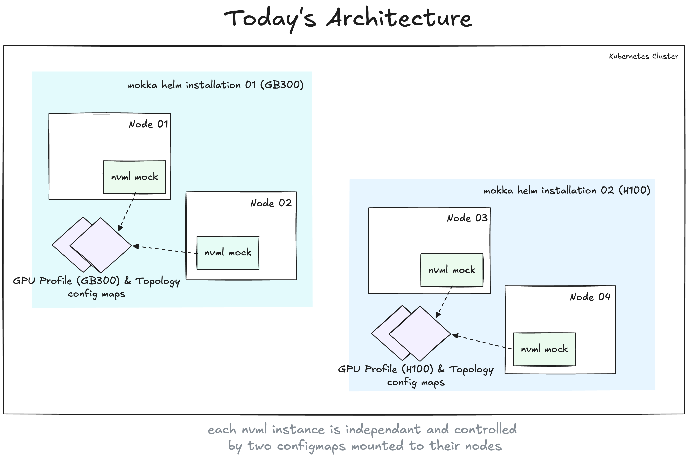
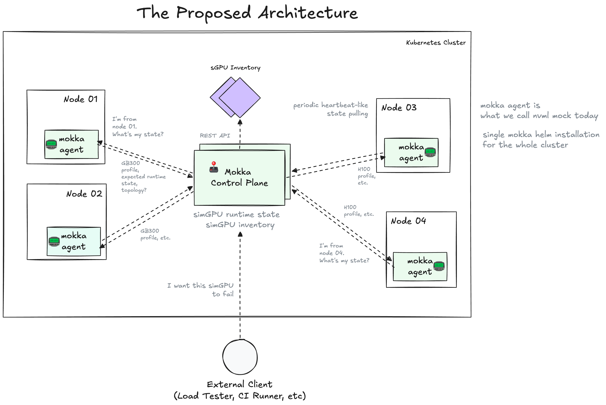

# MEP-0001: Mokka Control Plane

Author: [Roman Hlushko](https://github.com/roma-glushko)

<!-- toc -->
- [Summary](#summary)
- [Motivation](#motivation)
  - [Goals](#goals)
  - [Non-Goals](#non-goals)
- [Proposal](#proposal)
  - [User Stories (Optional)](#user-stories-optional)
    - [Story 1 (Optional)](#story-1-optional)
    - [Story 2 (Optional)](#story-2-optional)
  - [Notes/Constraints/Caveats (Optional)](#notesconstraintscaveats-optional)
  - [Risks and Mitigations](#risks-and-mitigations)
- [Design Details](#design-details)
- [Drawbacks](#drawbacks)
- [Alternatives](#alternatives)
<!-- /toc -->

## Summary

This proposal introduces a new component called Mokka Control Plane that centralizes:
- distribution of virtual GPU inventory (a new concept) across a K8s cluster 
- management of simulated GPU runtime state (for example, useful for chaos testing and fault injection)

## Motivation

The current architecture includes:
- one single central component NVML mock that acts as a node agent that applies nvml mock configuration and topology from configmaps
- each NVML instance is an independent component that knows nothing about existence of any other NVML mock instances
- if you want to have different GPU profiles for different nodes you need to label those nodes differently and deploy multiple mokka helm charts with different node selectors.

This architecture has given us a chance to focus on developing the core simulation logic so far.
However, we are approaching use cases to push it to the limits:

- there is no way to simulate capacity distribution of GPU platforms like GB300. For example, if you want to simulate two GB300 instances in the cluster, you should be able to schedule no more than 2 * 18 = 36 nodes with 4x GPU each. Today it's a responsibility of Mokka users to properly configure that which may lead to unrealistic cluster topologies.
- we would like to have a simple way to change simulated GPU runtime state like temperature, failure modes, etc. So there is quick way for a cluster operator to propagate a failure across thousands nodes.
- we ask cluster administrators to set `nvidia.com/clique` labels while it should be based on the GPU rack the node belongs to.

### Goals

We aim for:
- decoupling of the simulated GPU profiles and runtime state from NVML mocks in order to control it in a centralized way
- being able to schedule only realistic number of GPU nodes based on provided configuration.

### Non-Goals

<!--
What is out of scope for this MEP? Listing non-goals helps to focus discussion
and make progress.
-->

## Proposal

Before talking about the actual proposal, we need to refine our mental model. 
This should help us and our users to reason about Mokka better.

The proposed way of thinking about our domain is one of the key pieces of the proposal.

### Context

When you buy a GPU platform like GB300 in clouds like AWS,
it becomes reserved for you.
You can then distribute available number of GPUs across accounts and clusters as much as that capacity allows.

The reservation takes time and this is where Mokka can useful.

### Mental Model

Let's think about the GPU infrastructure we want to simulate in terms of simulated GPU racks (or sGPU, unfortunately vGPU already has a meaning in the field) that the user is expecting to have
and networking between them. That's our simulated GPU inventory.

The GPU inventory holds the capacity that we can distribute in the cluster. 
For example, if we have 2x GB300 racks in our simulated GPU inventory this gives 2x * 18 = 36 GPU nodes each has 4 sGPUs attached.
If we wanted to schedule 40 GPU nodes with that inventory, 40-36 = 4 would be without GPU.

The sGPU rack are characterized by:

- sGPU rack profile that contains physical and operational features and facts about the real GPU we simulate. This is our static ground truth. This includes expected node-level GPU profile (e.g. each of 18 GB300 nodes has 4 GPU).
- sGPU runtime state which is potentially dynamic set of simulated sGPU characteristics like temperature, failure modes, fan state, etc. This is not sGPU rack-level information, it's a sGPU-level information.

### Architecture

We propose to transform the current system state into a classic control-data plane architecture where:
- (new) Control Plane is a single, centralized source of truth for sGPU inventory information and network topology
- Data Plane is a node-level agent that applies the sGPU node information, runtime state and network topology.

With this, NVNL mock becomes a node-level agent (or Mokka Node Agent). 
Since it makes sure sGPU and networking reflects the desired state, 
so it could be thought as a virtual device set (virtual GPU and network card).

At the same time, Control Plane is responsible for distributing and assigning sGPU capacity to the node agents, 
receiving any changes external clients want to sGPUs runtime state.

### User Stories

#### S1: Precise Multi-GPU Distribution Simulation

I as a cluster administrator don't need to think about GPU rack architecture and 
details in order to simulate the GPU capacity my team expects.

I just specify the GPU racks we are waiting for and rough network topology between them and my cluster is representative.

#### S2: Dynamic Failure Injection

I as a cluster administrator can manage runtime state of my simulated GPU inventory in one place via Kubernetes Custom Resources.
I can write an automation that modifies the Kubernetes CR state and expect it to be propagated down the road without being concerned with cluster topology.

### Notes/Constraints/Caveats (Optional)

<!--
What are the caveats to the proposal?
What are some important details that didn't come across above?
Go in to as much detail as necessary here.
This might be a good place to talk about core concepts and how they relate.
-->

### Risks and Mitigations

<!--
What are the risks of this proposal, and how do we mitigate? Think broadly.
For example, consider operational overhead, resource consumption, and how
this will impact our users.
-->

## Design Details

### sGPU Inventory Distribution

Control Plane holds the currently configured sGPU inventory.
Then, cluster admins are free to label their CPU nodes with a custom label (for example, `mokka.nvidia.com/sgpu: gb300`) that indicate which sGPU type should be available on that node.

When node agent reaches out to Control Plane, it provides information about the current node it was installed into.
Based on that data, Control Plane does the following:

- resolves the current Kubernetes node information
- finds sGPU type in the `mokka.nvidia.com/sgpu` label
- look into the current sGPU inventory to see whether this is a newly created node that requires sGPU capacity assignment or a node with existing assignment
- for newly created node, Control Plane tries to find capacity and assign it, generating some runtime information like GPU, PCI IDs to make them unique. Control Plane also label the K8s node with `nvidia.com/clique` when sGPU is assigned to the node.

For both existing and new assignments, Control Plane returns sGPU profile information and runtime status.
Control Plane may return an error that indicates that we are out of capacity (because there is not enough sGPU in the inventory or because the capacity was reduced in runtime).

### Node Agent

The node agents focuses purely on what NVML mock does today which is how to mock the given expected state of NVML and networking.

However, the agent doesn't control the expected state, it merely receives and apply it (similarly, to kubelet).

In order to get the most recent sGPU state, the agent should periodically poll Control Plane (a.k.a. node agent heartbeat).
It should cache the previous state in memory, so we survive any temporary Control Plane crashes.

If node agent fails to send a heartbeat, it would be assumed inactive and the capacity it was holding will return back to sGPU inventory to reuse.
This is also a self-healing mechanism in case the node dies and node agent had no chance to inform us about shutdown.

### Control Plane State

Control Plane should keep three types of state:

- sGPU inventory state (cluster-wide configuration, mostly static, but may change infrequently if needed)
- sGPU-to-node assignment state (runtime, can be lost and recreated)
- sGPU-level runtime state (runtime, can be lost)

The sGPU inventory state may be kept in etcd as Kubernetes custom resources.
This is the simplest persistent database at our disposal.

The runtime information can be stored as Kubernetes CRs as well.

This way Kubernetes CR state is what external clients need to modify to adjust sGPU inventory and its runtime stats.

Control Plane would operate as a K8s Operator and we need to make sure we can make multiple
replicas active at the same time to fulfill node agent requests and do sGPU distribution.

### Configuration

The current NVML configuration may need to change slightly. 
Currently, it contains both GPU facts and spec and some runtime information mocks. The runtime portion should be decided by Control Plane.

### Cluster Admin Experience

The main high-level goal of this proposal is to simply and reduce the number of things
the cluster admins who deploy mokka and setup sGPU clusters should be responsible for.

After this proposal is implemented, the following steps would be needed to setup a new sGPU cluster:
- Deploy one single instance of Mokka helm chart.
- Configure sGPU inventory via K8s CRs
- Label the nodes that are supposed to have sGPU with `mokka.nvidia.com/sgpu: auto` (or specific sGPU type lik `h100`).

That's all. Mokka Control Plane should be able to distribute the capacity without any other help.

## Drawbacks

The main drawback is that we push the system to be more complicated. 
We add one more component, introduce network communication between control-data plane, have to think about control plane state.

## Alternatives

<!--
What other approaches did you consider, and why did you rule them out? These do
not need to be as detailed as the proposal, but should include enough
information to express the idea and why it was not acceptable.
-->
