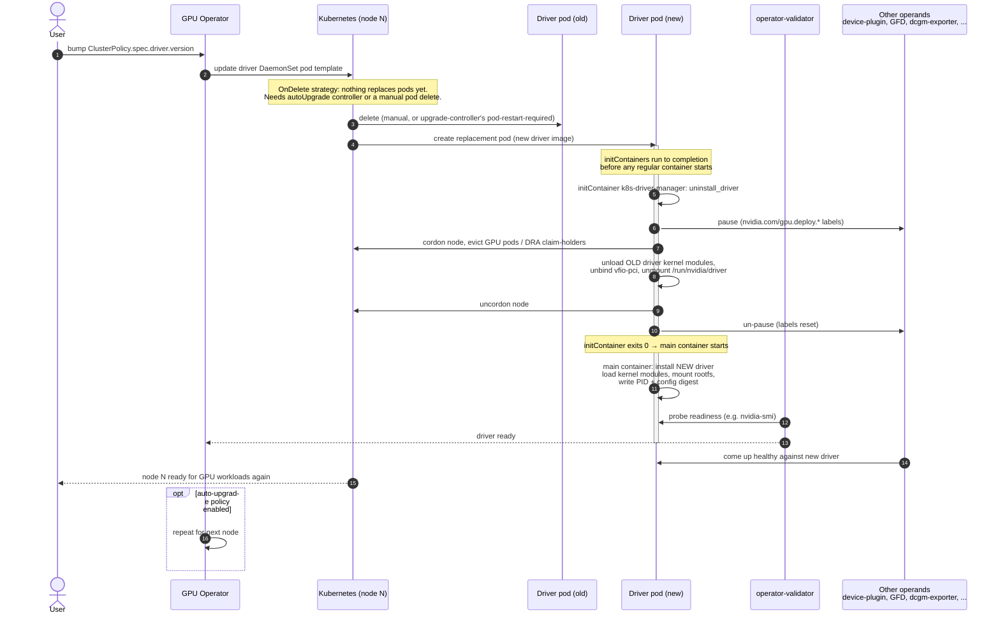

# MEP-0004: GPU Driver Upgrade Simulation

Author: [Roman Hlushko](https://github.com/roma-glushko)

<!-- toc -->
- [Summary](#summary)
- [Background](#background)
- [Motivation](#motivation)
  - [Goals](#goals)
  - [Non-Goals](#non-goals)
- [Proposal](#proposal)
  - [User Stories](#user-stories)
    - [Story 1](#story-1)
    - [Story 2](#story-2)
  - [Notes/Constraints/Caveats](#notesconstraintscaveats)
    - [GPU Operator's upgrade-controller (auto-upgrade path)](#gpu-operators-upgrade-controller-auto-upgrade-path)
    - [Emulation Surface](#emulation-surface)
  - [Risks and Mitigations](#risks-and-mitigations)
- [Design Details](#design-details)
  - [Analysis](#analysis)
  - [Proposed Mechanisms](#proposed-mechanisms)
- [Drawbacks](#drawbacks)
- [Alternatives](#alternatives)
<!-- /toc -->

## Summary

The GPU Operator team wants to validate NVIDIA GPU driver upgrades end to end
against Mokka instead of real GPU nodes, running `k8s-driver-manager` and
`vfio-manage` unmodified. This MEP documents, from source, exactly what those
two binaries do during a driver upgrade, enumerates the full emulation
surface Mokka would need to cover for them to run against a simulated node
without code changes, and proposes — at the level of which mechanism class,
not a full implementation — how each gap could be closed. It does not
implement anything itself: it exists so that the follow-on MEPs that do
implement a fix (a kernel module, a `/sys` overlay, a reconciler change) can
start from one agreed-upon account of the real workflow and an agreed
direction, instead of re-deriving either.

## Background

This section is for readers who have not worked with GPU Operator before.
It gives the end-to-end picture; later sections narrow in on the two
binaries this MEP is about.

**What GPU Operator manages.** GPU Operator is a Kubernetes operator that
installs and manages the full NVIDIA GPU software stack on GPU nodes from a
single `ClusterPolicy` custom resource. Each piece of that stack — the
driver, the container toolkit, the device plugin, GPU Feature Discovery
(GFD), the Data Center GPU Manager (DCGM) and its `dcgm-exporter`, the
Multi-Instance GPU (MIG) manager, an operator-validator, and (on newer
clusters) the Dynamic Resource Allocation (DRA) driver — runs as its own
DaemonSet. Every one of these DaemonSets schedules only onto GPU nodes,
gated by a node label of the form `nvidia.com/gpu.deploy.<component>=true`.
Those are exactly the labels
`k8s-driver-manager` flips to pause and resume components (see
`nvidiaDriverDeployLabel` and friends in `cmd/driver-manager/main.go`).

> **What "pause" means here.** Kubernetes has no per-node "suspend this
> DaemonSet's pod" verb, so `k8s-driver-manager` fakes one with the label
> above. Each operand's DaemonSet has a `nodeSelector` requiring its label to
> equal exactly `"true"`. To pause a component on one node,
> `k8s-driver-manager` rewrites that node's label value from `"true"` to the
> sentinel `paused-for-driver-upgrade`; the node stops matching the
> `nodeSelector`, and the DaemonSet controller tears down that component's
> pod there — the same effect as scaling it to zero on that one node, done
> purely by breaking scheduler affinity. Resuming just writes `"true"` back,
> which makes the node match again and the pod get rescheduled. No process is
> ever literally suspended.

**Why the driver is special.** Every other operand is a normal container
that can be killed and restarted independently. The driver is not: it loads
kernel modules that are node-wide, shared state — every GPU workload's CUDA
context, DCGM's NVML handle, and the device plugin's advertised
`nvidia.com/gpu` capacity all depend on those modules staying loaded and
consistent. Swapping the driver version means nothing on the node can safely
keep using the GPU, or keep depending on the driver being present, while the
swap happens. That is what forces a driver upgrade to be a coordinated,
multi-step node drain-and-requiesce rather than an ordinary rolling update.

**The end-to-end lifecycle.** A driver version bump — an edit to
`ClusterPolicy.spec.driver.version`, applied with `kubectl apply` or `kubectl
patch` against the cluster's `ClusterPolicy` object — is what starts this.
Trimmed to the fields this MEP cares about (based on GPU Operator's own
`config/samples/v1_clusterpolicy.yaml`):

```yaml
apiVersion: nvidia.com/v1
kind: ClusterPolicy
metadata:
  name: cluster-policy
spec:
  driver:
    enabled: true
    repository: nvcr.io/nvidia
    image: driver
    version: "550.90.07"     # bumping this is what starts an upgrade
    upgradePolicy:
      autoUpgrade: true      # false/unset: driver pods must be deleted manually
      maxParallelUpgrades: 1 # nodes upgraded at once; 0 = unlimited
      maxUnavailable: "25%"  # cap on simultaneously-unavailable driver nodes
```

Applying this once `spec.driver.version` already differs from what is
running plays out like this, once per node:

1. GPU Operator updates the driver DaemonSet's pod template with the new
   image tag. This step alone rolls out nothing: the driver DaemonSet ships
   with `updateStrategy: OnDelete`
   (`manifests/state-driver/0500_daemonset.yaml`), and GPU Operator's own
   code explicitly refuses to let it be set to `RollingUpdate`
   (`controllers/object_controls.go`). What replaces pods depends on
   `ClusterPolicy.spec.driver.upgradePolicy.autoUpgrade`: unset, an operator
   has to delete driver pods manually (e.g. `kubectl rollout restart`) to
   pick up the new image, with no cordon/drain coordination beyond what
   `k8s-driver-manager` itself does; enabled, GPU Operator's own
   upgrade-controller paces the rollout node by node through a state machine
   recorded on the `nvidia.com/gpu-driver-upgrade-state` node label (full
   state list in
   [GPU Operator's upgrade-controller](#gpu-operators-upgrade-controller-auto-upgrade-path)
   below).
2. For the node currently being upgraded, the existing driver pod is deleted
   — manually, or by the upgrade-controller reaching `pod-restart-required`
   — and the DaemonSet controller creates its replacement with the new
   driver image.
3. Kubernetes runs the new pod's `initContainers` to completion before
   starting any regular container. The first is `k8s-driver-manager
   uninstall_driver`, an init step on the *new* pod. It cleans up whatever
   the previous version left on the host — kernel modules and the
   `/run/nvidia/driver` mount are host state that outlives the old pod's
   container, so nothing else removes them. It quiesces the node: pauses
   every other GPU Operator component via labels, evicts GPU-using pods,
   unloads the currently loaded (old) driver kernel modules, unbinds
   `vfio-pci` where applicable, unmounts the old driver rootfs, uncordons the
   node, and un-pauses the component labels again. (Full step list in
   [Notes/Constraints/Caveats](#notesconstraintscaveats) below.)
4. Only once that `initContainer` exits 0 does the pod's main driver
   container start — part of the `gpu-driver-container` image, a separate
   repository, not `k8s-driver-manager` — and install the new driver: builds
   or loads the new kernel modules, mounts the new rootfs at
   `/run/nvidia/driver`, and writes the PID file and a config digest.
5. The operator-validator operand (its label was un-paused in step 3, but it
   only becomes actually ready once its own checks pass) confirms the new
   driver works — e.g., that `nvidia-smi` runs — before the node is
   considered upgraded.
6. The other operands, un-paused in step 3 but gated on the driver being
   genuinely ready, come up healthy against the new driver, and GPU
   workloads can be scheduled back onto the node.
7. With auto-upgrade enabled, the upgrade-controller then moves on to the
   next node, respecting `maxParallelUpgrades` and `maxUnavailable` from
   `ClusterPolicy.spec.driver.upgradePolicy`.

The same sequence, per node, as a diagram — numbers in the diagram match the
steps above:



**Where the two binaries in scope fit.** `k8s-driver-manager` and
`vfio-manage` own step 3 only — the new pod's `initContainer`, making it safe
to remove the old driver; neither touches step 4, the main container's
install. That split matters for Mokka: emulating step 3 alone is not
sufficient to observe "the upgrade completed and the new driver is in
place" — something also has to play step 4's role, or a simulated upgrade
test will correctly tear down and then simply stall.

## Motivation

Mokka's existing simulators (`gpudriver`, `pcibus`) were built to satisfy
discovery and allocation consumers (NVML, `nvidia-smi`, lspci, Node Feature
Discovery (NFD), the device plugin), and they do that well. They were not
built against the driver *lifecycle* surface described above, and a review of
`k8s-driver-manager`'s source against Mokka's current simulators turned up
several gaps, two of which are structural rather than missing coverage:

- `libpcisysfs.so`, Mokka's `LD_PRELOAD` shim, cannot intercept anything
  `k8s-driver-manager` or `vfio-manage` do, because both are Go binaries that
  issue raw Linux syscalls directly — there is no libc call for
  `dlsym(RTLD_NEXT, ...)` to hook.
- Mokka's node agent (MEP-0003) is a level-triggered reconciler driven by
  `State` updates from a control plane. The real driver-upgrade handoff is
  imperative: a container exits, a new container starts, and the new
  container's own entrypoint reinstalls the driver. Nothing in today's
  reconcile loop reacts to that event.

### Goals

- Establish one accurate, source-derived account of what `uninstall_driver`
  and `vfio-manage` actually touch on a node during a driver upgrade, so
  later design discussion works from facts rather than assumptions.
- Enumerate the emulation surface required for both binaries to run
  unmodified against a Mokka node, mapped against what `gpudriver` and
  `pcibus` already stage today.
- Name the structural mismatches (syscall interception, reconciler vs.
  imperative handoff) explicitly, so a follow-on MEP can scope a fix with
  full context instead of discovering them mid-implementation.
- Propose, for each row of the emulation surface, which class of mechanism
  closes it (a real kernel module, an extension of an existing rendered
  tree, a node-agent watcher, an explicit reconcile trigger), so follow-on
  MEPs start from an agreed direction instead of re-debating it per gap.

### Non-Goals

- Fully specifying or implementing any proposed mechanism (exact kernel
  module code, the watcher's implementation, the choice between the two
  reconcile-trigger options in Design Details, a Control Plane API for the
  driver-version watcher, etc.). Design Details proposes direction only;
  each mechanism becomes its own follow-on MEP.
- Covering installation of Mellanox OpenFabrics Enterprise Distribution
  (MOFED), NVIDIA's GPU Direct RDMA driver stack for InfiniBand/RoCE NICs,
  itself — only the presence and readiness checks `k8s-driver-manager`
  performs against it (`GPU_DIRECT_RDMA_ENABLED`, `waitForMofedDriver`).
- Changing any code in `gpudriver`, `pcibus`, or `libpcisysfs` — this MEP
  proposes direction; no code ships from it.

## Proposal

Document the current, real GPU driver upgrade workflow, the emulation
surface it implies, and a proposed mechanism per gap, as a MEP so it is
reviewed, versioned, and referenced by number the same way an implementation
proposal would be.

### User Stories

#### Story 1

As a GPU Operator engineer, I want to bump a `ClusterPolicy`'s driver version
against a Mokka-simulated cluster and watch the real `k8s-driver-manager` and
`vfio-manage` binaries run the full upgrade sequence — drain, evict, unload,
unmount, reinstall, reschedule — without modifying either binary, so that a
green run is evidence the upgrade logic itself works, not just that Mokka's
API surface looks right.

#### Story 2

As a CI maintainer, I want a nightly suite that exercises driver upgrades
against a Mokka-only `kind` cluster, so that regressions in
`k8s-driver-manager`'s node lifecycle logic (label sequencing, DRA
claim-holder checks, cordon/drain ordering) are caught without needing
GPU-backed runners.

### Notes/Constraints/Caveats

`k8s-driver-manager` is **teardown-only**. Per its own
[README](https://github.com/NVIDIA/k8s-driver-manager) and
`uninstallDriver()` in `cmd/driver-manager/main.go`, `uninstall_driver`:

1. Checks whether a driver is already pre-installed on the host
   (`chroot /host nvidia-smi ...`), and if so, disables the containerized
   driver instead of touching it.
2. Fetches current GPU Operator component state from node labels
   (`nvidia.com/gpu.deploy.*`) and the auto-upgrade-policy annotation.
3. If a driver is loaded, pauses all GPU Operator components by rewriting
   their deploy labels, then waits for their pods to terminate.
4. Cordons the node and evicts GPU pods — traditional device-plugin
   requests and DRA `ResourceClaim`s alike — falling back to a full
   `kubectl drain`-equivalent if enabled.
5. For DRA nodes, confirms no pod still holds a GPU `ResourceClaim`, then
   drains the DRA kubelet-plugin last (it must outlive its claim-holders).
6. Unloads the kernel modules (`nvidia_modeset`, `nvidia_uvm`,
   `nvidia_peermem`, `nvidia_fs`, `nvidia_vgpu_vfio`, `gdrdrv`, `nvidia`) via
   the raw `unix.DeleteModule` syscall, and unmounts `/run/nvidia/driver`
   recursively.
7. Unbinds `vfio-pci` from every NVIDIA PCI function via `vfio-manage`.
8. Waits for MOFED if `GPU_DIRECT_RDMA_ENABLED` and a Mellanox device
   (PCI vendor `0x15b3`) is present.
9. Uncordons the node and flips the component labels back to unpaused.

`k8s-driver-manager` never installs a driver. It runs as an
**`initContainer`** of the driver DaemonSet pod
(`manifests/state-driver/0500_daemonset.yaml`), on the *new* pod, cleaning up
whatever the previous version left on the host — kernel modules and the
`/run/nvidia/driver` mount are host state, so killing the old pod's container
doesn't touch either.

Once it exits 0, the pod's main driver container runs the `nvidia-driver`
entrypoint script from `github.com/NVIDIA/gpu-driver-container`
(e.g. `ubuntu22.04/nvidia-driver`) and installs the new driver. Its `init()`
(line 790) mirrors `uninstall_driver`: `_load_driver` loads the new kernel
modules; `_mount_rootfs` (line 540) recursively bind-mounts the container's
own root onto `${RUN_DIR}/driver` (`mount --rbind / ${RUN_DIR}/driver`,
`RUN_DIR=/run/nvidia` — the mount `RecursiveUnmount` tears down on the next
upgrade); `_store_driver_digest` (line 746) writes `${current_digest}` to
`/run/nvidia/nvidia-driver.state`; and `echo $$ >&3` against
`PID_FILE=/run/nvidia/nvidia-driver.pid` (line 7) writes the PID file. Its
own `_should_skip_kernel_module_reload()` (line 738) checks
`$DRIVER_CONFIG_DIGEST` against that same `nvidia-driver.state` file, so the
digest is verified independently on both sides of the handoff. Step 9's label
flip only re-permits scheduling; actual readiness is gated separately by the
operator-validator.

The `initContainers`/`containers` split, trimmed from an actual rendered
DaemonSet (`internal/state/testdata/golden/driver-minimal.yaml` in the
`gpu-operator` repo — a golden test fixture, not hand-written) to the fields
that matter here:

```yaml
apiVersion: apps/v1
kind: DaemonSet
metadata:
  name: nvidia-gpu-driver-ubuntu22.04-7c6d7bd86b
  namespace: test-operator
spec:
  template:
    spec:
      hostPID: true
      nodeSelector:
        nvidia.com/gpu.deploy.driver: "true"
      initContainers:
        - name: k8s-driver-manager
          image: nvcr.io/nvidia/cloud-native/k8s-driver-manager:devel
          command: ["driver-manager"]
          args: ["uninstall_driver"]
          securityContext:
            privileged: true
          env:
            - name: NODE_NAME
              valueFrom: { fieldRef: { fieldPath: spec.nodeName } }
            - name: ENABLE_GPU_POD_EVICTION
              value: "true"
            - name: ENABLE_AUTO_DRAIN
              value: "false"
            - name: DRIVER_CONFIG_DIGEST
              value: "886542011"
          volumeMounts:
            - { name: run-nvidia, mountPath: /run/nvidia, mountPropagation: Bidirectional }
            - { name: host-root, mountPath: /host, mountPropagation: HostToContainer, readOnly: true }
            - { name: host-sys, mountPath: /sys }
            - { name: run-mellanox-drivers, mountPath: /run/mellanox/drivers, mountPropagation: HostToContainer }
      containers:
        - name: nvidia-driver-ctr
          image: nvcr.io/nvidia/driver:525.85.03-ubuntu22.04
          command: ["nvidia-driver"]
          args: ["init"]
          securityContext:
            privileged: true
          env:
            - name: DRIVER_CONFIG_DIGEST
              value: "886542011"
          lifecycle:
            preStop:
              exec:
                command: ["/bin/sh", "-c", "rm -f /run/nvidia/validations/.driver-ctr-ready /run/nvidia/validations/.driver-daemons-status"]
          volumeMounts:
            - { name: run-nvidia, mountPath: /run/nvidia, mountPropagation: Bidirectional }
      volumes:
        - { name: run-nvidia, hostPath: { path: /run/nvidia, type: DirectoryOrCreate } }
        - { name: host-root, hostPath: { path: / } }
        - { name: host-sys, hostPath: { path: /sys, type: Directory } }
        - { name: run-mellanox-drivers, hostPath: { path: /run/mellanox/drivers, type: DirectoryOrCreate } }
  updateStrategy:
    type: OnDelete
```

`host-root` at `/host` is what `chroot /host nvidia-smi` in step 1 reaches.
`host-sys` mounted straight over `/sys`, not namespaced under a prefix, is
why every `/sys/module/*` and `/sys/bus/pci/*` path this MEP discusses is the
literal host path. `run-nvidia` mounted `Bidirectional` at `/run/nvidia` is
what makes `RecursiveUnmount` meaningful across container boundaries.
`DRIVER_CONFIG_DIGEST` set identically on both containers confirms it is a
value GPU Operator computes once per pod, read by both the teardown and the
install side. And `nodeSelector: nvidia.com/gpu.deploy.driver: "true"` is the
same label `disableContainerizedDriver()` (step 1 above) rewrites to
`"pre-installed"` to keep this entire pod off a node — the mechanism behind
[Analysis](#analysis)'s "driver containers disabled when Mokka is deployed"
point.

`vfio-manage` (`cmd/vfio-manage`) is the PCI-binding half, used on
vGPU/passthrough nodes to hand a GPU to Virtual Function I/O (VFIO), the
kernel framework that lets a device be passed through to a VM or container
instead of driven by the host's `nvidia` driver. `bind`/`unbind` enumerate
NVIDIA PCI devices via `go-nvlib/nvpci`, then read/write
`/sys/bus/pci/devices/<bdf>/driver_override` (`<bdf>` is the PCI
bus:device.function address, e.g. `0000:07:00.0`) and
`/sys/bus/pci/drivers/<name>/{bind,unbind}` directly, matching the best VFIO
variant driver against `/lib/modules/<kernel>/modules.alias`.

`vfio-manage` is invoked from two distinct places. `k8s-driver-manager`'s own
step 7 above (`unbind --all`, releasing devices *back* from VFIO before the
`nvidia` driver installs) is one. The other is the dedicated
`nvidia-vfio-manager` DaemonSet, from
`assets/state-vfio-manager/0500_daemonset.yaml` (a static asset with only
image/namespace filled in by the operator; everything else below is
verbatim), which runs the opposite direction as its *main* container:

```yaml
apiVersion: apps/v1
kind: DaemonSet
metadata:
  name: nvidia-vfio-manager
  namespace: gpu-operator
spec:
  template:
    spec:
      nodeSelector:
        nvidia.com/gpu.deploy.vfio-manager: "true"
      initContainers:
        - name: k8s-driver-manager
          image: nvcr.io/nvidia/cloud-native/k8s-driver-manager:devel
          command: ["driver-manager"]
          args: ["uninstall_driver"]
          env:
            - name: NODE_NAME
              valueFrom: { fieldRef: { fieldPath: spec.nodeName } }
            - name: ENABLE_GPU_POD_EVICTION
              value: "false"
            - name: ENABLE_AUTO_DRAIN
              value: "false"
          securityContext:
            privileged: true
          volumeMounts:
            - { name: run-nvidia, mountPath: /run/nvidia, mountPropagation: Bidirectional }
            - { name: host-root, mountPath: /host, readOnly: true, mountPropagation: HostToContainer }
            - { name: host-sys, mountPath: /sys }
      containers:
        - name: nvidia-vfio-manager
          image: nvcr.io/nvidia/cloud-native/vgpu-vfio-manager:devel
          command: ["/bin/sh", "-c"]
          args: ["vfio-manage bind --all && while true; do sleep 86400; done"]
          env:
            - name: HOST_ROOT
              value: "/host"
          securityContext:
            privileged: true
          lifecycle:
            preStop:
              exec:
                command: ["/bin/sh", "-c", "vfio-manage unbind --all"]
          volumeMounts:
            - { name: host-sys, mountPath: /sys }
            - { name: host-lib-modules, mountPath: /lib/modules, readOnly: true }
            - { name: host-root, mountPath: /host }
      volumes:
        - { name: host-sys, hostPath: { path: /sys, type: Directory } }
        - { name: host-lib-modules, hostPath: { path: /lib/modules, type: Directory } }
        - { name: run-nvidia, hostPath: { path: /run/nvidia, type: DirectoryOrCreate } }
        - { name: host-root, hostPath: { path: / } }
```

`vfio-manage bind --all` runs once at container start, then the container
idles (`sleep 86400` in a loop) holding the devices bound to VFIO for the
pod's lifetime; only `vfio-manage unbind --all` on `preStop` releases them —
a different lifecycle shape than the driver DaemonSet's
initContainer-then-exit pattern above, though `k8s-driver-manager` still runs
first here for the same reason: clearing whatever the *previous* driver left
on the host before this pod claims the devices. `HOST_ROOT=/host` on the main
container is the `--host-root` flag `vfio-manage bind` uses to `modprobe` the
VFIO module inside `/host`, separate from the `/sys` mount it reads/writes
device bindings through.

#### GPU Operator's upgrade-controller (auto-upgrade path)

When `ClusterPolicy.spec.driver.upgradePolicy.autoUpgrade` is set,
`controllers/upgrade_controller.go` drives every node through a state
machine from the vendored `k8s-operator-libs/pkg/upgrade` package, recorded
on the node label `nvidia.com/gpu-driver-upgrade-state`
(`upgrade/consts.go:20`):

```text
upgrade-required → cordon-required → wait-for-jobs-required
  → pod-deletion-required → drain-required → pod-restart-required
  → validation-required → uncordon-required → upgrade-done
```

`upgrade-failed` is reachable from several of these states on error, and
retries forward into `uncordon-required` once the driver pod resyncs.
`node-maintenance-required`/`post-maintenance-required` exist in the
vendored library for an external node-maintenance-operator integration but
are not reachable in GPU Operator's default wiring (`cmd/gpu-operator/main.go`
does not set `Requestor.UseMaintenanceOperator`).

`pod-restart-required` is the state in which the old driver pod is actually
deleted and the DaemonSet controller creates the replacement — the point
where control passes from this state machine to the new pod's own
`initContainer` sequence: `k8s-driver-manager` runs first, and only once it
exits 0 does the pod's main driver container start.
Rollout parallelism is bounded by two `ClusterPolicy.spec.driver.upgradePolicy`
fields enforced in `GetUpgradesAvailable`
(`upgrade/common_manager.go:761-786`): `maxParallelUpgrades` (default `1`,
`0` means unlimited) and `maxUnavailable` (default `25%`).

Separately, `nodelabeling_controller.go` writes the node annotation
`nvidia.com/gpu-driver-upgrade-enabled` on every node to mirror this
cluster-wide `autoUpgrade` setting; `k8s-driver-manager` reads that
annotation (`fetchAutoUpgradeAnnotation()` in `cmd/driver-manager/main.go`)
to decide whether it should defer cordon/drain/eviction to the
upgrade-controller or do it itself. The two codebases agree by construction
— the annotation is GPU Operator's own mirror of the field the
upgrade-controller is gated on — rather than by `k8s-driver-manager` reading
the `ClusterPolicy` directly.

#### Emulation Surface

The table below maps every host/kernel/PCI/API
surface the real workflow above touches (left column) against what Mokka
stages today (middle) and what is missing (right), ordered roughly by how
much of `uninstallDriver()` depends on it. Design Details proposes how to
close each row.

| Surface                                                                                                                                 | Staged by Mokka today                                                                                              | Gap                                                                                                                                                                     |
|-----------------------------------------------------------------------------------------------------------------------------------------|--------------------------------------------------------------------------------------------------------------------|-------------------------------------------------------------------------------------------------------------------------------------------------------------------------|
| `/sys/module/{nvidia,nvidia_uvm,nvidia_modeset,nvidia_peermem,nvidia_fs,nvidia_vgpu_vfio,gdrdrv,nouveau}/refcnt`                        | Nothing                                                                                                            | Full gap. Gates the loaded/not-loaded branch of `uninstallDriver()` entirely.                                                                                           |
| `unix.DeleteModule()` (real `delete_module(2)` syscall)                                                                                 | Nothing                                                                                                            | Full gap, and not shimmable in userspace — needs a real (dummy) loaded kernel module to respond correctly.                                                              |
| `/proc/modules`                                                                                                                         | Nothing                                                                                                            | Full gap. Only used for diagnostic listing on unload failure; low priority.                                                                                             |
| `/run/nvidia/driver` mount + recursive unmount                                                                                          | `gpudriver.Apply` creates a **symlink**, not a real mount                                                          | Partial — `os.Stat` sees it so the existence check passes, and `RecursiveUnmount` finds no real mountpoint under it, so it degrades to a safe no-op. Works by accident. |
| `/run/nvidia/nvidia-driver.pid`, `/run/nvidia/nvidia-driver.state` (digest)                                                             | Nothing                                                                                                            | Full gap. Drives `shouldSkipUninstall()`/`shouldUpdateDriverConfig()` — without it, every run is treated as a config change.                                            |
| `chroot /host nvidia-smi ...` (pre-installed host driver check)                                                                         | `nvidia-smi` staged only under the containerized driver path (`h.Root/driver/usr/bin`)                             | Gap, likely intentional — leaves the host-driver branch permanently false, which may be the desired default for a simulated cluster.                                    |
| `/sys/bus/pci/devices/<bdf>/{vendor,device,subsystem_vendor,subsystem_device,class,config}`                                             | `pcisysfs.Render` writes exactly these                                                                             | Covered.                                                                                                                                                                |
| `/sys/bus/pci/devices/<bdf>/{driver,driver_override,modalias}`, `/sys/bus/pci/drivers/<name>/{bind,unbind}`                             | Nothing                                                                                                            | Full gap — the entire surface `vfio-manage` operates on.                                                                                                                |
| `/lib/modules/<kernel>/modules.alias` (VFIO variant lookup)                                                                             | Nothing                                                                                                            | Full gap, low priority unless vGPU/passthrough scenarios are in scope.                                                                                                  |
| PCI vendor `0x15b3` (Mellanox) detection, `/run/mellanox/drivers/.driver-ready` or `mlx5_core` in `/proc/modules` (MOFED readiness)     | `internal/ib` renders an InfiniBand-specific sysfs tree, but not a generic PCI vendor file or a MOFED-ready marker | Full gap for the `GPU_DIRECT_RDMA_ENABLED` path.                                                                                                                        |
| The new driver version itself (what `ClusterPolicy.spec.driver.version` changed to)                                                     | `system.driver_version` in a static profile/env var, read once at Stage                                            | Full gap — nothing watches `ClusterPolicy`, so Mokka's reported version never reflects an upgrade.                                                                      |
| Node labels/annotations, cordon/drain, DRA `ResourceClaim`s, the `nvidia.com/gpu-driver-upgrade-state` upgrade-controller state machine | Real apiserver + real GPU Operator/DRA driver, external to Mokka                                                   | Not a gap — out of scope by design; Mokka fakes the node's device/driver footprint, not the control plane.                                                              |

Two findings constrain *how* these rows can be closed, not just whether:

- **Syscall interception.** `k8s-driver-manager` and `vfio-manage` use
  `os.*` and `golang.org/x/sys/unix` directly; on Linux these issue raw
  syscalls without going through libc, regardless of the binaries'
  `CGO_ENABLED` setting. `LD_PRELOAD`-based interposition — Mokka's current
  strategy for `lspci` and NVML/CUDA consumers — has nothing to attach to.
  Closing any row above that these binaries read or write therefore requires
  a real filesystem the kernel serves (a bind mount, a FUSE-backed tree, or,
  for `/sys/module` and `delete_module`, an actual loaded kernel module)
  rather than a shim.
- **Reconciler vs. imperative handoff.** Even once the surface above exists,
  something has to repopulate it after `k8s-driver-manager` tears it down.
  In production this is a new container starting and running its own
  install script; Mokka's node agent only re-stages on a `State` update from
  its control plane. Closing the table's rows without also deciding how the
  agent learns "the upgrade's uninstall phase finished, re-stage now" would
  leave a simulated node permanently driver-less after the first upgrade
  test.

### Risks and Mitigations

- **Assuming the `LD_PRELOAD` shim extends to these binaries.** It doesn't —
  see Syscall interception above. Mitigation: recorded here so a follow-on
  MEP doesn't have to re-verify it.
- **The reconciler/imperative mismatch going unaddressed.** A follow-on MEP
  that builds emulation surface without also picking a re-stage trigger
  leaves a simulated node permanently driver-less after the first upgrade.
  Mitigation: Design Details proposes two trigger options below rather than
  leaving the question open.

## Design Details

### Analysis

A few things make this workflow different from what Mokka is built for today:

- GPU Operator's driver containers — including the one running
  `k8s-driver-manager` — are purposely disabled when Mokka is deployed,
  since Mokka replaces the real driver install with simulation. Now we want to somehow enable those.
- Mokka's supported shape is install → stage once from a profile → serve
  consumers. A driver upgrade needs two more events layered on top: a *target* driver version arriving from
  `ClusterPolicy`, and a *completion signal* from `k8s-driver-manager` saying
  when it is safe to apply that target — neither of which the current
  reconcile loop has a notion of.
- `k8s-driver-manager` issues a real `delete_module(2)` syscall, which only a
  real kernel module stub can satisfy — Mokka has none today.
- Several other surfaces listed under
  [Emulation Surface](#emulation-surface) are missing or only partially
  simulated in ways that would not hold up under this workflow.

### Proposed Mechanisms

This section proposes, for each row of the emulation surface table above, a
mechanism class capable of closing it — enough for a reviewer to agree on
direction before a follow-on MEP commits to exact APIs, code, or a chart
layout. No mechanism here is implemented by this MEP; each becomes its own
follow-on MEP once the direction below is agreed.

**Guiding principle.** Pick the mechanism the binaries' own I/O path forces,
not the one that is easiest to build: where the kernel itself enforces the
semantics being read (module refcounts, `delete_module`), only a real kernel
module produces them correctly; where a surface is passive file content, a
bind-mounted or rendered tree — what `gpudriver`/`pcibus` already do — is
sufficient; where a write needs to trigger a visible side effect elsewhere
(PCI `bind`/`unbind`), a small watcher inside the existing node agent is a
better fit than a new filesystem driver, since Mokka is already structured
as a Go reconciler and not as a FUSE implementation.

**Module-state surface** (`/sys/module/*/refcnt`, `unix.DeleteModule()`,
`/proc/modules`). Proposed: a minimal stub kernel module per name
`k8s-driver-manager` checks (`nvidia`, `nvidia_uvm`, `nvidia_modeset`,
`nvidia_peermem`, `nvidia_fs`, `nvidia_vgpu_vfio`, `gdrdrv`), loaded by the
node agent, doing nothing but existing. The kernel then produces
`/sys/module/<name>/refcnt`, the `/proc/modules` entry, and correct
`delete_module(2)` semantics without Mokka reproducing any of them. This is
the one row nothing in userspace can substitute for — no shim reaches a real
syscall — so it sets the privilege floor for the rest of this MEP's scope
(see Drawbacks). Optionally, tying each module's refcount to open
`/dev/nvidia*` file descriptors would let an unload-while-in-use failure
reproduce faithfully too, but that refinement can wait for the follow-on
MEP.

**Driver rootfs and bookkeeping files** (`/run/nvidia/driver` mount,
`nvidia-driver.pid`, `nvidia-driver.state`). Proposed: change
`gpudriver.Apply` from a symlink to a real bind mount at `/run/nvidia/driver`
(the node agent already runs with host mount access for staging), so
`RecursiveUnmount` in `uninstall_driver` unmounts something real instead of
degrading to a no-op that happens to be harmless. Stage the PID file and a
digest file matching `DRIVER_CONFIG_DIGEST` alongside it — both are plain
files with no kernel involvement, so this is an extension of `gpudriver`'s
existing file-staging logic, not a new mechanism.

**PCI driver-binding surface** (`driver`, `driver_override`, `modalias`,
`/sys/bus/pci/drivers/<name>/{bind,unbind}`). Proposed: extend
`pcisysfs.Render`'s bind-mounted tree with these paths, and add a lightweight
watcher in the node agent (`inotify` on the rendered `bind`/`unbind` files)
that reacts to a write by updating the device's `driver` symlink and clearing
`driver_override` — reproducing the side effect `vfio-manage` depends on
without needing a real `struct pci_dev` or a synthetic PCI host bridge.
Fabricating a real PCI device would be a materially larger kernel project
than the stub modules above, and nothing here needs the device to be
functionally real — only for its sysfs attributes to react correctly to
reads and writes.

**`modules.alias` and MOFED readiness.** Proposed: static additions to
surfaces `pcibus`/`internal/ib` already own — a kernel-version-matched
`/lib/modules/<kernel>/modules.alias` fragment covering the VFIO variants in
scope, a PCI vendor `0x15b3` identity in `pcisysfs`'s existing `Identities`
map, and a `/run/mellanox/drivers/.driver-ready` marker file gated the same
way `gpudriver` gates its own readiness. No new mechanism class.

**Host-driver detection** (`chroot /host nvidia-smi ...`). Proposed:
formalize today's accidental behavior as an explicit decision rather than
leave it a gap — document that a Mokka node deliberately has no
`/host/usr/bin/nvidia-smi`, so this branch of `uninstall_driver` always
reports "no host driver," which is the correct default for a simulated
cluster unless a specific test wants to exercise the pre-installed-driver
path.

**The new driver version and the reconciler/imperative handoff.** These are
one gap with two parts, both from the "Reconciler vs. imperative handoff"
finding above. First, a value source: a Control Plane watcher (MEP-0001) reads `ClusterPolicy.spec.driver.version` — the same field GPU
Operator itself treats as ground truth — and feeds it into `State`, rather
than Mokka inferring the target version from anywhere else. Second, a
trigger: the node agent needs to learn when `k8s-driver-manager`'s teardown
has finished, so it can re-stage `gpudriver`/`pcibus` with that new value at
the right point in the sequence rather than immediately on `ClusterPolicy`
change. Two candidate triggers, not yet chosen between:

- *(A) Poke the agent.* Whatever plays `k8s-driver-manager`'s role bumps the
  `State` generation once `uninstall_driver` exits 0, forcing a reconcile.
  Small, but invents a signal the real lifecycle has no equivalent of.
- *(B) Mirror the real initContainer handoff.* Give Mokka's own driver pod
  the same two-stage shape production uses: `k8s-driver-manager` as an
  `initContainer`, and a main driver container — analogous to
  `gpu-driver-container` — whose entrypoint runs `Stage`/`Apply` once it
  starts, which Kubernetes itself only does after the initContainer exits 0.
  A DaemonSet rollout then re-triggers install the same way it does for real
  — no invented signal, just native `initContainer` ordering — at the cost of
  moving `gpudriver`/`pcibus` from an always-on node-agent responsibility to
  one tied to a pod GPU Operator is expected to kill and recreate per
  upgrade, a real change to how those simulators are deployed.

## Drawbacks

- The rows above that require a real kernel module or a real mounted (not
  shimmed) filesystem tree raise the privilege bar for a Mokka node —
  `CAP_SYS_MODULE`, kernel-version-matched builds, and/or mount capabilities
  it does not need today for discovery/allocation simulation alone.

## Alternatives

N/A
