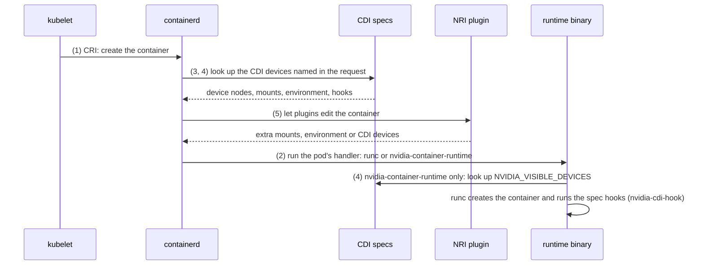
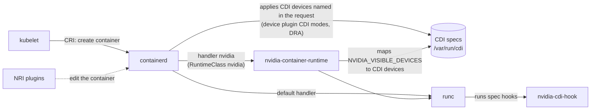
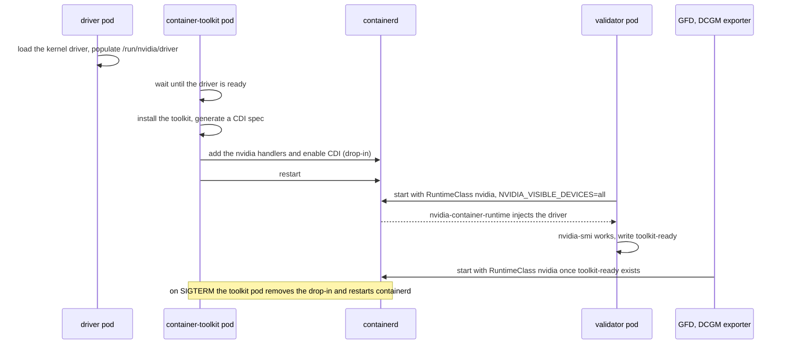
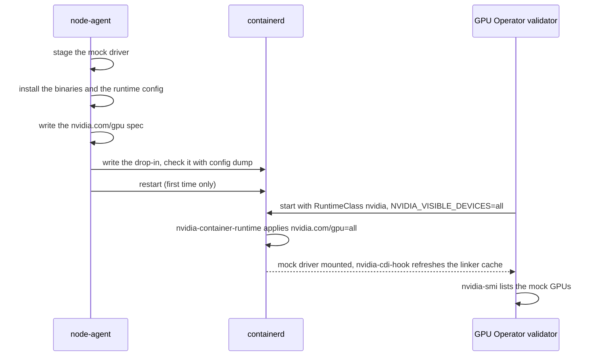
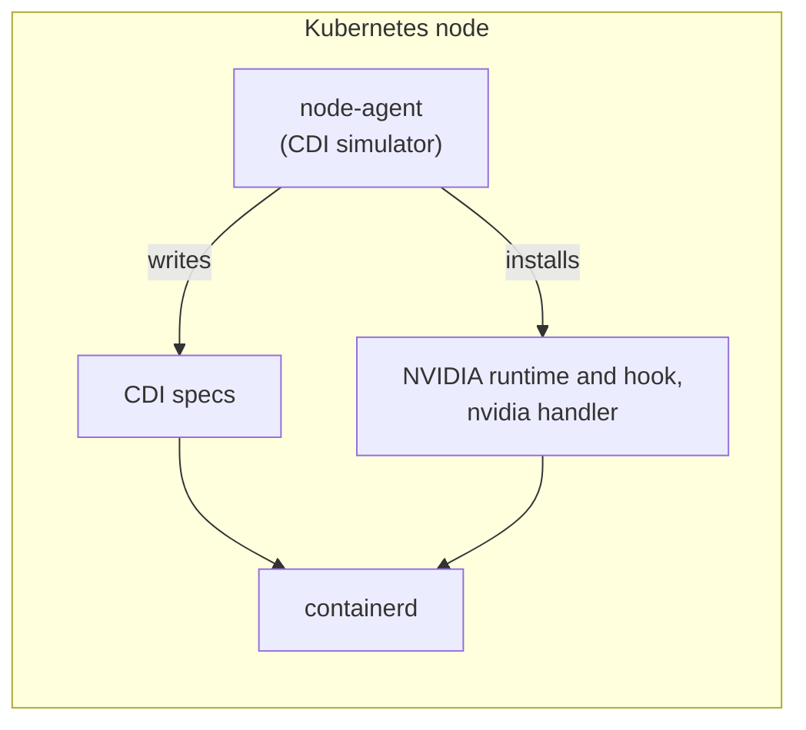
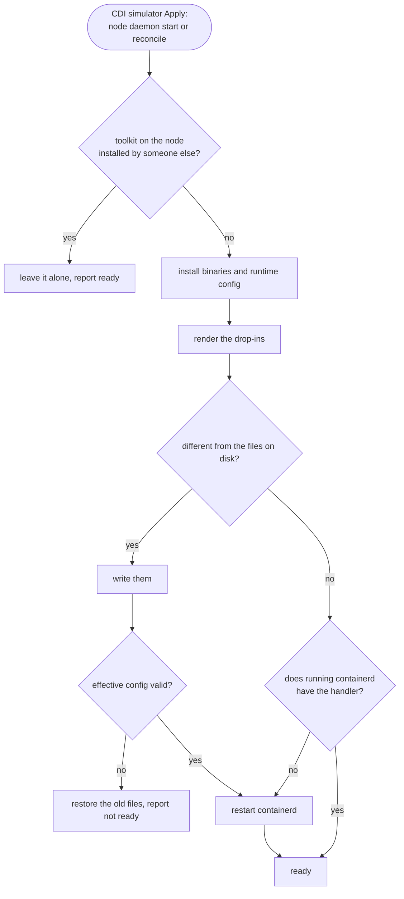
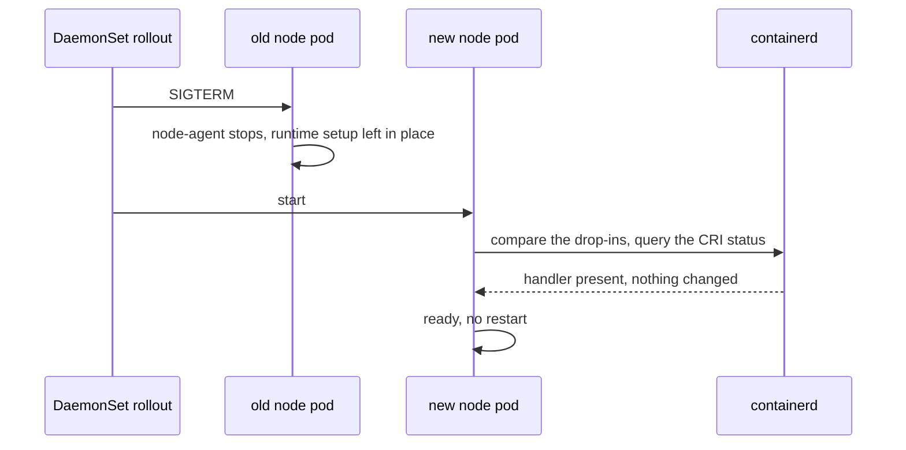

# MEP-0006: Automate the node's CDI setup

Author: [Roman Hlushko](https://github.com/roma-glushko)

<!-- toc -->
- [Summary](#summary)
- [Motivation](#motivation)
  - [Background: how a container gets a device](#background-how-a-container-gets-a-device)
  - [What Mokka does today](#what-mokka-does-today)
  - [What the GPU Operator does](#what-the-gpu-operator-does)
  - [How nodes are prepared today](#how-nodes-are-prepared-today)
  - [Goals](#goals)
  - [Non-Goals](#non-goals)
- [Proposal](#proposal)
  - [User Stories](#user-stories)
  - [Notes/Constraints/Caveats](#notesconstraintscaveats)
  - [Risks and Mitigations](#risks-and-mitigations)
- [Design Details](#design-details)
  - [Where it runs](#where-it-runs)
  - [What it puts on the node](#what-it-puts-on-the-node)
  - [Lifecycle](#lifecycle)
  - [Configuring containerd](#configuring-containerd)
  - [Restarting containerd](#restarting-containerd)
  - [Nodes that already have a toolkit](#nodes-that-already-have-a-toolkit)
  - [Shutdown and uninstall](#shutdown-and-uninstall)
  - [Helm values](#helm-values)
  - [Image](#image)
  - [Compatibility](#compatibility)
  - [Test plan](#test-plan)
  - [Migration](#migration)
  - [Implementation](#implementation)
- [Drawbacks](#drawbacks)
- [Alternatives](#alternatives)
<!-- /toc -->

## Summary

This MEP moves CDI setup into the Mokka chart. The node daemon's CDI
simulator, which already writes the CDI specs, also installs the upstream
NVIDIA Container Toolkit binaries and registers the `nvidia` runtime handler
with containerd. 

Creating a cluster from the stock `kindest/node` image, or a standard EKS node group, and installing the chart is then enough.

## Motivation

Mokka hands its simulated GPUs to containers through the Container Device Interface
(CDI). For that to work, the container runtime on each node needs a few NVIDIA pieces:

- the NVIDIA Container Runtime registered with the runtime, the CDI hook binary,
- and a runtime configuration in CDI mode (on a real GPU cluster the GPU
  Operator installs them). 

On Mokka nodes, they come from outside Mokka: 
- a custom Kind node image,
- cloud-init on EKS, 
- or a custom, adhoc DaemonSet that installs packages like this:

<details>
<summary>The workaround DaemonSet</summary>

```yaml
apiVersion: apps/v1
kind: DaemonSet
metadata:
  name: nvidia-container-toolkit-installer
  namespace: kube-system
  labels:
    app.kubernetes.io/name: nvidia-container-toolkit-installer
spec:
  selector:
    matchLabels:
      app.kubernetes.io/name: nvidia-container-toolkit-installer
  updateStrategy:
    type: RollingUpdate
    rollingUpdate:
      maxUnavailable: 1
  template:
    metadata:
      labels:
        app.kubernetes.io/name: nvidia-container-toolkit-installer
    spec:
      # Required for nsenter to target the host's systemd (PID 1).
      hostPID: true
      containers:
        - name: installer
          image: ubuntu:22.04
          imagePullPolicy: IfNotPresent
          securityContext:
            privileged: true
          volumeMounts:
            - name: host-root
              mountPath: /host
          command:
            - bash
            - -ceu
            - |
              # The host may use systemd-resolved's loopback stub. That stub is
              # unreachable from the pod network namespace, so make the pod's
              # Kubernetes DNS configuration available inside the chroot.
              HOST_RESOLV="$(readlink -f /host/etc/resolv.conf)"
              if [ ! -e "$HOST_RESOLV" ]; then
                mkdir -p "$(dirname "$HOST_RESOLV")"
                touch "$HOST_RESOLV"
              fi
              mount --bind /etc/resolv.conf "$HOST_RESOLV"
              cleanup() {
                umount "$HOST_RESOLV" || true
              }
              trap cleanup EXIT

              chroot /host bash -s <<'HOSTSCRIPT'
              set -euo pipefail
              export DEBIAN_FRONTEND=noninteractive
              # needrestart's dbus scan fails noisily in a container chroot.
              export NEEDRESTART_SUSPEND=1

              SENTINEL=/run/nvidia-container-toolkit-setup.done

              host_systemctl() {
                nsenter --target 1 --mount --pid -- systemctl "$@"
              }

              # Matches the effective config first (works whether enable_cdi
              # lands in config.toml or a conf.d/*.toml drop-in), then the raw
              # files as a fallback.
              check_cdi() {
                containerd config dump 2>/dev/null \
                  | grep -q 'enable_cdi = true' && return 0
                grep -q 'enable_cdi = true' \
                  /etc/containerd/config.toml 2>/dev/null && return 0
                grep -q 'enable_cdi = true' \
                  /etc/containerd/conf.d/99-nvidia.toml 2>/dev/null && return 0
                return 1
              }

              # The effective config must expose the nvidia runtime handler,
              # otherwise pods with runtimeClassName: nvidia fail to start with
              # "no runtime for nvidia is configured".
              check_nvidia_runtime() {
                containerd config dump 2>/dev/null \
                  | grep -q 'nvidia-container-runtime'
              }

              verify() {
                command -v nvidia-ctk >/dev/null 2>&1
                command -v nvidia-container-runtime >/dev/null 2>&1
                command -v nvidia-cdi-hook >/dev/null 2>&1
                host_systemctl is-active --quiet containerd
                check_cdi
                check_nvidia_runtime
              }

              # The host /run sentinel survives pod restarts; skip re-converging
              # a node that is already installed and verifies clean.
              if [ -f "$SENTINEL" ] && verify; then
                echo "nvidia-container-toolkit already ready on $(hostname)"
                exec sleep infinity
              fi

              rm -f "$SENTINEL"
              if command -v nvidia-ctk >/dev/null 2>&1 \
                 && command -v nvidia-container-runtime >/dev/null 2>&1; then
                echo "Toolkit already installed: $(nvidia-ctk --version 2>/dev/null | head -1)"
              else
                # Recover an apt transaction interrupted by an earlier
                # containerd restart.
                dpkg --configure -a || true

                need=""
                command -v curl >/dev/null 2>&1 || need="$need curl"
                command -v gpg >/dev/null 2>&1 || need="$need gnupg"
                if [ -n "$need" ]; then
                  apt-get update -qq
                  apt-get install -y -qq --no-install-recommends \
                    --allow-change-held-packages $need
                fi

                curl -fsSL https://nvidia.github.io/libnvidia-container/gpgkey \
                  | gpg --batch --yes --dearmor \
                    -o /usr/share/keyrings/nvidia-container-toolkit-keyring.gpg
                curl -fsSL \
                  https://nvidia.github.io/libnvidia-container/stable/deb/nvidia-container-toolkit.list \
                  | sed 's#deb https://#deb [signed-by=/usr/share/keyrings/nvidia-container-toolkit-keyring.gpg] https://#g' \
                  > /etc/apt/sources.list.d/nvidia-container-toolkit.list

                apt-get update -qq
                apt-get install -y -qq --no-install-recommends \
                  --allow-change-held-packages nvidia-container-toolkit
                echo "Installed: $(nvidia-ctk --version 2>/dev/null | head -1)"
              fi

              # Clear a stale nvidia drop-in so its runtime definition cannot
              # shadow the config written directly to config.toml below.
              rm -f /etc/containerd/conf.d/99-nvidia.toml

              # --config forces the single-file behavior (nvidia-ctk >= 1.18
              # defaults to a conf.d/*.toml drop-in that may not be imported by
              # config.toml).
              nvidia-ctk runtime configure \
                --runtime=containerd \
                --config=/etc/containerd/config.toml \
                --cdi.enabled

              cat > /etc/nvidia-container-runtime/config.toml <<'TOML'
              [nvidia-container-runtime]
              mode = "cdi"

              [nvidia-container-runtime.modes.cdi]
              default-kind = "nvidia.com/gpu"
              spec-dirs = ["/var/run/cdi", "/etc/cdi"]
              TOML

              # Record completed configuration before the disruptive restart.
              # If this pod is lost, its replacement verifies the sentinel.
              touch "$SENTINEL"
              host_systemctl restart containerd || true

              for attempt in $(seq 1 24); do
                if verify; then
                  echo "nvidia-container-toolkit ready on $(hostname)"
                  exec sleep infinity
                fi
                echo "Waiting for containerd/CDI (${attempt}/24)"
                sleep 5
              done

              echo "containerd did not return with CDI enabled" >&2
              exit 1
              HOSTSCRIPT
          readinessProbe:
            exec:
              command:
                - chroot
                - /host
                - bash
                - -ceu
                - |
                  test -f /run/nvidia-container-toolkit-setup.done
                  command -v nvidia-ctk >/dev/null
                  command -v nvidia-container-runtime >/dev/null
                  command -v nvidia-cdi-hook >/dev/null
                  nsenter --target 1 --mount --pid -- \
                    systemctl is-active --quiet containerd
                  effective="$(containerd config dump 2>/dev/null)"
                  grep -q 'nvidia-container-runtime' <<<"$effective"
                  grep -q 'enable_cdi = true' <<<"$effective" \
                    || grep -q 'enable_cdi = true' \
                      /etc/containerd/config.toml 2>/dev/null \
                    || grep -q 'enable_cdi = true' \
                      /etc/containerd/conf.d/99-nvidia.toml 2>/dev/null
            initialDelaySeconds: 5
            periodSeconds: 10
            timeoutSeconds: 5
            failureThreshold: 90
          resources:
            requests:
              cpu: 10m
              memory: 32Mi
            limits:
              cpu: "1"
              memory: 256Mi
      volumes:
        - name: host-root
          hostPath:
            path: /
            type: Directory
```

</details>

This makes the installation process error-prone and tedious to run.

### Background: how a container gets a device

The rest of this document relies on five pieces of the container stack. This
is how they take part in creating a container that uses a device; the numbers
match the list below.



1. **The kubelet asks a container runtime to run containers.** It does so
   through the Container Runtime Interface (CRI). On Kind and EKS the runtime
   is containerd.
2. **containerd hands each container to a low-level runtime.** It writes an
   OCI spec, the container's mounts, device nodes, environment and hooks, and
   runs a runtime binary, normally `runc`, to create the container. Which
   binary runs is decided by a **runtime handler**, a named entry in
   containerd's configuration. A pod selects a handler through a Kubernetes
   `RuntimeClass`; without one it gets the default handler.
3. **CDI describes a device as a file.** A CDI spec lists what a container
   needs to use a device: device nodes, files to mount, environment variables,
   and hooks, which are programs run while the container is being created.
   Specs live in `/etc/cdi` and `/var/run/cdi`, and devices have names such as
   `nvidia.com/gpu=0`.
4. **Two components can apply a CDI spec to a container.**
   - containerd itself, when the CRI request names the device. The NVIDIA
     device plugin's CDI modes and DRA drivers work this way. containerd 2.0
     and later have CDI on by default.
   - The NVIDIA Container Runtime (`nvidia-container-runtime`), a wrapper
     around runc. It reads `NVIDIA_VISIBLE_DEVICES` from the container and
     applies the matching CDI devices. It only runs for pods whose handler
     points at it.

   NVIDIA's specs also call `nvidia-cdi-hook`, for example to refresh the
   dynamic linker cache. The runtime, the hook and the `nvidia-ctk`
   configuration tool make up the NVIDIA Container Toolkit.
5. **NRI lets a plugin edit a container as it is created.** The Node Resource
   Interface is how Mokka's NRI plugin injects the mock driver into containers
   that hold a GPU allocation.

The two ways a CDI device reaches a container, side by side:



### What Mokka does today

The node daemon simulates the GPU and its driver. It stages device nodes,
`libnvidia-ml.so` and `nvidia-smi` under `/var/lib/nvml-mock/driver`, mirrors
that tree to `/run/nvidia/driver`, and writes CDI specs for the mock GPUs to
`/var/run/cdi`, including `nvidia.yaml` for the `nvidia.com/gpu` devices. The
optional NRI plugin injects the mock driver into containers that hold a GPU
allocation.

Mokka does not configure containerd. It registers no handler and installs no
toolkit binary, although its own `nvidia.com/gpu` spec calls
`/usr/bin/nvidia-cdi-hook`
([`internal/agent/cdi/spec.go`](../../../internal/agent/cdi/spec.go)).

### What the GPU Operator does

On a real GPU node the GPU Operator runs a container-toolkit DaemonSet, the
toolkit's `nvidia-ctk-installer`. It installs the toolkit, registers `nvidia`
handlers in containerd, turns CDI on, and restarts containerd. With CDI on it
keeps `runc` as the default handler
([`NVIDIA_RUNTIME_SET_AS_DEFAULT=false`](https://github.com/NVIDIA/gpu-operator/blob/v26.3.3/controllers/object_controls.go))
and creates a `nvidia` RuntimeClass. Its own pods, such as the validator, GFD
and the DCGM exporter, use that RuntimeClass with `NVIDIA_VISIBLE_DEVICES=all`.
Workload pods get their GPUs from containerd, through the device plugin's own
CDI spec, whose hooks call `/usr/bin/nvidia-cdi-hook` while the operator's
toolkit is disabled.

On a real GPU node the sequence looks like this:



With Mokka the operator's driver is replaced by the node daemon, and its
toolkit is disabled (`toolkit.enabled=false`). The installer cannot run on a
node without the NVIDIA kernel driver:

- the runtime wrappers it installs run plain runc unless `/proc/modules` lists
  `nvidia`
  ([`executables.go`](https://github.com/NVIDIA/nvidia-container-toolkit/blob/v1.19.1/cmd/nvidia-ctk-installer/toolkit/installer/executables.go));
- it creates device nodes from the NVIDIA entries in `/proc/devices` and fails
  without them
  ([`devices.go`](https://github.com/NVIDIA/nvidia-container-toolkit/blob/v1.19.1/internal/info/proc/devices/devices.go)).

So the node needs, from somewhere else:

- `nvidia-container-runtime`, `nvidia-cdi-hook` and `nvidia-ctk` in `/usr/bin`,
  where both Mokka's spec and the device plugin's spec expect the hook;
- an `nvidia` handler in containerd that runs `nvidia-container-runtime`;
- the runtime's configuration in CDI mode, so that `NVIDIA_VISIBLE_DEVICES`
  resolves against the node daemon's `nvidia.com/gpu` spec;
- CDI and NRI enabled in containerd, which containerd 2.0 and later already do.

### How nodes are prepared today

- **Kind.** A custom node image
  ([`deployments/kind-nvidia-cdi`](../../../deployments/kind-nvidia-cdi))
  bakes in the toolkit 1.19.1 packages and a fork of Kind's containerd
  configuration with `nvidia` as the default handler. All CI jobs and local
  development use it, and the fork has to be redone on every `kindest/node`
  bump.
- **EKS.** The guide's
  [Terraform](../../../docs/guides/install/aws/eks/terraform/main.tf) runs
  CPU-only workers on the GPU-accelerated AMI, because that AMI ships the
  toolkit, and switches the runtime to CDI mode with cloud-init. Existing node
  groups have to be replaced.
- **Other managed clusters.** A privileged DaemonSet installs the toolkit
  packages on each node with apt, runs `nvidia-ctk runtime configure`, writes
  the runtime configuration and restarts containerd. It needs Debian-family
  nodes and outbound access to the NVIDIA package repository, and it registers
  `nvidia` without making it the default.

The three setups are specific to one environment each, already differ in
toolkit version and in whether `nvidia` is the default handler, and none of
them is configured by Mokka. [MEP-0003](../0003-node-agent/README.md) left
runtime configuration out of the node daemon's scope. 

It's about time to have automatic setup in the same way everywhere.

### Goals

- Installing the Mokka chart prepares `containerd` on any node with a
  systemd-managed containerd: stock `kindest/node`, standard EKS AL2023, other
  managed clusters.
- The toolkit binaries are the upstream releases, unmodified, at the paths a
  package install uses.
- Stopping, rolling or uninstalling the node pod never restarts `containerd` in order to avoid CRI disruptions.
- Nodes that already have a toolkit are left alone.
- The custom Kind node image, the EKS bootstrap and the workaround DaemonSet
  are no longer needed.

### Non-Goals

- Running the GPU Operator's own container-toolkit operand.
- CRI-O, the embedded containerd of k3s and rke2, Bottlerocket, and hosts with
  a read-only `/usr`.
- Changing which containers the NRI plugin injects
  ([MEP-0002](../0002-device-plugin-nri-composition/README.md)) or making NRI
  the default (#814).

## Proposal

The node daemon's CDI simulator takes over the workaround DaemonSet's job, on
by default, from binaries shipped in the nvml-mock image instead of a package
repository. In its Apply step, which runs when the node daemon starts and on
every reconcile, it:

1. installs `nvidia-container-runtime`, `nvidia-ctk` and `nvidia-cdi-hook` at
   `/usr/bin`, before writing the specs that call the hook;
2. writes the runtime configuration in CDI mode;
3. registers the `nvidia` handler through a containerd drop-in file, leaving
   the default handler as it is;
4. restarts containerd only when that configuration changed or containerd
   does not have it.

It never reverts what it set up.

The node ends up in the state the existing setups produce.

On a freshly prepared node, a GPU Operator pod then starts like this:



### User Stories

1. **CI and local development.** `make cluster-create` uses the stock
   `kindest/node` image. With the GPU Operator installed, its validator runs
   under the `nvidia` RuntimeClass, finds `nvidia-smi` and passes.
2. **EKS.** A standard AL2023 node group with no user data runs the guide's
   workload after `helm install`.
3. **A cluster with the workaround DaemonSet.** The DaemonSet is deleted and
   the chart installed. Nodes it already prepared keep working; new nodes are
   prepared by Mokka.
4. **Upgrade.** A chart upgrade or a GPU-profile change rolls the node pods.
   If the upgrade leaves the containerd configuration as it is, containerd is
   not restarted and running pods are not affected. If it changes that
   configuration, each node's new pod applies it and restarts containerd once;
   until then the node keeps running on the previous configuration. New
   toolkit binaries alone need no restart, because containerd starts the
   runtime afresh for every container.

### Notes/Constraints/Caveats

- **`nvidia` is not the default handler.** A device-plugin workload that only
  carries `NVIDIA_VISIBLE_DEVICES` gets its device nodes, but no driver files,
  unless the NRI plugin is enabled or the pod sets `runtimeClassName: nvidia`.
- **containerd still restarts sometimes:** when a node is first prepared, when
  a chart upgrade changes the configuration, and when the node daemon starts
  or reconciles and finds the configuration missing. Each restart briefly
  interrupts `kubectl exec` sessions and container operations in flight on
  that node. Running containers survive.
- **A failed setup does not stop the mock GPUs.** The CDI simulator still
  publishes its specs, reports not ready with the reason, and tries again on
  the next reconcile or when the node pod restarts.
- **Restarts go through systemd.** Hosts without it can use
  `restartMode: none` and restart containerd themselves.
- **NRI's CDI device mode depends on the containerd version.** The NRI
  plugin's `cdi` mode needs containerd 2.1 or later, or 1.7.30 or later with
  NRI and CDI on. containerd 2.0.x drops CDI devices requested through NRI
  without an error. The handler itself does not depend on this.

### Risks and Mitigations

| Risk                                                             | Mitigation                                                                                                                 |
|------------------------------------------------------------------|----------------------------------------------------------------------------------------------------------------------------|
| A bad configuration keeps containerd from starting               | The effective configuration is checked before any restart; on failure the previous files are restored and nothing restarts |
| Overwriting a toolkit installed by someone else                  | A node with a toolkit Mokka did not install is left alone                                                                  |
| Device-plugin `envvar` workloads lose their driver files         | CI jobs and guides that rely on them enable NRI                                                                            |

## Design Details

### Where it runs



The CDI simulator already writes the CDI specs; in the same Apply step it now
puts in place what containerd needs to use them. It runs in the existing
`node-agent` container: no new binary or container, and no `hostPID`.

### What it puts on the node

| Path | Content |
|---|---|
| `/usr/local/nvml-mock/toolkit/` | `nvidia-container-runtime`, `nvidia-ctk`, `nvidia-cdi-hook` from the image |
| `/usr/bin/nvidia-container-runtime`, `nvidia-ctk`, `nvidia-cdi-hook` | symlinks into the toolkit directory |
| `/etc/nvidia-container-runtime/config.toml` | symlink to `config.toml` in the toolkit directory, the same file the custom Kind image ships: `mode = "cdi"`, default kind `nvidia.com/gpu`, spec directories `/etc/cdi` and `/var/run/cdi` |
| `/etc/containerd/conf.d/50-nvml-mock.toml` | the `nvidia` handler, plus `enable_cdi` where it is not already on |
| `/etc/containerd/conf.d/50-nvml-mock-nri.toml` | NRI on at `nri.socketPath`; only when the chart enables NRI |
| `imports` in `/etc/containerd/config.toml` | the `conf.d/*.toml` glob, added if missing |

The toolkit directory is outside `/var/lib/nvml-mock` because the NRI plugin
mounts that tree into the containers it injects. The package's
`nvidia-cdi-refresh` service is not installed: it regenerates
`/var/run/cdi/nvidia.yaml`, the spec the node daemon owns.

### Lifecycle



The CDI specs are written right after the binaries are installed, so the hook
they call exists first. A failed setup does not fail the Apply step: the specs
are still published, the simulator reports not ready with the reason, and the
setup runs again on the next reconcile or when the node pod restarts. A lock
file in the toolkit directory, held for the life of the process, keeps two
node pods on one node from interleaving.

### Configuring containerd

The CDI simulator writes the drop-in itself, doing what the workaround's
`nvidia-ctk runtime configure` does
([`config.go`](https://github.com/NVIDIA/nvidia-container-toolkit/blob/v1.19.1/pkg/config/engine/containerd/config.go)):

1. **Reads the `version` of `/etc/containerd/config.toml`.** The version says
   where the CRI settings live: `plugins."io.containerd.grpc.v1.cri"` in
   version 2, `plugins."io.containerd.cri.v1.runtime"` in version 3. The
   drop-in uses the same version. It reads the file rather than
   `containerd config dump`, which always reports `version = 3`: a version-3
   drop-in in a version-2 configuration, such as Kind's, raises the merged
   version, and containerd then skips migrating the version-2 settings
   ([`LoadConfig`](https://github.com/containerd/containerd/blob/v2.2.4/cmd/containerd/server/config/config.go),
   [`server.New`](https://github.com/containerd/containerd/blob/v2.2.4/cmd/containerd/server/server.go)).
2. **Adds the `nvidia` handler** as a copy of the `runc` handler's settings,
   with `options.BinaryName` set to `/usr/bin/nvidia-container-runtime`.
3. **Sets `enable_cdi = true`** where it is not already on.
4. **Leaves `default_runtime_name` alone.**
5. **Adds `imports = ["/etc/containerd/conf.d/*.toml"]`** to `config.toml` if
   it has no imports, as one added line; the rest of the file is not
   rewritten.

On Kind (containerd 2.2, configuration version 2) the drop-in is:

```toml
version = 2

[plugins."io.containerd.grpc.v1.cri".containerd.runtimes.nvidia]
  runtime_type = "io.containerd.runc.v2"
  base_runtime_spec = "/etc/containerd/cri-base.json"

  [plugins."io.containerd.grpc.v1.cri".containerd.runtimes.nvidia.options]
    BinaryName = "/usr/bin/nvidia-container-runtime"
    SystemdCgroup = true
```

containerd 2.1 and later merge an imported file key by key, so the drop-in
holds only these keys. containerd 1.7 and 2.0 replace a whole section from an
imported file, so there the drop-in starts from a copy of the node's CRI
section, as `nvidia-ctk` does
([`getBaseDropInConfigTree`](https://github.com/NVIDIA/nvidia-container-toolkit/blob/v1.19.1/pkg/config/engine/containerd/containerd.go)).

**NRI gets its own drop-in** when the chart enables the NRI plugin. It has no
`version` key, so it cannot change the merged version. It only matters on
containerd 1.7, where NRI is off by default, or with a non-default socket.

The drop-ins are named `50-…`, so a toolkit installed later, which writes
`99-nvidia.toml`, takes precedence.

containerd reads its configuration only when it starts, so the new files are
checked before any restart: `containerd config dump` must succeed, show the
handler and `enable_cdi`, keep the default handler, and differ from the
previous dump only in the keys above. Otherwise the old files go back.

### Restarting containerd

containerd restarts when the files changed, when the running daemon does not
report the handler (CRI status), or when a requested NRI socket does not
answer. The restart is `systemctl restart containerd` inside a chroot of the
host, with `SYSTEMD_IGNORE_CHROOT=1` so that systemctl acts on the host.
Running containers survive a restart because each is held by its own shim
process.

### Nodes that already have a toolkit

A file at one of the `/usr/bin` paths or at
`/etc/nvidia-container-runtime/config.toml` that is not Mokka's symlink, or an
`nvidia` handler that points elsewhere, means another installer prepared the
node: the custom Kind image, the GPU-accelerated EKS AMI, or the workaround
DaemonSet. The CDI simulator then leaves the runtime setup alone, logs which
paths it found, and reports ready; it still publishes its specs.

### Shutdown and uninstall

When the node daemon stops, the CDI simulator's Revoke withdraws its specs as
it does today and leaves the runtime setup as it is, so stopping, rolling or
uninstalling the node pod never restarts containerd. Reverting would
restart it on every rollout, breaking `kubectl exec` sessions and in-flight
container operations on the node and leaving `runtimeClassName: nvidia` pods
unable to start until the handler came back.



Leaving the configuration is safe because `nvidia` is not the default handler:
only pods that ask for it reach it, and they fail anyway once the node
daemon's spec is gone. The binaries must stay regardless, because containers
created through the handler keep calling it for `exec`, `kill` and `delete`.
The documentation lists how to remove the drop-ins by hand.

### Helm values

```yaml
nodeAgent:
  containerToolkit:
    enabled: true
    restartMode: systemd   # systemd | none
    containerd:
      configPath: /etc/containerd/config.toml
      dropInDir: /etc/containerd/conf.d
      socketPath: /run/containerd/containerd.sock
      systemdUnit: containerd
```

The handler name is always `nvidia`, the name of the GPU Operator's
RuntimeClass. The `node-agent` container, already privileged, gains a read-only
mount of the host root for the chroot and read-write mounts of `/usr/bin`,
`/usr/local/nvml-mock`, `/etc/nvidia-container-runtime` and `/etc/containerd`.

### Image

The nvml-mock image copies the three binaries from the `/artifacts/rpm` tree of
a digest-pinned `nvcr.io/nvidia/k8s/container-toolkit:v1.19.1`, the version the
custom Kind image uses. That tree is built on CentOS 7, so the binaries need
glibc 2.17 or later. The image is multi-architecture.

### Compatibility

| Requirement | Supported |
|---|---|
| containerd | 1.7 and later, with a version 2 or 3 `config.toml` |
| Restart | systemd, or `restartMode: none` |
| Host filesystem | writable `/usr/bin`, `/usr/local` and `/etc` |
| Kubernetes | the chart's existing minimum |

### Test plan

- **Unit.** Recorded `containerd config dump` output from `kindest/node:v1.35.0`,
  EKS AL2023 and a containerd 1.7 node drives the configuration checks.
  CDI simulator tests on a fake host root: a second Apply writes nothing and
  does not restart; a foreign toolkit means zero writes; a failed setup still
  publishes the specs; Revoke leaves the runtime setup in place.
- **Chart.** Rendering, mounts, values schema, NOTES.
- **E2E**, on stock `kindest/node` in every CI job. A `container-runtime`
  scenario checks that each node has the handler with `runc` still the
  default; that a `runtimeClassName: nvidia` pod with
  `NVIDIA_VISIBLE_DEVICES=all` sees the node's mock GPUs and the same pod
  without the RuntimeClass sees none; that replacing the node pod does not
  restart containerd; and that a deleted drop-in comes back when the node
  pod restarts.
- **Manual.** One run of the EKS guide on the standard AMI.

### Migration

- **Kind.** CI and local development move to the pinned stock `kindest/node`
  in the same change that turns the runtime setup on, so the new checks cannot
  pass on the old image. The custom image, its publish workflows and its CI job
  are removed afterwards.
- **EKS.** The guide moves to the standard AL2023 AMI without user data, and
  enables NRI for its device-plugin workload.
- **Workaround DaemonSet.** Delete it; the nodes it prepared stay prepared.
- **GPU Operator.** The values keep `driver.enabled: false` and
  `toolkit.enabled: false`.

### Implementation

1. This MEP.
2. The runtime setup in the CDI simulator and the image contents.
3. The chart wiring, CI on stock `kindest/node`, the e2e scenario and the
   documentation.
4. Removal of the custom Kind node image.
5. The EKS guide on the standard AMI.

## Drawbacks

- Mokka changes files outside its own directories and restarts containerd,
  which no Mokka component did before.
- Mokka owns a toolkit version and the code that registers the handler, so it
  has to follow changes to containerd's configuration format itself.
- The configuration stays on the node after uninstall until it is removed by
  hand.
- A failed setup is retried only on the next reconcile or when the node pod
  restarts.

## Alternatives

**Keep the image and the per-environment scripts.** Each environment keeps its
own setup, the Kind fork has to be maintained, and EKS node groups have to be
replaced.

**Run the GPU Operator's installer unmodified.** Its runtime wrappers and its
device-node creation need a loaded kernel driver, as described above.

**Rely on NRI alone.** An NRI plugin can name CDI devices and let containerd
apply them without any runtime configuration. A pod whose RuntimeClass names a
handler that containerd does not have fails before any NRI plugin is called,
so the GPU Operator's own pods cannot be served this way.

**Install the packages from the network, as the workaround does.** It ties
Mokka to one distribution family and needs outbound access from every node.

**Make `nvidia` the default handler and revert on stop.** It keeps
device-plugin `envvar` workloads working without NRI, but the revert becomes
mandatory, because a leftover default breaks every image that sets
`NVIDIA_VISIBLE_DEVICES=all` once Mokka is gone, and it restarts containerd on
every rollout.

**A separate container or DaemonSet.** A new binary would repeat the node
daemon's lifecycle, health checks and configuration for one job; a DaemonSet
would also add a second pod on every node. Without a revert, rollouts of the
node pod do not touch containerd, so the separation would buy nothing.

**A retry loop in the node daemon.** Running the setup as a long-lived loop
would retry failures and repair drift between reconciles. Apply keeps the
setup in the existing reconcile, and a pod restart covers recovery.
