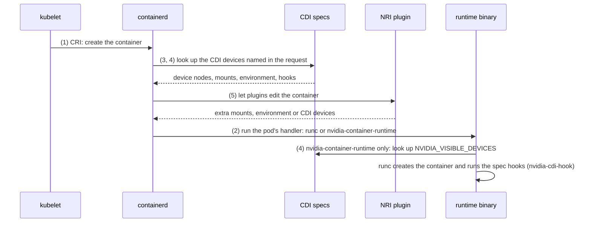
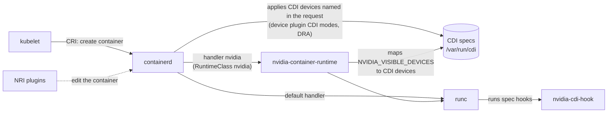
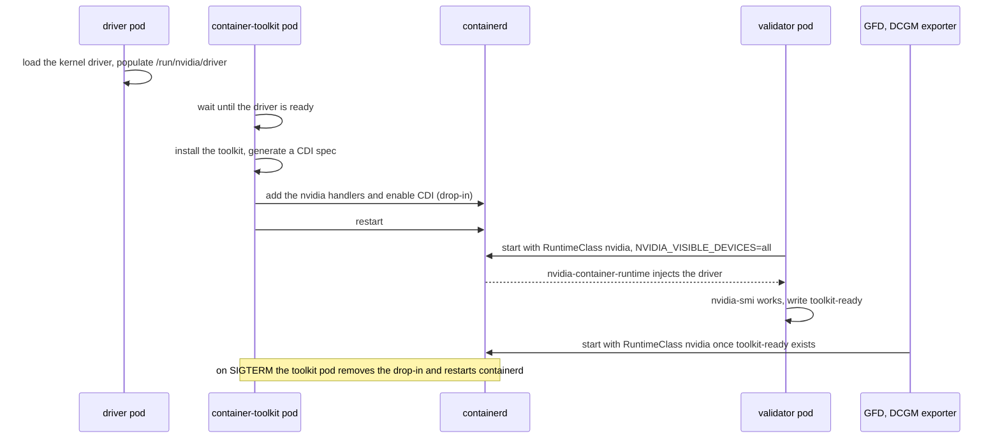
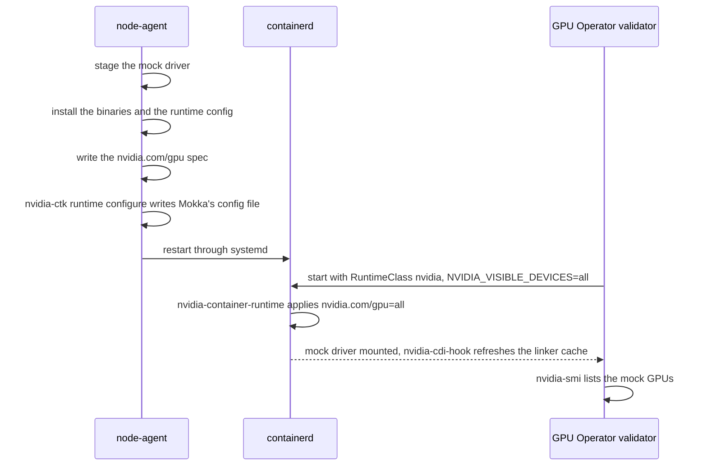
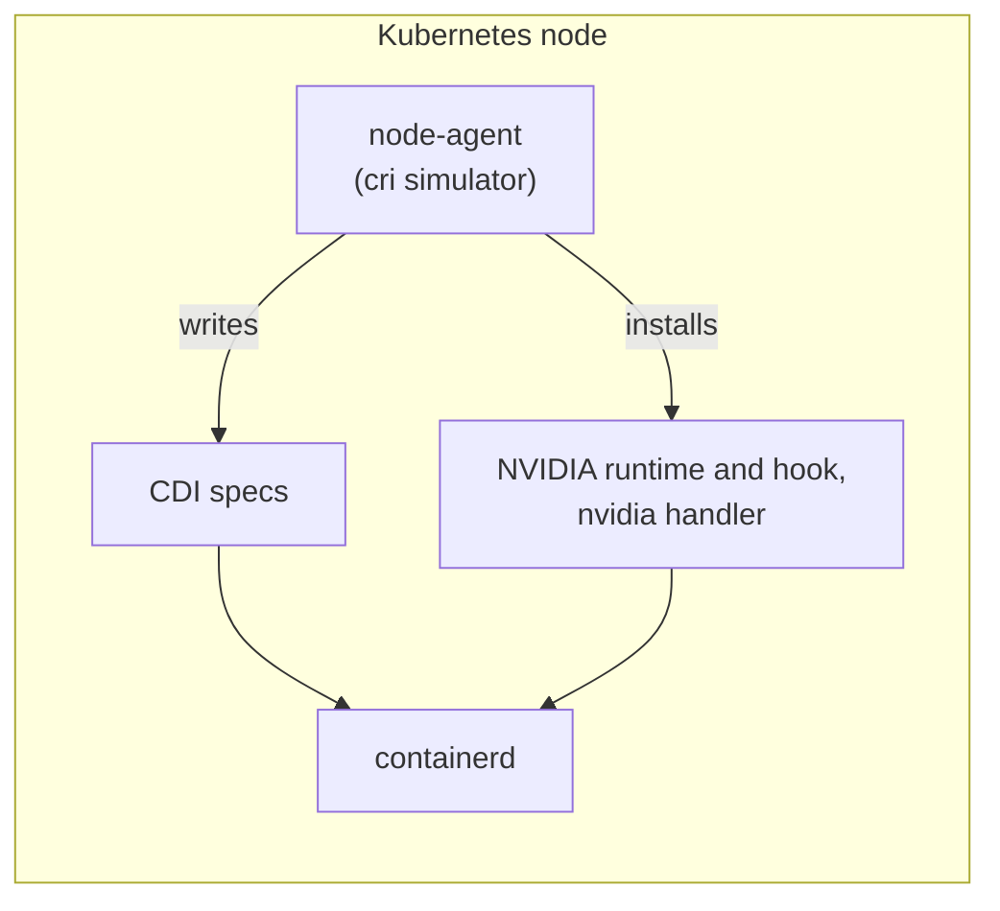
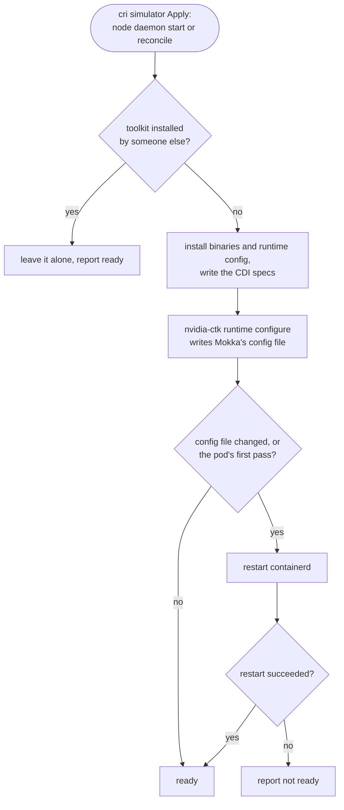
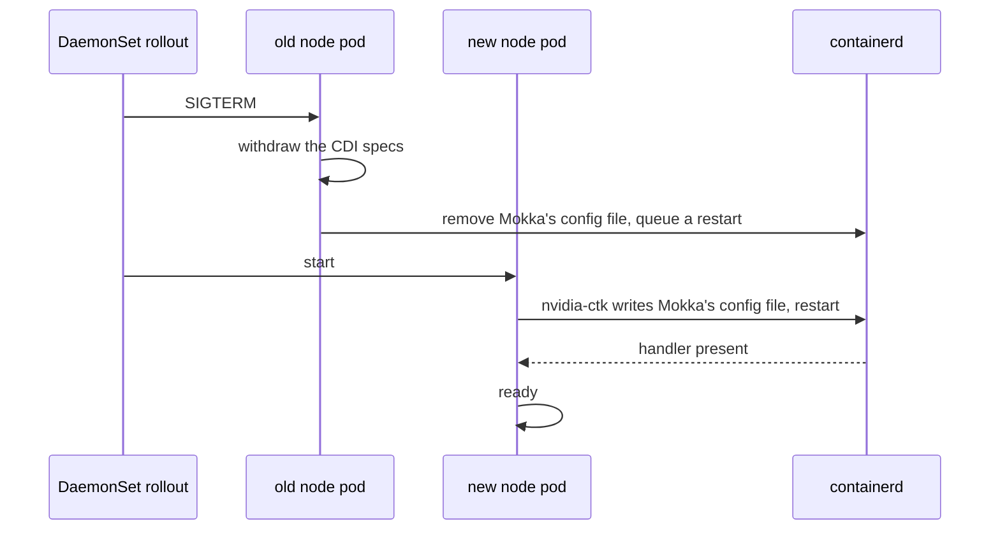

# MEP-0006: Automate the node's CDI setup

Author: [Roman Hlushko](https://github.com/roma-glushko)

<!-- toc -->
- [Summary](#summary)
- [Motivation](#motivation)
  - [Background: how a container gets a device](#background-how-a-container-gets-a-device)
  - [What Mokka does today](#what-mokka-does-today)
  - [What the GPU Operator does](#what-the-gpu-operator-does)
  - [How nodes are prepared today](#how-nodes-are-prepared-today)
  - [Goals](#goals)
  - [Non-Goals](#non-goals)
- [Proposal](#proposal)
  - [User Stories](#user-stories)
  - [Notes/Constraints/Caveats](#notesconstraintscaveats)
  - [Risks and Mitigations](#risks-and-mitigations)
- [Design Details](#design-details)
  - [Where it runs](#where-it-runs)
  - [Container runtimes](#container-runtimes)
  - [What it puts on the node](#what-it-puts-on-the-node)
  - [Lifecycle](#lifecycle)
  - [Configuring containerd](#configuring-containerd)
  - [Restarting containerd](#restarting-containerd)
  - [Nodes it leaves alone](#nodes-it-leaves-alone)
  - [Shutdown and uninstall](#shutdown-and-uninstall)
  - [Helm values](#helm-values)
  - [Image](#image)
  - [Compatibility](#compatibility)
  - [Test plan](#test-plan)
  - [Migration](#migration)
  - [Implementation](#implementation)
- [Drawbacks](#drawbacks)
- [Alternatives](#alternatives)
<!-- /toc -->

## Summary

This MEP moves CDI setup into the Mokka chart. The node daemon's CDI
simulator already writes the CDI specs. It becomes the `cri` simulator. It also
installs the upstream NVIDIA Container Toolkit binaries, and has the toolkit's
own `nvidia-ctk` register the `nvidia` runtime handler as the default with the
node's container runtime, containerd first. When the node pod stops, it
reverts that setup, as the toolkit's own installer does.

Creating a cluster from the stock `kindest/node` image, or a standard EKS node group, and installing the chart is then enough.

## Motivation

Mokka hands its simulated GPUs to containers through the Container Device Interface
(CDI). For that to work, the container runtime on each node needs a few NVIDIA pieces:

- the NVIDIA Container Runtime registered with the runtime, the CDI hook binary,
- and a runtime configuration in CDI mode (on a real GPU cluster the GPU
  Operator installs them). 

On Mokka nodes, they come from outside Mokka: 
- a custom Kind node image,
- cloud-init on EKS, 
- or a custom, adhoc DaemonSet that installs packages like this:

<details>
<summary>The workaround DaemonSet</summary>

```yaml
apiVersion: apps/v1
kind: DaemonSet
metadata:
  name: nvidia-container-toolkit-installer
  namespace: kube-system
  labels:
    app.kubernetes.io/name: nvidia-container-toolkit-installer
spec:
  selector:
    matchLabels:
      app.kubernetes.io/name: nvidia-container-toolkit-installer
  updateStrategy:
    type: RollingUpdate
    rollingUpdate:
      maxUnavailable: 1
  template:
    metadata:
      labels:
        app.kubernetes.io/name: nvidia-container-toolkit-installer
    spec:
      # Required for nsenter to target the host's systemd (PID 1).
      hostPID: true
      containers:
        - name: installer
          image: ubuntu:22.04
          imagePullPolicy: IfNotPresent
          securityContext:
            privileged: true
          volumeMounts:
            - name: host-root
              mountPath: /host
          command:
            - bash
            - -ceu
            - |
              # The host may use systemd-resolved's loopback stub. That stub is
              # unreachable from the pod network namespace, so make the pod's
              # Kubernetes DNS configuration available inside the chroot.
              HOST_RESOLV="$(readlink -f /host/etc/resolv.conf)"
              if [ ! -e "$HOST_RESOLV" ]; then
                mkdir -p "$(dirname "$HOST_RESOLV")"
                touch "$HOST_RESOLV"
              fi
              mount --bind /etc/resolv.conf "$HOST_RESOLV"
              cleanup() {
                umount "$HOST_RESOLV" || true
              }
              trap cleanup EXIT

              chroot /host bash -s <<'HOSTSCRIPT'
              set -euo pipefail
              export DEBIAN_FRONTEND=noninteractive
              # needrestart's dbus scan fails noisily in a container chroot.
              export NEEDRESTART_SUSPEND=1

              SENTINEL=/run/nvidia-container-toolkit-setup.done

              host_systemctl() {
                nsenter --target 1 --mount --pid -- systemctl "$@"
              }

              # Matches the effective config first (works whether enable_cdi
              # lands in config.toml or a conf.d/*.toml drop-in), then the raw
              # files as a fallback.
              check_cdi() {
                containerd config dump 2>/dev/null \
                  | grep -q 'enable_cdi = true' && return 0
                grep -q 'enable_cdi = true' \
                  /etc/containerd/config.toml 2>/dev/null && return 0
                grep -q 'enable_cdi = true' \
                  /etc/containerd/conf.d/99-nvidia.toml 2>/dev/null && return 0
                return 1
              }

              # The effective config must expose the nvidia runtime handler,
              # otherwise pods with runtimeClassName: nvidia fail to start with
              # "no runtime for nvidia is configured".
              check_nvidia_runtime() {
                containerd config dump 2>/dev/null \
                  | grep -q 'nvidia-container-runtime'
              }

              verify() {
                command -v nvidia-ctk >/dev/null 2>&1
                command -v nvidia-container-runtime >/dev/null 2>&1
                command -v nvidia-cdi-hook >/dev/null 2>&1
                host_systemctl is-active --quiet containerd
                check_cdi
                check_nvidia_runtime
              }

              # The host /run sentinel survives pod restarts; skip re-converging
              # a node that is already installed and verifies clean.
              if [ -f "$SENTINEL" ] && verify; then
                echo "nvidia-container-toolkit already ready on $(hostname)"
                exec sleep infinity
              fi

              rm -f "$SENTINEL"
              if command -v nvidia-ctk >/dev/null 2>&1 \
                 && command -v nvidia-container-runtime >/dev/null 2>&1; then
                echo "Toolkit already installed: $(nvidia-ctk --version 2>/dev/null | head -1)"
              else
                # Recover an apt transaction interrupted by an earlier
                # containerd restart.
                dpkg --configure -a || true

                need=""
                command -v curl >/dev/null 2>&1 || need="$need curl"
                command -v gpg >/dev/null 2>&1 || need="$need gnupg"
                if [ -n "$need" ]; then
                  apt-get update -qq
                  apt-get install -y -qq --no-install-recommends \
                    --allow-change-held-packages $need
                fi

                curl -fsSL https://nvidia.github.io/libnvidia-container/gpgkey \
                  | gpg --batch --yes --dearmor \
                    -o /usr/share/keyrings/nvidia-container-toolkit-keyring.gpg
                curl -fsSL \
                  https://nvidia.github.io/libnvidia-container/stable/deb/nvidia-container-toolkit.list \
                  | sed 's#deb https://#deb [signed-by=/usr/share/keyrings/nvidia-container-toolkit-keyring.gpg] https://#g' \
                  > /etc/apt/sources.list.d/nvidia-container-toolkit.list

                apt-get update -qq
                apt-get install -y -qq --no-install-recommends \
                  --allow-change-held-packages nvidia-container-toolkit
                echo "Installed: $(nvidia-ctk --version 2>/dev/null | head -1)"
              fi

              # Clear a stale nvidia drop-in so its runtime definition cannot
              # shadow the config written directly to config.toml below.
              rm -f /etc/containerd/conf.d/99-nvidia.toml

              # --config forces the single-file behavior (nvidia-ctk >= 1.18
              # defaults to a conf.d/*.toml drop-in that may not be imported by
              # config.toml).
              nvidia-ctk runtime configure \
                --runtime=containerd \
                --config=/etc/containerd/config.toml \
                --cdi.enabled

              cat > /etc/nvidia-container-runtime/config.toml <<'TOML'
              [nvidia-container-runtime]
              mode = "cdi"

              [nvidia-container-runtime.modes.cdi]
              default-kind = "nvidia.com/gpu"
              spec-dirs = ["/var/run/cdi", "/etc/cdi"]
              TOML

              # Record completed configuration before the disruptive restart.
              # If this pod is lost, its replacement verifies the sentinel.
              touch "$SENTINEL"
              host_systemctl restart containerd || true

              for attempt in $(seq 1 24); do
                if verify; then
                  echo "nvidia-container-toolkit ready on $(hostname)"
                  exec sleep infinity
                fi
                echo "Waiting for containerd/CDI (${attempt}/24)"
                sleep 5
              done

              echo "containerd did not return with CDI enabled" >&2
              exit 1
              HOSTSCRIPT
          readinessProbe:
            exec:
              command:
                - chroot
                - /host
                - bash
                - -ceu
                - |
                  test -f /run/nvidia-container-toolkit-setup.done
                  command -v nvidia-ctk >/dev/null
                  command -v nvidia-container-runtime >/dev/null
                  command -v nvidia-cdi-hook >/dev/null
                  nsenter --target 1 --mount --pid -- \
                    systemctl is-active --quiet containerd
                  effective="$(containerd config dump 2>/dev/null)"
                  grep -q 'nvidia-container-runtime' <<<"$effective"
                  grep -q 'enable_cdi = true' <<<"$effective" \
                    || grep -q 'enable_cdi = true' \
                      /etc/containerd/config.toml 2>/dev/null \
                    || grep -q 'enable_cdi = true' \
                      /etc/containerd/conf.d/99-nvidia.toml 2>/dev/null
            initialDelaySeconds: 5
            periodSeconds: 10
            timeoutSeconds: 5
            failureThreshold: 90
          resources:
            requests:
              cpu: 10m
              memory: 32Mi
            limits:
              cpu: "1"
              memory: 256Mi
      volumes:
        - name: host-root
          hostPath:
            path: /
            type: Directory
```

</details>

This makes the installation process error-prone and tedious to run.

### Background: how a container gets a device

The rest of this document relies on five pieces of the container stack. This
is how they take part in creating a container that uses a device; the numbers
match the list below.



1. **The kubelet asks a container runtime to run containers.** It does so
   through the Container Runtime Interface (CRI). On Kind and EKS the runtime
   is containerd.
2. **containerd hands each container to a low-level runtime.** It writes an
   OCI spec, the container's mounts, device nodes, environment and hooks, and
   runs a runtime binary, normally `runc`, to create the container. Which
   binary runs is decided by a **runtime handler**, a named entry in
   containerd's configuration. A pod selects a handler through a Kubernetes
   `RuntimeClass`; without one it gets the default handler.
3. **CDI describes a device as a file.** A CDI spec lists what a container
   needs to use a device: device nodes, files to mount, environment variables,
   and hooks, which are programs run while the container is being created.
   Specs live in `/etc/cdi` and `/var/run/cdi`, and devices have names such as
   `nvidia.com/gpu=0`.
4. **Two components can apply a CDI spec to a container.**
   - containerd itself, when the CRI request names the device. The NVIDIA
     device plugin's CDI modes and DRA drivers work this way. containerd 2.0
     and later have CDI on by default.
   - The NVIDIA Container Runtime (`nvidia-container-runtime`), a wrapper
     around runc. It reads `NVIDIA_VISIBLE_DEVICES` from the container and
     applies the matching CDI devices. It only runs for pods whose handler
     points at it.

   NVIDIA's specs also call `nvidia-cdi-hook`, for example to refresh the
   dynamic linker cache. The runtime, the hook and the `nvidia-ctk`
   configuration tool make up the NVIDIA Container Toolkit.
5. **NRI lets a plugin edit a container as it is created.** The Node Resource
   Interface is how Mokka's NRI plugin injects the mock driver into containers
   that hold a GPU allocation.

The two ways a CDI device reaches a container, side by side:



### What Mokka does today

The node daemon simulates the GPU and its driver. It stages device nodes,
`libnvidia-ml.so` and `nvidia-smi` under `/var/lib/nvml-mock/driver`, mirrors
that tree to `/run/nvidia/driver`, and writes CDI specs for the mock GPUs to
`/var/run/cdi`, including `nvidia.yaml` for the `nvidia.com/gpu` devices. The
optional NRI plugin injects the mock driver into containers that hold a GPU
allocation.

Mokka does not configure containerd. It registers no handler and installs no
toolkit binary, although its own `nvidia.com/gpu` spec calls
`/usr/bin/nvidia-cdi-hook`
([`internal/agent/cri/spec.go`](../../../internal/agent/cri/spec.go)).

### What the GPU Operator does

On a real GPU node the GPU Operator runs a container-toolkit DaemonSet, the
toolkit's `nvidia-ctk-installer`. It installs the toolkit, registers `nvidia`
handlers in containerd, turns CDI on, and restarts containerd. With CDI on it
keeps `runc` as the default handler
([`NVIDIA_RUNTIME_SET_AS_DEFAULT=false`](https://github.com/NVIDIA/gpu-operator/blob/v26.3.3/controllers/object_controls.go))
and creates a `nvidia` RuntimeClass. Its own pods, such as the validator, GFD
and the DCGM exporter, use that RuntimeClass with `NVIDIA_VISIBLE_DEVICES=all`.
Workload pods get their GPUs from containerd, through the device plugin's own
CDI spec, whose hooks call `/usr/bin/nvidia-cdi-hook` while the operator's
toolkit is disabled.

On a real GPU node the sequence looks like this:



With Mokka the operator's driver is replaced by the node daemon, and its
toolkit is disabled (`toolkit.enabled=false`). The installer cannot run on a
node without the NVIDIA kernel driver:

- the runtime wrappers it installs run plain runc unless `/proc/modules` lists
  `nvidia`
  ([`executables.go`](https://github.com/NVIDIA/nvidia-container-toolkit/blob/v1.19.1/cmd/nvidia-ctk-installer/toolkit/installer/executables.go));
- it creates device nodes from the NVIDIA entries in `/proc/devices` and fails
  without them
  ([`devices.go`](https://github.com/NVIDIA/nvidia-container-toolkit/blob/v1.19.1/internal/info/proc/devices/devices.go)).

So the node needs, from somewhere else:

- `nvidia-container-runtime`, `nvidia-cdi-hook` and `nvidia-ctk` in `/usr/bin`,
  where both Mokka's spec and the device plugin's spec expect the hook;
- an `nvidia` handler in containerd that runs `nvidia-container-runtime`;
- the runtime's configuration in CDI mode, so that `NVIDIA_VISIBLE_DEVICES`
  resolves against the node daemon's `nvidia.com/gpu` spec;
- CDI and NRI enabled in containerd, which containerd 2.0 and later already do.

### How nodes are prepared today

- **Kind.** A custom node image
  (`deployments/kind-nvidia-cdi`)
  bakes in the toolkit 1.19.1 packages and a fork of Kind's containerd
  configuration with `nvidia` as the default handler. All CI jobs and local
  development use it, and the fork has to be redone on every `kindest/node`
  bump.
- **EKS.** The guide's
  [Terraform](../../../docs/guides/install/aws/eks/terraform/main.tf) runs
  CPU-only workers on the GPU-accelerated AMI, because that AMI ships the
  toolkit, and switches the runtime to CDI mode with cloud-init. Existing node
  groups have to be replaced.
- **Other managed clusters.** A privileged DaemonSet installs the toolkit
  packages on each node with apt, runs `nvidia-ctk runtime configure`, writes
  the runtime configuration and restarts containerd. It needs Debian-family
  nodes and outbound access to the NVIDIA package repository, and it registers
  `nvidia` without making it the default.

The three setups are specific to one environment each, already differ in
toolkit version and in whether `nvidia` is the default handler, and none of
them is configured by Mokka. [MEP-0003](../0003-node-agent/README.md) left
runtime configuration out of the node daemon's scope. 

It's about time to have automatic setup in the same way everywhere.

### Goals

- Installing the Mokka chart prepares `containerd` on any node with a
  systemd-managed containerd: stock `kindest/node`, standard EKS AL2023, other
  managed clusters.
- The toolkit binaries are the upstream releases, unmodified, at the paths a
  package install uses, and the toolkit's own `nvidia-ctk` writes the
  container runtime's configuration.
- Uninstalling the chart leaves no Mokka configuration in `containerd`: like
  the toolkit's installer, the node pod reverts its setup when it stops.
- Nodes that already have a toolkit, and nodes without containerd, are left
  alone.
- The setup is written per container runtime, so CRI-O and Docker can follow
  containerd without changes to the node daemon.
- The custom Kind node image, the EKS bootstrap and the workaround DaemonSet
  are no longer needed.

### Non-Goals

- Running the GPU Operator's own container-toolkit operand.
- Implementing CRI-O and Docker; the design leaves room for them (see
  [Container runtimes](#container-runtimes)).
- Setting up the embedded containerd of k3s and rke2, whose nodes are left
  alone, Bottlerocket, and hosts with a read-only `/usr`.
- Changing which containers the NRI plugin injects
  ([MEP-0002](../0002-device-plugin-nri-composition/README.md)) or making NRI
  the default (#814).

## Proposal

The node daemon's CDI simulator takes over the workaround DaemonSet's job, on
by default, from binaries shipped in the nvml-mock image instead of a package
repository. It is renamed `cri`, because it now covers everything the
container runtime needs from Mokka. In its Apply step, which runs when the
node daemon starts and on every reconcile, it:

1. installs `nvidia-container-runtime`, `nvidia-ctk` and `nvidia-cdi-hook` at
   `/usr/bin`, before writing the specs that call the hook;
2. writes the runtime configuration in CDI mode;
3. runs the toolkit's `nvidia-ctk runtime configure`, which writes Mokka's
   config file into containerd's config dir, registering the `nvidia` handler
   as the default handler;
4. restarts containerd when that file changed, and once when the node pod
   starts.

When the node pod stops, it undoes steps 3 and 4, as the toolkit's installer
does on SIGTERM. It removes Mokka's config file and queues a containerd
restart, which systemd completes after the pod is gone. The binaries stay,
because containers created through the handler keep calling them.

The node ends up in the state the existing setups produce.

On a freshly prepared node, a GPU Operator pod then starts like this:



### User Stories

1. **CI and local development.** `make cluster-create` uses the stock
   `kindest/node` image. With the GPU Operator installed, its validator runs
   under the `nvidia` RuntimeClass, finds `nvidia-smi` and passes.
2. **EKS.** A standard AL2023 node group with no user data runs the guide's
   workload after `helm install`.
3. **A cluster with the workaround DaemonSet.** The DaemonSet is deleted and
   the chart installed. Nodes it already prepared keep working; new nodes are
   prepared by Mokka.
4. **Upgrade.** A chart upgrade or a GPU-profile change rolls the node pods.
   On each node, the old pod reverts the setup and restarts containerd. The new
   pod sets it up again and restarts containerd a second time. Running
   containers survive both restarts. Between them, new pods start without the
   mock driver, and `runtimeClassName: nvidia` pods cannot start.
5. **Uninstall.** `helm uninstall` stops every node pod. Each one removes its
   config file and queues a containerd restart, so every node returns to its own
   containerd configuration. The toolkit binaries stay.

### Notes/Constraints/Caveats

- **`nvidia` is the default handler,** as on the custom Kind image, the EKS
  accelerated AMI and the toolkit's classic setup. A device-plugin workload
  that carries `NVIDIA_VISIBLE_DEVICES` gets the mock driver with no
  RuntimeClass. Every container on the node runs under the NVIDIA runtime: one
  without the variable runs as it would under runc, and an image that sets
  `NVIDIA_VISIBLE_DEVICES=all`, as CUDA base images do, sees every mock GPU.
  The GPU Operator with CDI on keeps `runc` as the default instead (see
  [What the GPU Operator does](#what-the-gpu-operator-does)); its pods name the
  RuntimeClass and work either way.
- **containerd restarts whenever the node pod starts or stops.** The stopping
  pod reverts the setup and the starting pod applies it. A reconcile restarts
  containerd only when Mokka's config file changed. Each restart briefly
  interrupts `kubectl exec` sessions and container operations in flight on
  that node, and the NRI plugin reconnects. Running containers survive.
- **`nvidia-ctk` rewrites `config.toml`.** It saves the file on every run,
  adding an `imports` entry for Mokka's config file when no entry covers it. The
  settings stay as they were; comments in the file are lost.
- **A failed setup does not stop the mock GPUs.** The `cri` simulator still
  publishes its specs, logs the error and reports not ready, and tries again
  on the next reconcile or when the node pod restarts.
- **Restarts go through systemd.** Hosts without it can use
  `restartMode: none` and restart containerd themselves.
- **NRI's CDI device mode depends on the containerd version.** The NRI
  plugin's `cdi` mode needs containerd 2.1 or later, or 1.7.30 or later with
  NRI and CDI on. containerd 2.0.x drops CDI devices requested through NRI
  without an error. The handler itself does not depend on this.

### Risks and Mitigations

| Risk | Mitigation |
|---|---|
| A bad configuration keeps containerd from starting | The toolkit's own `nvidia-ctk` writes it, as on any node with the toolkit. If containerd still doesn't come back, the node pod is not ready, its log has the error, and the documentation lists how to remove Mokka's config file by hand |
| The node pod is killed before it restarts containerd | The next node pod restarts containerd on its first pass, even if the file did not change |
| Two node pods on one node during a rollout | The chart refuses `maxSurge` while the setup is on, so the old pod stops before the new one starts |
| Overwriting a toolkit installed by someone else | A node with a toolkit Mokka didn't install is left alone |
| The default handler outlives Mokka and keeps routing every container through the NVIDIA runtime | The revert removes the default with Mokka's config file. Only a node pod killed before it reverts leaves it behind, and the documentation lists the manual cleanup |

## Design Details

### Where it runs



The `cri` simulator, called the CDI simulator before this MEP, writes the CDI
specs. In the same Apply step it puts in place what containerd needs to use
them. It runs in the existing `node-agent` container: no new binary or
container.

### Container runtimes

The simulator drives the container runtime through one interface, `Runtime`.
There is one implementation per runtime, just as the toolkit's installer has
one per runtime
([`container/runtime`](https://github.com/NVIDIA/nvidia-container-toolkit/tree/v1.19.1/cmd/nvidia-ctk-installer/container/runtime)).
`Runtime` has the installer's two methods: `Setup` makes the runtime serve the
`nvidia` handler, and `Cleanup` removes Mokka's configuration again. A third,
`Installed`, says whether the runtime is on the node at all. Each
implementation hands the configuration itself to `nvidia-ctk runtime
configure`, which supports containerd, CRI-O and Docker. Installing the toolkit
and restarting through systemd are shared.

This MEP implements containerd. CRI-O (a config file in `/etc/crio/crio.conf.d`)
and Docker through cri-dockerd (`runtimes` in `/etc/docker/daemon.json`) can
follow as further implementations, and the chart selects one with
`nodeAgent.containerRuntime.type`. A Docker restart stops its containers
unless `live-restore` is on, so that implementation would require it.

### What it puts on the node

| Path | Content |
|---|---|
| `/usr/local/nvml-mock/toolkit/` | `nvidia-container-runtime`, `nvidia-ctk`, `nvidia-cdi-hook` from the image, and the runtime's `config.toml` |
| `/usr/bin/nvidia-container-runtime`, `nvidia-ctk`, `nvidia-cdi-hook` | symlinks into the toolkit directory |
| `/etc/nvidia-container-runtime/config.toml` | symlink to `config.toml` in the toolkit directory, the same file the custom Kind image ships: `mode = "cdi"`, default kind `nvidia.com/gpu`, spec directories `/etc/cdi` and `/var/run/cdi` |
| `/etc/containerd/conf.d/50-mokka.toml` | the `nvidia` handler and `enable_cdi = true`, as `nvidia-ctk` writes them |
| `imports` in `/etc/containerd/config.toml` | the `conf.d/*.toml` glob, which `nvidia-ctk` adds if no entry covers the config dir |

The toolkit directory is outside `/var/lib/nvml-mock` because the NRI plugin
mounts that tree into the containers it injects. The package's
`nvidia-cdi-refresh` service is not installed: it regenerates
`/var/run/cdi/nvidia.yaml`, the spec the node daemon owns.

### Lifecycle



The CDI specs are written right after the binaries are installed, so the hook
they call exists first. A failed setup doesn't fail the Apply step. The specs
are still published, the simulator logs the error and reports not ready, and
the setup runs again on the next reconcile or when the node pod restarts.

A node never runs two node pods at once: the chart refuses a rollout with
`maxSurge` while the setup is on, because the old pod's revert would remove
the new pod's setup.

### Configuring containerd

The containerd implementation runs the toolkit's own `nvidia-ctk`, from the
nvml-mock image, in the node daemon's container:

```text
nvidia-ctk runtime configure --runtime=containerd --config-source=file \
  --config=/etc/containerd/config.toml \
  --drop-in-config=/etc/containerd/conf.d/50-mokka.toml \
  --nvidia-runtime-name=nvidia \
  --nvidia-runtime-path=/usr/bin/nvidia-container-runtime \
  --nvidia-set-as-default \
  --cdi.enabled
```

`nvidia-ctk` writes Mokka's config file
([`pkg/config/engine/containerd`](https://github.com/NVIDIA/nvidia-container-toolkit/tree/v1.19.1/pkg/config/engine/containerd)).
It adds the `nvidia` handler as a copy of the default runtime's settings, with
`options.BinaryName` set to `/usr/bin/nvidia-container-runtime`; turns CDI on;
sets `default_runtime_name` to `nvidia`; and makes sure an `imports` entry in
`config.toml` covers the config dir. Which settings the file carries on each
containerd version is `nvidia-ctk`'s decision, the same on every node that has
the toolkit.

The node daemon's container mounts containerd's configuration directory at its
host path, `/etc/containerd`, rather than under the `/host` prefix the other
simulators use: `nvidia-ctk` writes the config dir into `imports`, and that
path must resolve on the host. `--config-source=file` keeps it from looking
for a `containerd` binary in the container.

Mokka's config file is named `50-mokka.toml`, so a toolkit installed later,
which writes `99-nvidia.toml`, takes precedence.

### Restarting containerd

containerd reads its configuration only when it starts. The simulator restarts
it when `nvidia-ctk` changed Mokka's config file, and once when a node pod
starts: a pod killed between writing the file and restarting would otherwise
leave a file containerd never loaded. The restart is
`systemctl restart containerd` inside a chroot of the host. It runs with
`SYSTEMD_IN_CHROOT=0`, and with the older `SYSTEMD_IGNORE_CHROOT=1`, so that
systemctl acts on the host instead of ignoring the request. The node pod
shares the host's PID namespace: before acting, systemctl checks who is at the
other end of systemd's socket, and from a pod's own PID namespace the kernel
hides systemd's PID, so systemctl gives up with
`Failed to connect to bus: No data available`. Running containers survive a
restart because each is held by its own shim process.

If the restart fails, the node pod is not ready and its log has systemctl's
error. Nothing is rolled back, as the toolkit's installer rolls nothing back;
the documentation lists how to remove Mokka's config file by hand. The
restart is tried again on the next reconcile or when the node pod restarts.

### Nodes it leaves alone

A node with no `containerd` on the host's `PATH` runs another runtime, such as
CRI-O, or the containerd that k3s and rke2 embed. The `cri` simulator installs
nothing there, logs a warning that says so, and reports ready, so a cluster
that mixes runtimes needs no per-node values.

A file at one of the `/usr/bin` paths or at
`/etc/nvidia-container-runtime/config.toml` that is not Mokka's symlink means
another installer prepared the node: the custom Kind image, the
GPU-accelerated EKS AMI, or the workaround DaemonSet. The `cri` simulator then
installs nothing, leaves containerd alone, logs which paths it found, and
reports ready. It still publishes its specs, and it doesn't revert anything
when it stops.

### Shutdown and uninstall

When the node daemon stops, the `cri` simulator's Revoke withdraws its specs.
It then reverts the runtime setup the way the toolkit's installer does on
SIGTERM: it calls `Cleanup`, which removes Mokka's config file and runs
`systemctl restart --no-block containerd`. systemd completes that restart after
the pod is gone, so the revert fits in the pod's existing grace period.
containerd then serves only the node's own handlers, so `helm uninstall`
leaves no Mokka handler in it. The `imports` entry `nvidia-ctk` added stays,
and with the file gone it loads nothing.

Revoke skips `Cleanup` only when another installer prepared the node. A host
shutdown reverts the setup like any other stop, and the next node pod sets it
up again after the boot.



The binaries, their symlinks and the runtime configuration stay, because
containers created through the handler keep calling the runtime for `exec`,
`kill` and `delete`. The documentation lists how to remove them by hand. It
also lists how to clean up a node whose pod was killed before it could revert.

### Helm values

```yaml
nodeAgent:
  containerRuntime:
    enabled: true
    type: containerd       # the only implementation so far
    restartMode: systemd   # systemd | none
    containerd:
      configPath: /etc/containerd/config.toml
      configDir: /etc/containerd/conf.d
      systemdUnit: containerd
```

The handler name is always `nvidia`, the name of the GPU Operator's
RuntimeClass. The `node-agent` container, already privileged, gains a read-only
mount of the host root for the chroot and read-write mounts of `/usr/bin`,
`/usr/local/nvml-mock`, `/etc/nvidia-container-runtime` and `/etc/containerd`,
the last at its own path. With `restartMode: systemd` the pod also runs in the
host's PID namespace. While the setup is on, the chart refuses
`updateStrategy.rollingUpdate.maxSurge`.

### Image

The nvml-mock image copies the three binaries from the `/artifacts/rpm` tree of
a digest-pinned `nvcr.io/nvidia/k8s/container-toolkit:v1.19.1`, the version the
custom Kind image uses. That tree is built on CentOS 7, so the binaries need
glibc 2.17 or later. The image is multi-architecture.

### Compatibility

| Requirement | Supported |
|---|---|
| containerd | 1.7 and later |
| Other runtimes | CRI-O and Docker once they are implemented; see [Container runtimes](#container-runtimes). Until then their nodes are left alone with a warning |
| Restart | systemd, or `restartMode: none` |
| Host filesystem | writable `/usr/bin`, `/usr/local` and `/etc` |
| Pod security | privileged, as before, and `hostPID` unless `restartMode: none` |
| Kubernetes | the chart's existing minimum |

### Test plan

- **Unit.**
  - The containerd implementation runs `nvidia-ctk` with the arguments above,
    restarts containerd only when Mokka's config file changed or on its first
    pass, and reverts by removing Mokka's config file and queuing a restart.
  - `cri` simulator tests on a fake host root cover these cases:
    - the toolkit is installed before the specs are written;
    - a foreign toolkit means zero writes;
    - a failed setup still publishes the specs;
    - Revoke reverts the setup, except on a node another installer prepared.
- **Chart.** Rendering, mounts, values schema, NOTES.
- **E2E**, on stock `kindest/node` in every CI job. A `container-runtime`
  scenario checks that:
  - each node has the handler as the default;
  - a pod with `NVIDIA_VISIBLE_DEVICES=all` sees the node's mock GPUs, with or
    without `runtimeClassName: nvidia`;
  - replacing the node pod brings the handler back;
  - a deleted config file comes back when the node pod restarts;
  - a node that loses its node pod loses the handler.
- **Manual.** One run of the EKS guide on the standard AMI.

### Migration

- **Kind.** CI and local development move to the pinned stock `kindest/node`
  in the same change that turns the runtime setup on, so the new checks cannot
  pass on the old image. The custom image, its publish workflows and its CI job
  are removed afterwards.
- **EKS.** The guide moves to the standard AL2023 AMI without user data. The
  config dir is `/etc/containerd/config.d`, which the `config.toml`
  `nodeadm` writes at every boot already imports.
- **Workaround DaemonSet.** Delete it; the nodes it prepared stay prepared.
- **GPU Operator.** The values keep `driver.enabled: false` and
  `toolkit.enabled: false`.

### Implementation

1. This MEP.
2. Renaming the CDI simulator to `cri`.
3. The `Runtime` interface and its containerd implementation.
4. The setup in the `cri` simulator, and the image contents.
5. The chart wiring, CI on stock `kindest/node`, the e2e scenario and the
   documentation.
6. Removal of the custom Kind node image.
7. The EKS guide on the standard AMI.

## Drawbacks

- Mokka changes files outside its own directories and restarts containerd,
  which no Mokka component did before.
- To restart containerd, the node pod shares the host's PID namespace: every
  container in it sees the node's processes and, running as root, can signal
  them.
- Mokka owns a toolkit version, and follows changes to containerd's
  configuration format by bumping it.
- Nothing checks a configuration before containerd restarts with it, or rolls
  it back after. A node whose containerd does not come back needs Mokka's
  config file removed by hand.
- Every node pod start and stop restarts containerd, so a rollout restarts it
  twice on each node.
- A node pod that is killed before it reverts leaves its setup behind until it
  is removed by hand.
- A failed setup is retried only on the next reconcile or when the node pod
  restarts.

## Alternatives

**Keep the image and the per-environment scripts.** Each environment keeps its
own setup, the Kind fork has to be maintained, and EKS node groups have to be
replaced.

**Run the GPU Operator's installer unmodified.** Its runtime wrappers and its
device-node creation need a loaded kernel driver, as described above.

**Render the config file in Mokka, and check it before restarting.** Mokka could
render its config file itself, check it with `containerd config dump` on staged
copies of the configuration, roll back a restart that does not take, and track
which node pod owns the setup during a surging rollout. That guards against
more failures, but the renderer has to track `nvidia-ctk`'s, and the checks
are several times the code of the setup itself. The toolkit's installer does
none of it.

**Rely on NRI alone.** An NRI plugin can name CDI devices and let containerd
apply them without any runtime configuration. A pod whose RuntimeClass names a
handler that containerd does not have fails before any NRI plugin is called,
so the GPU Operator's own pods cannot be served this way.

**Install the packages from the network, as the workaround does.** It ties
Mokka to one distribution family and needs outbound access from every node.

**Keep `runc` as the default handler,** as the GPU Operator does with CDI on.
Only pods that name `runtimeClassName: nvidia` would run under the NVIDIA
runtime, so a setup left behind would affect nothing else. But device-plugin
workloads in its default `envvar` mode would need a RuntimeClass on Mokka that
they did not need on the custom Kind image.

**Keep the setup when the node pod stops.** Rollouts would not restart
containerd. The cost is that uninstalling would leave Mokka's handler
configured in containerd, which the toolkit's installer does not do.

**A separate container or DaemonSet.** A separate DaemonSet would roll, and so
revert and restart containerd, only when its own configuration changes, not
on every node daemon rollout. But a new binary would repeat the node daemon's
lifecycle, health checks and configuration for one job, and a DaemonSet would
add a second pod on every node. Keeping the setup in the simulator keeps it
next to the specs that depend on it.

**A retry loop in the node daemon.** Running the setup as a long-lived loop
would retry failures and repair drift between reconciles. Apply keeps the
setup in the existing reconcile, and a pod restart covers recovery.
